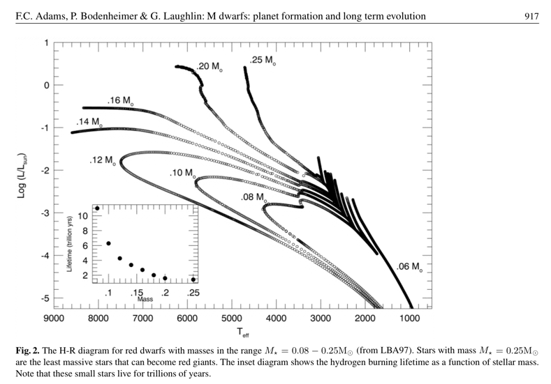
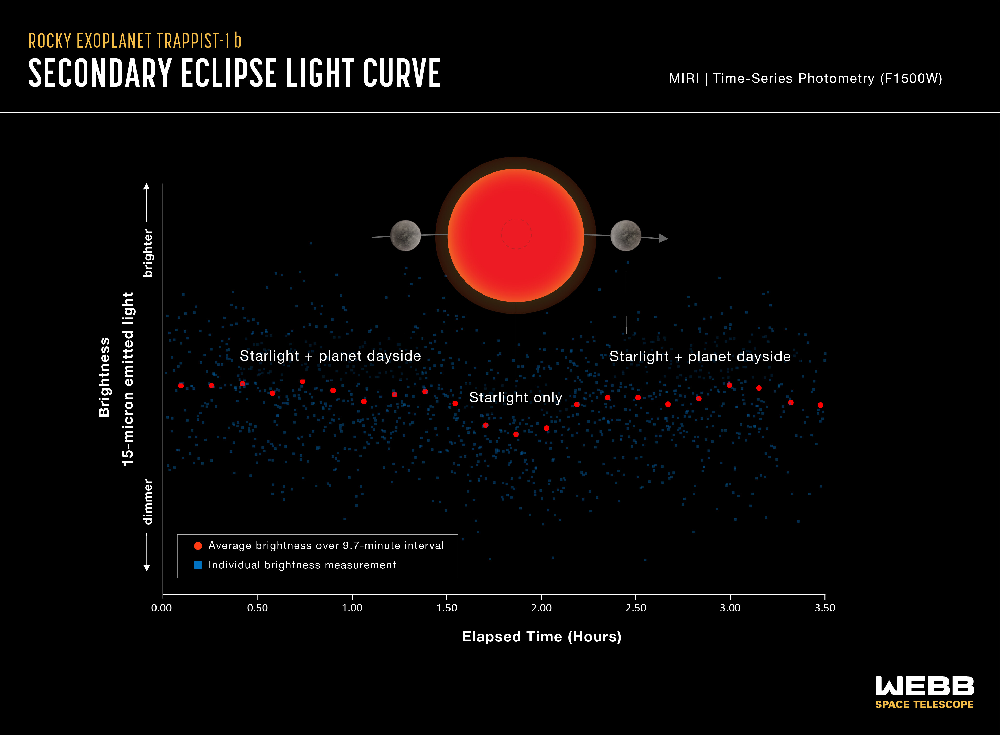
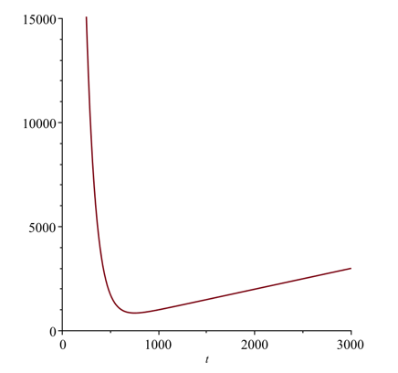
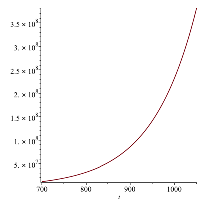




UPDATE 2024-2026:
The James Webb Space Telescope (JWST) has now taken extensive spectrographic readings of the TRAPPIST system. Initial findings suggest that the innermost planets (TRAPPIST-1 b, c, and d) lack thick atmospheres and might be bare rocks. Observations of TRAPPIST-1 e, the most promising planet in the habitable zone, are ongoing but extremely challenging due to the red dwarf's intense stellar activity. These findings further reinforce the skepticism discussed below.



UPDATE Aug 10 2021:
An article [[mnras-flaring]](#ref-mnras-flaring) in the _Monthly Notices of the Royal Astronomical Society_ suggests that ultra-cool dwarf stars are potentially not as deadly as first thought [[skyandtelescope-red-dwarfs]](#ref-skyandtelescope-red-dwarfs). The article suggests that the flaring tends to happen at higher latitudes on the star, which would result in such flares to tend to be directed away from the planets which are located closer to the equatorial plane of the star. Should this prove to be accurate, then that would soften the skepticism we displayed in the earlier version of this blog in regards to stars of this type hosting life, although the other causes of skepticism still remain high.


## Quick overview
* It was recently announced that a nearby star, TRAPPIST-1,
has been found to have additional planets (some were discovered prior to this study)
which exist in a potentially
life-hosting region around the star.
* Astronomically speaking, TRAPPIST-1 is quite close to
us. It remains a prime candidate for spectrographic observation, and the JWST has indeed begun characterizing its planets.
* However, the nature of the star and the configuration of
the planets mean that there have always been good reasons to be
skeptical that any of those planets host life—a skepticism borne out by recent JWST findings indicating some of its planets likely lack atmospheres.
* Also, it is practically impossible with our current
technology to visit that system with unmanned probes,
let alone (hu)maned missions.
* The distances in space are so vast and the restrictions
that the laws of Physics place on space travel are so stringent
that we would probably have to completely exploit our entire
planet's resources to even have a chance to visit that solar
system within 10,000 years.
* We are probably not alone in the universe, but we are
also probably very, very rare, and we likely won't meet
any alien intelligence before we go extinct.

## Deeper Dive

An article published in the science journal _Nature_ [[nature-discovery]](#ref-nature-discovery)
(Gillon et al., February 23, 2017) made many mainstream media
headlines by announcing the discovery of new terestrial planets around a nearby
star. __CNN__ was pretty tame by announcing [[cnn-announcement]](#ref-cnn-announcement) that _Astronomers discover 7 Earth-sized planets orbiting nearby star_ in their headline. The __New York Times__ was
equally tame in announcing [[nytimes-announcement]](#ref-nytimes-announcement) that _7 Earth-Size Planets Orbit Dwarf Star, NASA and European Astronomers Say_. __NBC__ went a little
louder with the headline [[nbc-announcement]](#ref-nbc-announcement)
_Living on the TRAPPIST-1 Planets Would Be Very Strange_, which, let's be clear, suggest to the average reader
that those planets are in fact habitable, which is not confirmed yet (more on that soon).
__CNET__ was bolder [[cnet-announcement]](#ref-cnet-announcement)
with a headline _'Incredible' star system could host life_, but the "could" was a good word to use though
it spoke nothing to the actual probability. I _could_ win the lottery and get struck down by lightening and
then a meteor could hit the ambulance carrying me to the hospital, but I'm not going to bet on it.
The UK __Telegraph__ pushed it [[telegraph-announcement]](#ref-telegraph-announcement) a bit
further with the headline _Nasa discovers new solar system TRAPPIST-1 - where life may have evolved on three planets_.
The __Guardian__ asked [[guardian-announcement]](#ref-guardian-announcement)
_is there life on exoplanets orbiting Trappist-1?_

For the record, I don't have an issue with those headlines, as if that would matter anyway. I'm even
a bit fond of that creative website [[io9-fanfic]](#ref-io9-fanfic)
that some planetary scientist have put up to host information and fan fiction related to TRAPPIST-1.
The more public interest they can drum up for their work, the more grant money that will
flow towards planetary and exoplanetary science.

However, let's bring this discussion back down to Earth for a moment.

### Some background on TRAPPIST-1

TRAPPIST-1 [[wiki-trappist1]](#ref-wiki-trappist1) is a very small and relatively cold
star that is about 40 light-years away from our solar system. TRAPPIST-1's radial velocity
is 56.3 km/s towards us, which isn't very fast. For example, the Juno spacecraft's maximum
speed was about 73.6 km/s. The fastest speed of a (hu)manned spacecraft was achieved by
Apollo 10 at about 11.08 km/s.

TRAPPIST-1 is so dim you can't see it without a strong telescope.

Two things are interesting about our findings on exoplanets: it is pretty common for a star to have planets (just a few decades ago this wasn't an accepted reality); and our solar system seems to be a bit of an outlier in terms of the configuration of planets around the star based on what we've seen so far. A lot of these systems have Jupiter size or larger planets in very close orbit around the star; in the case of TRAPPIST-1, the star is much much weaker than the sun and all the planets we've found are in a very close tight orbit. This later fact may be due to selection bias, i.e. it is easier to find planets around a star when the planets are large and very close because the motion of the star is more strongly affected (for Doppler-effect discovered planets and also the luminosity detection method) and also when they are closer to the star and the plane of orbit is nearly head on relative to Earth. Also, of course, an Earth sized planet is going to cause a bigger
dip in the intensity of light of a dwarf star when passing in between our telescopes and that star than would a similar size planet,
say ours, have on a larger star like our sun (which itself isn't all that big compared to some of the giant stars that can be
found in the universe, but is substantially bigger than TRAPPIST-1). So
right now the limitations of our detection technology is creating a statistical bias towards systems for which it is better
able to detect exoplanets. As the next generation observation equipment is developed, we may start finding more solar systems
which resemble ours.

### Why we are excited about this discovery

* Three of the planets are believed to be capable of hosting liquid water oceans.
Having liquid water oceans vastly increases the chances a planet could host
life.
* Ultracool stars, which TRAPPIST-1 is classified as, are the most common type [[trappist1-website]](#ref-trappist1-website) of
stars in our galaxy. The fact that TRAPPIST-1 has so many planets and so many planets that
are within the potentially habitable zone bodes well for our chances of finding life-hosting
exoplanets if the negatives in the next section aren't enough to stop life from evolving.
* Because the stars are so small, it is easier to see the dip in light which an Earth-sized
planet would cause if it passes between us and TRAPPIST-1. TRAPPIST-1's solar system's orbital
plane happens to be position just right for us to see these planets crossing the star; random
chance says that only a ver small percentage of solar systems would yield this lucky result.
However, because ultracool stars are so common, the odds are in our favor that we will continue
to discover similar systems.

### Why we shouldn't be too excited about this discovery

* The planets are probably tidally locked or near tidally locked and suffer run-away green house effects. One side of
planet always faces the sun, the other always faces dark space. The resulting temperature differential would result
in massive global winds if the planets retain their atmospheres. There is still a lot of debate [[hz-debate]](#ref-hz-debate)
about where the habitable zone is for tidally locked systems, and the predictions that three of these planets
exist in the "Goldilocks zone" are not settled science.

* As the director of the Carl Sagan Institute,
Lisa Kaltenegger, points out, these planets are incredibly close to their star
and their star could be emitting intense levels of ultraviolet light. UV radiation
is dangerous for life as we know it, so in order to host light the planets would
need some very serious ozone protection. Alternatively, assuming they had oceans,
and that their oceans didn't boil away or freeze over, life would probably be limited
to deep oceans.

* Ultracool dwarfs are often violent stars with massive flares. However, TRAPPIST-1 is
relatively peaceful, according to some of the reports. [UPDATE AUG 10 2021]: See also the above update which suggests that these stars may not be as deadly via flares as originally thought.

* They may possibly have lost their atmospheres due to being so close to the star.

* It was originally thought to be only 500 million years old, but more recent studies have revealed it is actually much older—between 5.4 and 9.8 billion years old [[burgasser-age]](#ref-burgasser-age). Our solar system is only about 4.5 billion years old. Even if life had time to evolve, these stars, unlike ours, can hypothetically last for __trillions__ of years since
they burn their hydrogen fuel much more slowly [[hydrogen-burn-rate]](#ref-hydrogen-burn-rate)
than larger stars:

Even if some of oceans remain and are frozen over, that doesn't rule out life.
Some of the moons in our solar system have frozen oceans of water where there is a suspected liquid layer underneath that could possible host life (e.g. Europa) which is why NASA has an interest in looking for potential life on Europa. So the conditions of the TRAPPIST-1 system may support some form of life but like with Europa, the ability for complex life to develop is highly limited due to lack of resources. Also, life can be fragile, and Earth went through many periods of mass extinctions; if any of the planets around TRAPPIST-1 have life, they are probably relegated to small regions in the twilight zones (that is, if one side always faces the star and the other always faces empty space, the part of the planet between these two zones would be in permanent twilight and have the mildest climates if the planets still have their atmospheres) making life on those planets much more vulnerable to total extinction, a fate Earth avoided in part due to being almost entirely habitable and thus having a more diverse biosphere.

### JWST Observations (2023-2026 Updates)

Since the original publication of this article, the James Webb Space Telescope has turned its mirrors toward TRAPPIST-1. The results thus far have reinforced the sobering perspective outlined above:
* **Inner Planets (b, c, d):** Observations strongly suggest that TRAPPIST-1 b, c, and d do not possess thick, Earth-like atmospheres. In a pair of pivotal _Nature_ publications, authors Greene et al. (2023) [[greene-nature]](#ref-greene-nature) and Zieba et al. (2023) [[zieba-nature]](#ref-zieba-nature) utilized JWST's Mid-Infrared Instrument (MIRI) to measure the thermal emissions of planets b and c, finding them consistent with bare rocky bodies or possessing, at most, extremely thin atmospheres. Planet d's spectrum is similarly flat, pointing to a barren world despite residing near the inner edge of the habitable zone.

_The JWST MIRI light curve of TRAPPIST-1b showing the drop in brightness during its secondary eclipse, a key measurement indicating the planet's lack of a heat-redistributing atmosphere. Credit: NASA/ESA/CSA/STScI._

* **Habitable Zone (Planet e) & Stellar Contamination:** TRAPPIST-1 e lies squarely in the theoretical habitable zone, but characterizing its atmosphere presents a monumental challenge due to the host star itself. The intense stellar activity of the red dwarf—frequent flares, faculae, and starspots—creates a phenomenon known as the **transit light source effect** (or stellar contamination). These stellar features can mimic or completely obscure planetary atmospheric signatures in the transmission spectra. As a result, while thick hydrogen or carbon dioxide cloaks have been ruled out for planet e, pinning down the exact nature of its atmosphere (or lack thereof) remains frustratingly difficult.


graph LR
    classDef proNode fill:#ecfdf5,stroke:#10b981,color:#064e3b
    classDef conNode fill:#fef2f2,stroke:#ef4444,color:#7f1d1d

    E{"TRAPPIST-1 e"}

    E -->|Pros| P1("In the Habitable Zone"):::proNode
    E -->|Pros| P2("Potential Liquid Water Oceans"):::proNode
    E -->|Pros| P3("Star Lives for Trillions of Years"):::proNode
    E -->|Pros| P4("Possibility of Nitrogen Atmosphere"):::proNode

    E -->|Cons| C1("Intense UV Radiation & Flares"):::conNode
    E -->|Cons| C2("Likely Tidally Locked"):::conNode
    E -->|Cons| C3("Thick CO2/H2 Atmosphere Ruled Out"):::conNode
    E -->|Cons| C4("Observation Blocked by Star Spots"):::conNode


These ongoing efforts are a testament to our technological capabilities, but they also serve as a stark reminder of how hostile ultracool dwarf stars can be to the atmospheres of their closely-orbiting planets.

## Sobering Conclusions

Forty lightyears is a long way away. Apollo 10's max speed was around 11,094 m/s (39,938 km/h), which is the fastest manned craft speed we've ever obtained. That's slower than how fast TRAPPIST-1 is moving toward us. 40 light years is 3.784e+17 meters away. If Apollo 10 went directly towards TRAPPIST-1 at its maximum obtained speed, it would close the distance at a rate of about 67,394 m/s (the sum of its speed relative to Earth and the speed of TRAPPIST-1 relative to Earth using Galilean Relativity, these speeds are too slow to justify using Einstein's Relativity). It would take Apollo 10 approximately 5.614e+12 seconds to make it to TRAPPIST-1. That's nearly 177,900 years. Rocket technology hasn't changed radically since then. And, of course, the astronauts wouldn't live long enough to get even
a tiny fraction of the way there.

Even if the entire world turned all of their defense spending towards producing a Generation ship [[wiki-generation-ship]](#ref-wiki-generation-ship) to reach TRAPPIST-1 and impoverished the planet's resources to supply fuel and food supplies for said ship, we are still talking many tens of thousands of years at best, ignoring all threats to human life such as radiation, collision with stray objects, etc. One could easily imagine that within a few generations, the community on the generational
ship would lose faith in their great-grandparent's mission and turn the ship around, assuming they had enough fuel to do so.
It is likely they would, as they would have to have some breaking capacity once they reach TRAPPIST-1, and then enough fuel
to escape TRAPPIST-1's gravity well. All to say that this is never going to happen.

Science fiction has sparked our imagination of traveling to the stars, but the cold reality is that while there is probably a lot of life off Earth in this Universe, everybody is trapped in their own solar systems by relativity and the vast distances between stars. Also, Earth is about 4.5 billion years old and we have about another few billion years until our sun eats its inner planets; who knows what can happen in those billions of years. Keep in mind that human-level intelligence is probably very rare in any case. Some scientist have proposed based on genetic evidence [[krulwich-extinction]](#ref-krulwich-extinction)
that at one point about 75,000 years ago the human species was once reduced to 3,000 - 10,000 individuals due to climate catastrophes. If this is true (and not all scientist think it is), then we were once very close to extinction. Earth was very close to losing its human population, becoming a wild planet whose greatest intelligence might be the non-human apes that survive today. Not only must a planet have the right conditions for life, it must also have the right conditions for complex life, and even then, it's going to take some luck to get to a human-like intelligence.

So we (complex intelligent life) are probably not alone but we are also probably very, very rare, and we likely won't meet any alien intelligence before we go extinct.

## Coda

In regards to the discussion above on generation ships, there is something related to that known as
the Wait Calculation [[wait-calculation]](#ref-wait-calculation) (A. Kennedy, _Interstellar Travel: The Wait Calculation and the Incentive Trap of Progress_, JBIS __59__, July 2006) which is relevant beyond the concept of a generation ship.

From the abstract:

>  This paper describes an incentive trap of growth that shows that civilisations may delay interstellar exploration as long as voyagers have the reasonable expectation that whenever they set out growth will continue to progress and find quicker means of travel, overtaking them to reach and colonise the destination before they do. This paper analyses the voyagers' wait calculation, using the example of a trip to Barnard's Star, and finds a surprising minimum to time to destination at a given rate of growth that affects the expansion of all civilisations. Using simple equations of growth, it can be shown that there is a time where the negative incentive to travel turns positive and where departures will beat departures made at all other times. Waiting for fear future technology will make a journey redundant is irrational since it can be shown that if growth rates alter then leaving earlier may be a better option. It considers that while growth is resilient and may follow surprising avenues, a future discovery producing a quantum leap in travel technology that justifies waiting is unlikely.

Kennedy derives a __Wait Equation__: "The wait equation describes ... the
point at which the negative incentive to leave changes to a positive one; where the incentive to set out on the interstellar
journey is the strongest."

The equation assumes that the growth rate of the speed of the potential ship per year is tied to the
general global GDP growth rate:

$$ v(t) = v_0 (1 + r)^t$$

where $v$ is the velocity $t$ years after the velocity is $v_0$ and $r$ is the average growth rate year over year.
Since velocity is inversely proportional to the time it would take to reach the star, we can rewrite this as

$$ \frac{T_0}{T} = (1+r)^t $$

where $T$ is the time it would take if we waited $t$ years for technology to evolve, and $T_0$ is the time
to take if we were to launch with today's current technology. The purpose of the __Wait Equation__ is to find the
sweet spot for launching such that to wait any longer would not return any advantage.

We seek, then, the condition for which:

$$ t  + \frac{T_0}{(1+r)^t} $$

reaches a minimum. Using our previous rough estimate of 178,846 years for
Apollo 10 to reach TRAPPIST-1 and a growth rate of 1%,
we see that this minimum would happen about
seven centuries from now.

The implication, if you accept the premises of this equation, is that
to ensure that the generation ship we launch won't be beat to the destination
by a faster model, we should wait about 700 years to launch.

A word of warning, of course. This model is entirely unrealistic. It
would predict that we exceed the speed of light with our technology
in a little over 1000 years:

So let's in no way see this as a valid physical prediction. Instead, let's see
it as sort of a conceptual starting point for a discussion about "the incentive
trap of progress." I'll revisit the _Wait Equation_ again in some future
blog post (probably) because it has applications elsewhere. For example,
it might help us understand why it may be better to avoid getting a first
or even second or third generation product. If you buy a first generation
product and you don't have a budget such that you can buy an upgraded product
for many years ahead, then you will suffer a poorer quality product than you
might if you waited a year or two for the next iterations of that product
to improve. However, if you wait too long, you also harm yourself by denying
yourself access to that product, and waiting too long means that the net
harm to yourself could exceed the harm of buying too early.

Indeed, that's a potentially awesome post so let's plan to discuss it again soon.

---

## References

- **[nature-discovery]** **Gillon, M., Triaud, A.H.M.J., Demory, B.-O., et al. (2017).** *[Seven temperate terrestrial planets around the nearby ultracool dwarf star TRAPPIST-1](http://nature.com/articles/doi:10.1038/nature21360).* Nature. [↩](#cite-nature-discovery)
- **[mnras-flaring]** **Ilin, E., et al. (2021).** *[Giant white-light flares on fully convective stars occur at high latitudes](https://academic.oup.com/mnras/article-abstract/507/2/1723/6339287?redirectedFrom=fulltext&login=false).* Monthly Notices of the Royal Astronomical Society. ([Preprint](https://arxiv.org/abs/2108.01917)). [↩](#cite-mnras-flaring)
- **[greene-nature]** **Greene, T.P., Bell, T.J., Ducrot, E. et al. (2023).** *[Thermal Emission from the Earth-sized Exoplanet TRAPPIST-1 b using JWST](https://www.nature.com/articles/s41586-023-05951-7).* Nature. [↩](#cite-greene-nature)
- **[zieba-nature]** **Zieba, S., Kreidberg, L., Ducrot, E. et al. (2023).** *[No thick carbon dioxide atmosphere on the rocky exoplanet TRAPPIST-1 c](https://www.nature.com/articles/s41586-023-06232-z).* Nature. [↩](#cite-zieba-nature)
- **[cnn-announcement]** **CNN. (2017).** *[Astronomers discover 7 Earth-sized planets orbiting nearby star](http://www.cnn.com/2017/02/22/world/new-exoplanets-discovery-nasa/).* [↩](#cite-cnn-announcement)
- **[nytimes-announcement]** **New York Times. (2017).** *[7 Earth-Size Planets Orbit Dwarf Star, NASA and European Astronomers Say](https://www.nytimes.com/2017/02/22/science/trappist-1-exoplanets-nasa.html?_r=0).* [↩](#cite-nytimes-announcement)
- **[nbc-announcement]** **NBC. (2017).** *[Living on the TRAPPIST-1 Planets Would Be Very Strange](http://www.nbcnews.com/mach/space/living-trappist-1-planets-would-be-very-strange-n725206).* [↩](#cite-nbc-announcement)
- **[cnet-announcement]** **CNET. (2017).** *['Incredible' star system could host life](https://www.cnet.com/pictures/trappist-1-star-system-could-host-life-exoplanets-earth-like/).* [↩](#cite-cnet-announcement)
- **[telegraph-announcement]** **Telegraph. (2017).** *[Nasa discovers new solar system TRAPPIST-1 - where life may have evolved on three planets](http://www.telegraph.co.uk/science/2017/02/22/nasa-announcement-live/).* [↩](#cite-telegraph-announcement)
- **[guardian-announcement]** **The Guardian. (2017).** *[is there life on exoplanets orbiting Trappist-1?](https://www.theguardian.com/science/2017/feb/24/lab-notes-is-there-life-on-exoplanets-orbiting-trappist-1).* [↩](#cite-guardian-announcement)
- **[io9-fanfic]** **io9 / Gizmodo. (2017).** *[NASA Is Turning TRAPPIST-1 Into Science Nerd Fanfic](http://io9.gizmodo.com/nasa-is-turning-trappist-1-into-science-nerd-fanfic-1792713502).* [↩](#cite-io9-fanfic)
- **[skyandtelescope-red-dwarfs]** **Sky & Telescope.** *[Red Dwarfs Aren't So Bad for Planets After All](https://skyandtelescope.org/astronomy-news/red-dwarfs-arent-so-bad-for-planets-after-all/).* [↩](#cite-skyandtelescope-red-dwarfs)
- **[wiki-trappist1]** **Wikipedia.** *[TRAPPIST-1](https://en.wikipedia.org/wiki/TRAPPIST-1).* [↩](#cite-wiki-trappist1)
- **[trappist1-website]** **TRAPPIST-1 Website.** *[About TRAPPIST-1](http://www.trappist.one/#about).* [↩](#cite-trappist1-website)
- **[hz-debate]** **Kopparapu, R.K., et al. (2016).** *[The Habitable Zone for Earth-like planets](https://arxiv.org/abs/1602.05176).* arXiv preprint. [↩](#cite-hz-debate)
- **[hydrogen-burn-rate]** **Laughlin, G., Bodenheimer, P., & Adams, F. C. (1997).** *[The end of the main sequence](http://onlinelibrary.wiley.com/doi/10.1002/asna.200510440/abstract).* Astronomische Nachrichten. [↩](#cite-hydrogen-burn-rate)
- **[wiki-generation-ship]** **Wikipedia.** *[Generation ship](https://en.wikipedia.org/wiki/Generation_ship).* [↩](#cite-wiki-generation-ship)
- **[krulwich-extinction]** **Krulwich, R. (2012).** *[How Human Beings Almost Vanished From Earth In 70,000 B.C.](http://www.npr.org/sections/krulwich/2012/10/22/163397584/how-human-beings-almost-vanished-from-earth-in-70-000-b-c).* NPR. [↩](#cite-krulwich-extinction)
- **[wait-calculation]** **Kennedy, A. (2006).** *[Interstellar Travel: The Wait Calculation and the Incentive Trap of Progress](https://ui.adsabs.harvard.edu/abs/2006JBIS...59..239K/abstract).* Journal of the British Interplanetary Society (JBIS). [↩](#cite-wait-calculation)
- **[burgasser-age]** **Burgasser, A. J., & Mamajek, E. E. (2017).** *[On the Age of the TRAPPIST-1 System](https://iopscience.iop.org/article/10.3847/1538-4357/aa7fea).* The Astrophysical Journal. [↩](#cite-burgasser-age)
