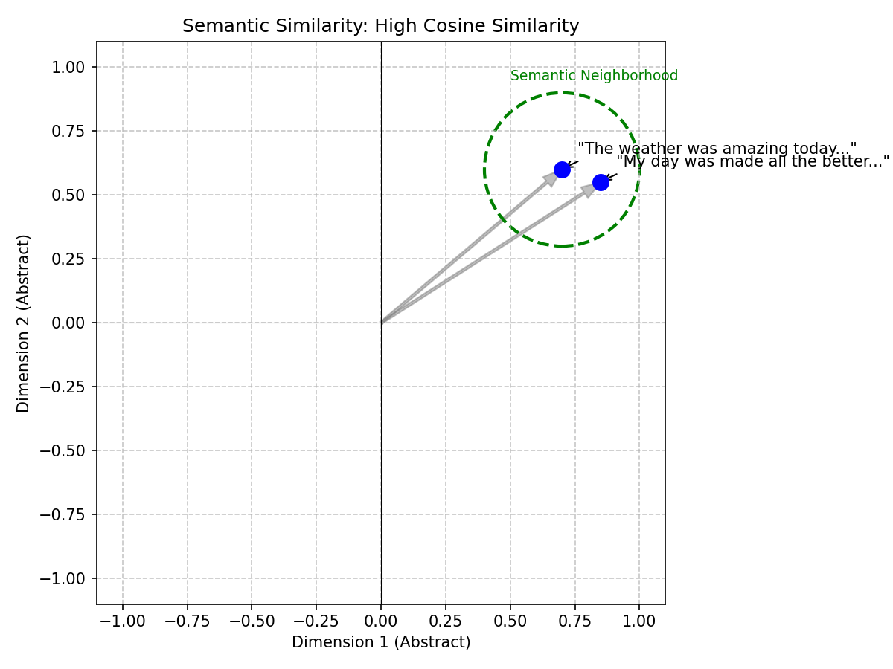
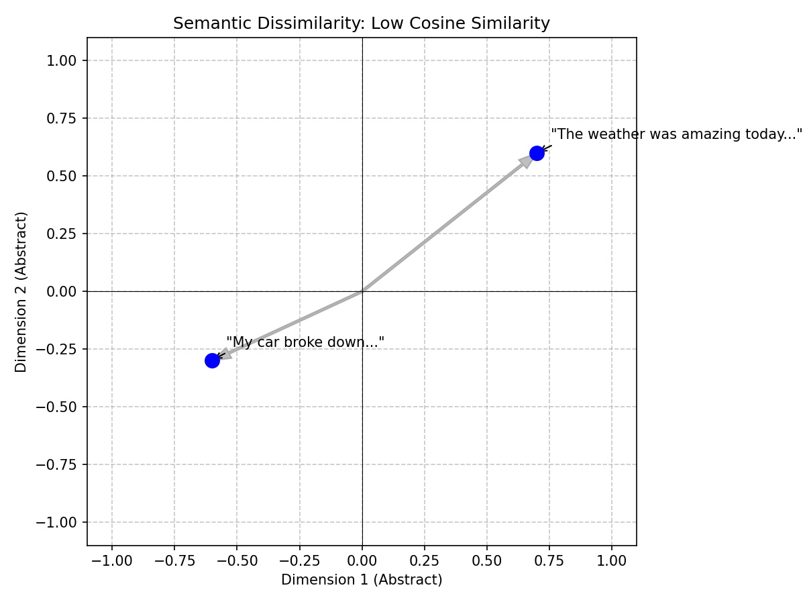
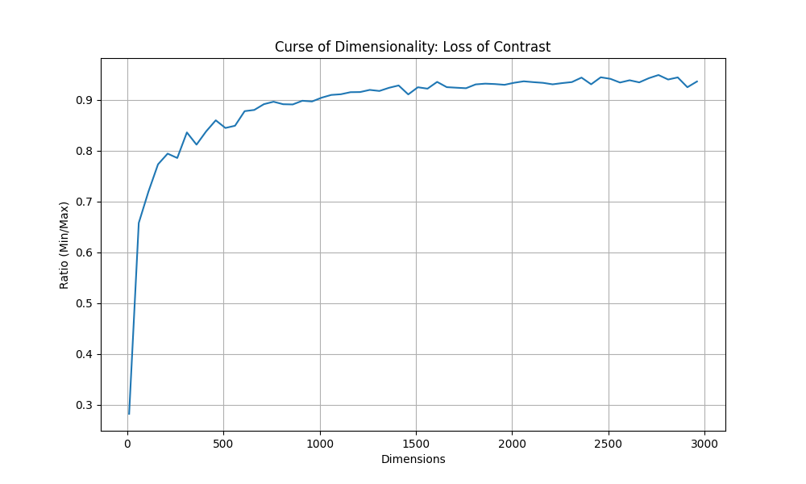
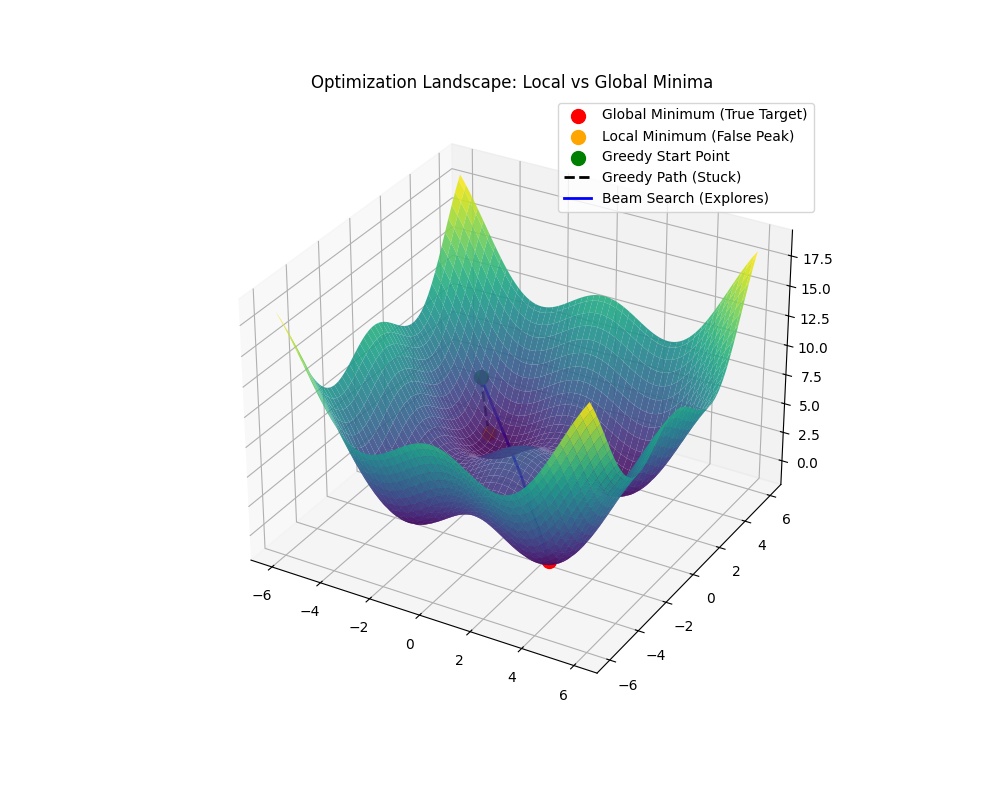


Creation of this blog post was driven by the 
human author who has many years of experience 
in education. AI tooling was used to accelerate 
content creation and peer review the
accuracy of the content.


The rise of Large Language Models (LLMs) and other Machine Learning tools such as CLIP and semantic search has made **Vector Databases** a critical component of modern infrastructure. They are the foundational retrieval engine behind **Retrieval-Augmented Generation (RAG)**, enabling AI applications to dynamically pull relevant, domain-specific context from massive datasets. But unlike traditional databases that search for exact substring matches, vector databases search for *meaning*.

For example, if we vectorize two separate images of a dog in some representation space, we should expect that those vectors should be closer together than the vectors of an image of a dog to that of an image of a car. Similarly, these two sentences embedded into a vector space should be expected to be closer together because they have similar *meaning*:

> The weather was amazing today and made me so happy!

> My day was made all the better by the beautiful weather!



And we should also expect these two sentences to have vector representations that are much further away from each other because their meanings are quite different:

> The weather was amazing today and made me so happy!

> My car broke down and I got a flat tire on the way to work!



Intuitively this makes sense, but intuition isn't good enough for computation. So how do we quantify these differences in a scalable, efficient manner?

To do this, we rely on **Approximate Nearest Neighbor (ANN)** algorithms to navigate high-dimensional spaces efficiently. This post provides an introduction to the core algorithms that empower embedding vector searching at scale.

## Out of Scope: Dense vs. Sparse Vectors
This post exclusively covers the mathematics of **Dense Vector Search**. 

Dense vectors (like embeddings from OpenAI or CLIP) are relatively low-dimensional (e.g., 384 to 3072 dimensions). Dense embeddings require evaluating similarity across (nearly) all dimensions, so high-dimensional geometry and distance concentration matter operationally.

By contrast, **Sparse Vectors** (such as traditional TF-IDF/BM25 profiles, or modern neural representations like **SPLADE** <a id="cite-32"></a>[[32]](#ref-32) and Elastic's ELSER) have massive dimensionality (often corresponding to the entire English vocabulary, e.g., 30,000+ dimensions), but they are 99% zeros. Sparse retrieval typically exploits **Inverted Indexes** (data structures that map terms directly to the list of documents containing them) so scoring touches only non-zero coordinates, changing both the cost model and failure modes. Therefore, sparse vectors do not suffer from the same geometric curse, and algorithms like HNSW or IVF are not the primary mechanisms for scaling them.

## The Classical Approach: Space Partitioning

Before we had modern vector databases or graph algorithms, we had spatial indexes. In low-dimensional spaces (like 2D maps or 3D CAD models), we solved the nearest neighbor problem using **Space Partitioning Trees**:

### KD-Trees (k-dimensional Trees)
A **KD-Tree** is a binary tree that splits the data space into two halves at every node using axis-aligned hyperplanes (hyperplanes are just n-dimensional planes).

1.  **Root**: Split the data along the X-axis (dimension 0) at the median. Points with $x < median$ go left; points with $x \ge median$ go right.
2.  **Level 1**: Split each child node along the Y-axis (dimension 1). Notice in the diagram below that the split values (e.g., $Y < 30$ vs $Y < 80$) are different for each branch because they are the **local medians** for that specific subset of points.
3.  **Level 2**: Split along the Z-axis (dimension 2), and so on, cycling through dimensions.

{}
{}
```python
class Node:
    def __init__(self, point, left=None, right=None, axis=0):
        self.point = point
        self.left = left
        self.right = right
        self.axis = axis

def build_kdtree(points, depth=0):
    if not points:
        return None
    
    k = len(points[0])  # dimensionality
    axis = depth % k    # cycle through axes
    
    # Sort points and choose median (we copy to avoid mutating the input array)
    points = points.copy()
    points.sort(key=lambda x: x[axis])
    median = len(points) // 2
    
    # Note: For production, prefer `nth_element`/partition selection and 
    # operate on index ranges to avoid repeated sorts and O(N log^2 N) copies.
    return Node(
        point=points[median],
        left=build_kdtree(points[:median], depth + 1),
        right=build_kdtree(points[median + 1:], depth + 1),
        axis=axis
    )
```
{}
{}
```go
type Node struct {
    Point []float64
    Left  *Node
    Right *Node
    Axis  int
}

func BuildKDTree(points [][]float64, depth int) *Node {
    if len(points) == 0 {
        return nil
    }

    k := len(points[0])
    axis := depth % k

    // Sort by current axis (simplified)
    sort.Slice(points, func(i, j int) bool {
        return points[i][axis] < points[j][axis]
    })

    median := len(points) / 2
    return &Node{
        Point: points[median],
        Left:  BuildKDTree(points[:median], depth+1),
        Right: BuildKDTree(points[median+1:], depth+1),
        Axis:  axis,
    }
}
```
{}
{}
```cpp
struct Node {
    std::vector<double> point;
    Node *left = nullptr;
    Node *right = nullptr;
    int axis;

    Node(std::vector<double> pt, int ax) : point(pt), axis(ax) {}
};

Node* buildKDTree(std::vector<std::vector<double>>& points, int depth) {
    if (points.empty()) return nullptr;

    int axis = depth % points[0].size();
    int median = points.size() / 2;

    // Use nth_element to find median in O(N)
    std::nth_element(points.begin(), points.begin() + median, points.end(),
        [axis](const auto& a, const auto& b) { return a[axis] < b[axis]; });

    Node* node = new Node(points[median], axis);
    
    std::vector<std::vector<double>> leftPoints(points.begin(), points.begin() + median);
    std::vector<std::vector<double>> rightPoints(points.begin() + median + 1, points.end());

    node->left = buildKDTree(leftPoints, depth + 1);
    node->right = buildKDTree(rightPoints, depth + 1);

    return node;
}
```
{}
{}

**Search**: To find the nearest neighbor, you traverse the tree from root to leaf (expected $\log N$ steps). You can **prune** entire branches of the tree if the query point is too far from the bounding box of that branch. In low dimensions ($d < 10$), this is incredibly efficient (expected / empirical under typical assumptions; worst-case can degrade).


graph TD
    Root["X < 50?"] -->|Yes| L1["Y < 30?"]
    Root -->|No| R1["Y < 80?"]
    L1 -->|Yes| LL["Leaf: Points A, B"]
    L1 -->|No| LR["Leaf: Points C, D"]
    R1 -->|Yes| RL["Leaf: Points E, F"]
    R1 -->|No| RR["Leaf: Points G, H"]


### R-Trees: Object-Centric Grouping
While KD-Trees partition the *space* (splitting the canvas like a grid, regardless of where the data is), **R-Trees** partition the *data* (grouping the ink, drawing boxes only where the points actually exist).

**The Core Concept: Minimum Bounding Rectangles (MBRs)**
An R-Tree groups nearby objects into a box described by its coordinates: $(min_x, min_y)$ and $(max_x, max_y)$.
*   **Leaf Nodes**: Contain actual data points.
*   **Internal Nodes**: Contain the "MBR" that encompasses all its children.

**The Fatal Flaw: Overlap**
Unlike KD-Trees, where a point belongs strictly to the Left *or* Right side of a split, R-Tree nodes can **overlap**. A single query point might fall inside the bounding boxes of *multiple* sibling nodes.
*   **Low Dimensions**: Overlap is minimal; search remains expected $O(\log N)$ under typical assumptions (worst-case can degrade).
*   **High Dimensions**: As dimensions rise, the "empty space" problem forces MBRs to grow larger to encompass their children. Eventually, MBRs overlap significantly. A single query might intersect with 50% of the tree's branches, destroying the pruning advantage.


graph TD
    Q("Query Point") --> Check{Intersects?}
    Check -->|Yes| A["MBR A (Branch 1)"]
    Check -->|Yes| B["MBR B (Branch 2)"]
    A --> S1["Must Search Branch 1"]
    B --> S2["Must Search Branch 2"]
    style A fill:#ffcccc,stroke:#333
    style B fill:#ffcccc,stroke:#333
    style S1 fill:#ff9999,stroke:#333
    style S2 fill:#ff9999,stroke:#333


**Search Logic**:
You calculate which MBRs intersect with your query's search radius. You must descend into **every** intersecting MBR.

### Locality Sensitive Hashing (LSH)
As practitioners realized trees failed in high dimensions, the classical "theory-first" approach shifted to **Locality Sensitive Hashing (LSH)**. Rooted in the Johnson-Lindenstrauss lemma (which provides the intuition that random projections approximately preserve pairwise distances), LSH uses random hyperplanes to hash vectors into buckets.

If two vectors are close in space, they are highly likely to fall on the same side of a random hyperplane, and thus land in the same hash bucket. While mathematically elegant, LSH requires many parallel hash tables to achieve good recall and struggles with precision compared to the modern methods we use today.

---

{}
{}
```python
class MBR:
    def __init__(self, min_coords, max_coords):
        self.min = min_coords  # [x_min, y_min, ...]
        self.max = max_coords  # [x_max, y_max, ...]

    def intersects(self, query_point, radius):
        # Accumulate squared distances across ALL dimensions
        dist_sq = 0
        for i in range(len(query_point)):
            # Per-dimension distance to the box
            delta = 0
            if query_point[i] < self.min[i]:
                delta = self.min[i] - query_point[i]
            elif query_point[i] > self.max[i]:
                delta = query_point[i] - self.max[i]
            dist_sq += delta * delta
        return dist_sq <= radius * radius
```
{}
{}
```go
type MBR struct {
    Min []float64
    Max []float64
}

func (m MBR) Intersects(query []float64, radius float64) bool {
    distSq := 0.0
    for i := range query {
        delta := 0.0
        if query[i] < m.Min[i] {
            delta = m.Min[i] - query[i]
        } else if query[i] > m.Max[i] {
            delta = query[i] - m.Max[i]
        }
        distSq += delta * delta
    }
    return distSq <= radius*radius
}
```
{}
{}
```cpp
struct MBR {
    std::vector<double> min_coords;
    std::vector<double> max_coords;

    bool intersects(const std::vector<double>& query, double radius) {
        double dist_sq = 0.0;
        for (size_t i = 0; i < query.size(); ++i) {
            double delta = 0.0;
            if (query[i] < min_coords[i]) {
                delta = min_coords[i] - query[i];
            } else if (query[i] > max_coords[i]) {
                delta = query[i] - max_coords[i];
            }
            dist_sq += delta * delta;
        }
        return dist_sq <= radius * radius;
    }
};
```
{}
{}


graph TD
    Root["Root (MBR Global)"] --> NodeA["Node A (MBR 1)"]
    Root --> NodeB["Node B (MBR 2)"]
    NodeA --> Obj1("Object 1")
    NodeA --> Obj2("Object 2")
    NodeB --> Obj3("Object 3")
    NodeB --> Obj4("Object 4")
    style Root fill:#f9f,stroke:#333,stroke-width:2px
    style NodeA fill:#ccf,stroke:#333,stroke-width:2px
    style NodeB fill:#ccf,stroke:#333,stroke-width:2px


### The Failure Mode: Why Pruning Fails in High Dimensions

**What is Pruning?**
In a search tree, "pruning" means safely ignoring an entire branch of the tree. If you know for a fact that the closest point in a branch is 10 units away, but you've already found a neighbor that is 5 units away, you don't need to enter that branch at all. You "prune" it. This is what gives trees their expected $O(\log N)$ speed—you skip most of the data since it isn't relevant to your search (though worst-case can degrade depending on parameters).

**The "High-Dimensional" Problem**
In 2D or 3D, space is "crowded" and data points are distinct. If you are in one quadrant, you are far from the others.
However, as dimensions increase ($d > 10$), a strange geometric phenomenon occurs: **points move to the edges <a id="cite-5"></a>[[5]](#ref-5).**

Imagine a high-dimensional hypercube. The volume of the cube is $1^d$. The volume of a slightly smaller inscribed cube (say, 90% size) is $0.9^d$.
*   In 2D: $0.9^2 = 0.81$ (81% of volume is in the center).
*   In 100D: $0.9^{100} \approx 0.00002$ (Almost 0% of volume is in the center!).

**The Consequence:**
Almost all data points sit on the "surface" or shell of the structure. When you query this space:
1.  Your query point is almost always near a "boundary" of the partition.
2.  The "search radius" effectively overlaps with *every* partition.
3.  You cannot prove that a branch is "too far away" because in high dimensions, **relative distance contrast collapses** (nearest and farthest distances concentrate), so 'close vs far' becomes hard to separate.

Because you can't rule out any branches, you are forced to visit them all. The tree devolves into a complicated, slow linked list, often performing *worse* than a brute-force linear scan.

## The Challenge: The Curse of Dimensionality

Before diving into the solutions, we must understand the problem. Why can't we just use a B-Tree or a KD-Tree?

In low-dimensional spaces (like 2D or 3D geographical data), structures like **KD-Trees** or **R-Trees** work beautifully. They partition space so you can quickly discard vast regions that are "too far away."

However, modern embedding models (like CLIP or OpenAI's text-embedding-3) output vectors with hundreds or thousands of dimensions (e.g., 512, 768, 1536, or 3072). In these high-dimensional spaces, a phenomenon known as the **Curse of Dimensionality** renders traditional spatial partitioning ineffective.

Mathematically, as dimension $d$ increases:
1.  **Distance Concentration <a id="cite-5-2"></a>[[5]](#ref-5)**: The ratio of the distance to the nearest neighbor vs. the farthest neighbor approaches 1. **Relative distance contrast collapses** (nearest and farthest distances concentrate), so 'close vs far' becomes hard to separate, making it impossible for the algorithm to distinguish a "clear" winner.
2.  **Empty Space**: As discussed in the **[Failure Mode](#the-failure-mode-why-pruning-fails-in-high-dimensions)** section above, volume expands exponentially, pushing all data points to the surface.

**The "Dice Roll" Intuition**:
Think of 1 dimension as rolling a single die. You can easily get a 1 (min) or a 6 (max). The "contrast" is high.
Now, think of 1,000 dimensions as summing 1,000 independent dice. According to the **Central Limit Theorem**, the sum of independent random variables tends toward a **Normal Distribution (Gaussian)**. The result will cluster tightly around the mean (3,500). It is effectively statistically impossible to roll all 1s (1,000) or all 6s (6,000).
In high dimensions, every vector is effectively a "sum of many dice." Its length (norm) and distance to others converge to a statistical mean. The "spikes" (unique features) get washed out in the law of large numbers.

**The Saving Grace: Intrinsic Dimension**
While the math above assumes embeddings are perfectly uniform across all dimensions, real-world data is inherently structured. Embeddings typically lie on much lower-dimensional manifolds (their *intrinsic dimension* is much smaller than their raw dimension $d$). This clustered, non-uniform structure is the saving grace that allows ANN algorithms to successfully partition and navigate the space despite the raw geometric curse.

**The Hubness Phenomenon**
Because of that same high-dimensional concentration, embedding spaces also exhibit "Hubness." A very small subset of dense vectors (the "hubs") end up appearing as the nearest neighbors for exponentially many uncorrelated queries, which requires careful algorithm tuning to avoid retrieving the same dominant hubs over and over.



To visualize this, here is a script to generate the "Ratio of Distances" graph shown above.

{}
{}
```python
import numpy as np
import matplotlib.pyplot as plt

def calculate_ratio(dim, num_points=1000):
    # Generate random points on unit sphere
    points = np.random.randn(num_points, dim)
    points /= np.linalg.norm(points, axis=1)[:, np.newaxis]
    
    # Calculate min/max pairwise distances
    # (Approximation: compare 1st point to all others to save time; 
    # the true min/max would check all pairs, but this serves the intuition)
    diff = points[1:] - points[0]
    dists = np.linalg.norm(diff, axis=1)
    
    return np.min(dists) / np.max(dists)

dims = range(10, 3000, 50)
ratios = [calculate_ratio(d) for d in dims]

plt.figure(figsize=(10, 6))
plt.plot(dims, ratios, label='Min/Max Distance Ratio')
plt.xlabel('Dimensions')
plt.ylabel('Ratio (Min/Max)')
plt.title('Curse of Dimensionality: Loss of Contrast')
plt.grid(True)
plt.savefig('curse_of_dimensionality.png')
print("Graph saved to curse_of_dimensionality.png")
```
{}
{}
```go
package main

import (
	"fmt"
	"math"
	"math/rand"
)

func calculateRatio(dim, numPoints int) float64 {
	points := make([][]float64, numPoints)
	for i := range points {
		points[i] = make([]float64, dim)
		var norm float64
		for j := 0; j < dim; j++ {
			v := rand.NormFloat64()
			points[i][j] = v
			norm += v * v
		}
		norm = math.Sqrt(norm)
		for j := 0; j < dim; j++ {
			points[i][j] /= norm
		}
	}

	minDist, maxDist := math.MaxFloat64, 0.0

	// Compare point 0 to all others
	for i := 1; i < numPoints; i++ {
		var distSq float64
		for k := 0; k < dim; k++ {
			diff := points[0][k] - points[i][k]
			distSq += diff * diff
		}
		dist := math.Sqrt(distSq)
		if dist < minDist { minDist = dist }
		if dist > maxDist { maxDist = dist }
	}
	return minDist / maxDist
}

func main() {
    fmt.Println("dimension,ratio")
    for dim := 10; dim <= 3000; dim += 50 {
        ratio := calculateRatio(dim, 1000)
        fmt.Printf("%d,%.4f\n", dim, ratio)
    }
    // Pipe this output to a plotting tool
}
```
{}
{}
```cpp
#include <iostream>
#include <vector>
#include <random>
#include <cmath>
#include <algorithm>
#include <iomanip>

double calculate_ratio(int dim, int num_points = 1000) {
    std::vector<std::vector<double>> points(num_points, std::vector<double>(dim));
    std::mt19937 gen(42);
    std::normal_distribution<> d(0, 1);

    for (int i = 0; i < num_points; ++i) {
        double norm_sq = 0.0;
        for (int j = 0; j < dim; ++j) {
            points[i][j] = d(gen);
            norm_sq += points[i][j] * points[i][j];
        }
        double norm = std::sqrt(norm_sq);
        for (int j = 0; j < dim; ++j) {
            points[i][j] /= norm;
        }
    }

    double min_dist = 1e9;
    double max_dist = 0.0;

    // Compare point 0 to all others
    for (int i = 1; i < num_points; ++i) {
        double dist_sq = 0.0;
        for (int k = 0; k < dim; ++k) {
            double diff = points[0][k] - points[i][k];
            dist_sq += diff * diff;
        }
        double dist = std::sqrt(dist_sq);
        min_dist = std::min(min_dist, dist);
        max_dist = std::max(max_dist, dist);
    }
    return min_dist / max_dist;
}

int main() {
    std::cout << "dimension,ratio\n";
    for (int dim = 10; dim <= 3000; dim += 50) {
        double ratio = calculate_ratio(dim);
        std::cout << dim << "," << std::fixed << std::setprecision(4) << ratio << "\n";
    }
    // Pipe this output to a plotting tool
    return 0;
}
```
{}
{}

This forces us to compromise: we trade **exactness** for **speed**, accepting "approximate" nearest neighbors (ANN) to achieve sub-linear search times.

---

## Distance Metrics: The Foundation

### Baseline: Linear Search (Exact k-NN)

Before optimizing, it's useful to know the baseline. This is the $O(N)$ approach.

> **Production Context:** While too slow for billion-scale data, this brute-force approach guarantees 100% recall. Providers often expose this explicitly (e.g., Azure AI Search calls its brute-force algorithm `exhaustiveKnn` <a id="cite-26"></a>[[26]](#ref-26)) for use cases requiring absolute precision on small, pre-filtered datasets, or to generate a gold-standard ground truth for evaluating ANN recall.

{}
{}
```python
import numpy as np

def linear_search(query, dataset):
    best_dist = float('inf')
    best_item = None
    
    for item in dataset:
        dist = np.linalg.norm(query - item)
        if dist < best_dist:
            best_dist = dist
            best_item = item
            
    return best_item, best_dist
```
{}
{}
```go
func LinearSearch(query []float64, dataset [][]float64) ([]float64, float64) {
	bestDist := math.MaxFloat64
	var bestItem []float64

	for _, item := range dataset {
		dist := EuclideanDistance(query, item)
		if dist < bestDist {
			bestDist = dist
			bestItem = item
		}
	}
	return bestItem, bestDist
}
```
{}
{}
```cpp
#include <vector>
#include <limits>
#include <cmath>

std::pair<std::vector<double>, double> linear_search(const std::vector<double>& query, const std::vector<std::vector<double>>& dataset) {
    double best_dist = std::numeric_limits<double>::max();
    std::vector<double> best_item;

    for (const auto& item : dataset) {
        double dist = euclidean_distance(query, item);
        if (dist < best_dist) {
            best_dist = dist;
            best_item = item;
        }
    }
    return {best_item, best_dist};
}
```
{}
{}

All ANN algorithms operate on a distance (or similarity) function between vectors. The choice of metric affects both the mathematics of the index and the quality of retrieval results.

### Euclidean Distance (L2)
Measures the straight-line distance between two points in $\mathbb{R}^d$:

$$d_{\text{L2}}(\mathbf{x}, \mathbf{y}) = \sqrt{\sum_{i=1}^{d} (x_i - y_i)^2}$$

### Cosine Similarity
Measures the angle between two vectors, normalized to [-1, 1]. It effectively ignores the *magnitude* of the vectors, focusing only on their direction (semantic meaning).

$$\text{cos}(\mathbf{x}, \mathbf{y}) = \frac{\mathbf{x} \cdot \mathbf{y}}{\|\mathbf{x}\| \cdot \|\mathbf{y}\|} = \frac{\sum_{i=1}^{d} x_i y_i}{\sqrt{\sum_{i=1}^{d} x_i^2} \cdot \sqrt{\sum_{i=1}^{d} y_i^2}}$$

### Inner Product (IP / Dot Product)
Used when vectors are pre-normalized:

$$\text{IP}(\mathbf{x}, \mathbf{y}) = \sum_{i=1}^{d} x_i y_i$$

{}
{}
```python
import numpy as np

def cosine_similarity(v1, v2):
    dot_product = np.dot(v1, v2)
    norm_v1 = np.linalg.norm(v1)
    norm_v2 = np.linalg.norm(v2)
    return dot_product / (norm_v1 * norm_v2)
```
{}
{}
```go
func CosineSimilarity(v1, v2 []float64) float64 {
	var dot, norm1, norm2 float64
	for i := range v1 {
		dot += v1[i] * v2[i]
		norm1 += v1[i] * v1[i]
		norm2 += v2[i] * v2[i]
	}
	if norm1 == 0 || norm2 == 0 {
		return 0
	}
	return dot / (math.Sqrt(norm1) * math.Sqrt(norm2))
}
```
{}
{}
```cpp
#include <vector>
#include <cmath>

double cosine_similarity(const std::vector<double>& v1, const std::vector<double>& v2) {
    double dot = 0.0, norm1 = 0.0, norm2 = 0.0;
    for (size_t i = 0; i < v1.size(); ++i) {
        dot += v1[i] * v2[i];
        norm1 += v1[i] * v1[i];
        norm2 += v2[i] * v2[i];
    }
    if (norm1 == 0 || norm2 == 0) return 0.0;
    return dot / (std::sqrt(norm1) * std::sqrt(norm2));
}
```
{}
{}

> **MIPS vs Distance Cheat Sheet:** 
> When working with Maximum Inner Product Search (MIPS) and distances, practitioners rely on these canonical reductions:
> *   **L2 to Dot Product Equivalency**: If you unit-normalize your vectors ($||x|| = 1$), calculating the Dot Product yields the exact same ranking as computing Cosine Similarity or Euclidean (L2) distance.
> *   **MIPS to L2 Reduction**: For unnormalized vectors, MIPS can be converted into an L2 search problem by augmenting the *data* vectors with an extra dimension $x' = [x; \sqrt{M^2 - ||x||^2}]$ (where $M \ge \max_x ||x||$). The *query* gets padded with a zero: $q' = [q; 0]$. This ensures $||x'||$ is constant, making finding the minimum L2 distance mathematically equivalent to finding the maximum inner product: $||q' - x'||^2 = ||q||^2 + M^2 - 2(q \cdot x)$.
> *   **Norm Drift**: If you rely on dot product as a proxy for cosine, you must enforce normalization; otherwise ranking differences emerge as norms vary, sometimes materially.

---

## Graph-Based Indexing: HNSW

**HNSW (Hierarchical Navigable Small World) <a id="cite-1"></a>[[1]](#ref-1)** is currently the industry standard for in-memory vector search. It works by constructing a **multi-layered proximity graph**.

### The Small World Phenomenon
A **navigable small world** graph has a special property: even though each node connects to only a few neighbors (low degree), the graph is structured so that you can hop between any two nodes in very few steps (empirically near $O(\log N)$ for typical data distributions).
*   **Intuition**: Think of the "Six Degrees of Kevin Bacon." You can connect any actor to Kevin Bacon in less than 6 steps knowing only who worked with whom.

### Multi-Layered Architecture
HNSW borrows ideas from **Skip Lists** (a linked list with "express lanes" that let you skip over 10, 50, or 100 items at a time). It builds a hierarchy of graph layers:

*   **Top Layer (Highways)**: Very few nodes. Long-range links. Allows you to "zoom" across the vector space quickly (like taking an Interstate highway).
*   **Middle Layers**: More nodes. Finer granularity (like exiting to state routes).
*   **Bottom Layer (Layer 0)**: Contains **every** vector. Used for the final, precise search (like navigating neighborhood streets).


graph TD
    subgraph L1 ["Layer 1: Interstates (Sparse)"]
        E((Entry)) -- 100km --> H((Hub))
        H -- 200km --> F((Far))
    end
    
    subgraph L0 ["Layer 0: Local Roads"]
        H_L0((Hub)) -- 5km --> N1((Node A))
        N1 -- 1km --> T((Target))
    end
    
    H -. "Exit Highway" .-> H_L0
    
    style T fill:#f96,stroke:#333,stroke-width:4px
    style H fill:#f9f,stroke:#333
    style H_L0 fill:#f9f,stroke:#333



### Search Algorithm (Greedy Routing & Beam Search)
The search uses **Greedy Routing** with a **Beam Search** buffer.

*   **Intuition (Greedy)**: Imagine driving toward a mountain peak (the Query) you can see in the distance. At every intersection (Node), you turn down the road that points most directly at the peak.
*   **Intuition (Beam Search)**: Instead of sending just one car, you send a fleet of **$ef$ (Exploration Factor)** cars. They explore slightly different routes. If one car hits a dead end (a "local minimum" where all neighbors are further away), the others can still find the peak.


graph TD
    Q((Query Peak))

    subgraph Step1 ["Step 1: Check Neighbors"]
        Current((Start)) --> N1((Node 1))
        Current --> N2((Node 2))
        Current --> N3((Node 3))
    end

    subgraph Step2 ["Step 2: Move to Best & Expand"]
        N3 --> N4((Node 4))
        N3 --> N5((Node 5))
    end

    %% Distances to Query (Dotted Lines)
    N1 -. "10m" .-> Q
    N2 -. "50m" .-> Q
    N3 -. "5m (Best)" .-> Q
    N4 -. "4m" .-> Q
    N5 -. "1m (Best)" .-> Q

    style N3 fill:#f9f,stroke:#333,stroke-width:4px
    style N5 fill:#f9f,stroke:#333,stroke-width:4px
    
    click N3 "Step 1 Winner"
    click N5 "Step 2 Winner"


#### The Algorithm Steps:
1.  **Enter** at the top layer.
2.  **Greedily traverse** to the node closest to the query.
3.  **Descend** to the next layer, using the current node as the entry point.
4.  **Repeat** until Layer 0.
5.  **Beam Search** at Layer 0:
    *   Maintain a priority queue **`W`** of size **`ef`** (Exploration Factor).
    *   `W` stores the "best candidates found so far."
    *   At each step, explore the neighbors of the closest candidate in `W`.
    *   Add them to `W` if they are closer than the worst candidate in `W` (and **drop** the worst one to keep `W` at size `ef`).
    *   Stop when no candidate in `W` yields a closer neighbor.

### Mathematical Complexity: Why ~$O(\log N)$?

Why is HNSW so fast? It comes down to the probability of layer promotion, similar to a **Skip List**.

#### HNSW Layer Assignment Logic (Code)
The core idea is **Probabilistic Layer Promotion**. Instead of balancing a tree recursively, HNSW relies on an exponential/geometric distribution parameterized by $M$ (the maximum number of neighbors per layer). By taking the negative natural logarithm of a uniform random float and scaling it by $m_L = 1 / \ln(M)$, the probability of a node reaching layer $L$ perfectly decays by a factor of $1/M$ at each step.

{}
{}
```python
import random
import math

class HNSWNode:
    def __init__(self, value, level):
        self.value = value
        # Neighbors list for each layer from 0 to level
        self.neighbors = [[] for _ in range(level + 1)]

class HNSWGraph:
    def __init__(self, M=16, max_level=16):
        self.M = M
        self.max_level = max_level
        # The normalization factor
        self.m_L = 1.0 / math.log(M)
    
    def random_level(self):
        # HNSW layer assignment follows an exponential distribution.
        # This ensures the probability of reaching layer L decays by 1/M at each step.
        f = random.uniform(0, 1)
        # Avoid log(0) edge case
        if f == 0.0:
            f = 1e-10
            
        level = int(-math.log(f) * self.m_L)
        return min(level, self.max_level)
```
{}
{}
```go
package main

import (
	"math"
	"math/rand"
)

type HNSWNode struct {
	Value     int
	Neighbors [][]int // Indexes of neighbors at each layer
}

type HNSWGraph struct {
	M        int
	MaxLevel int
	mL       float64
}

func NewHNSWGraph(m int, maxLevel int) *HNSWGraph {
	return &HNSWGraph{
		M:        m,
		MaxLevel: maxLevel,
		mL:       1.0 / math.Log(float64(m)),
	}
}

func (g *HNSWGraph) RandomLevel() int {
	// Exponential distribution scaled by 1/ln(M)
	f := rand.Float64()
	if f == 0.0 {
		f = 1e-10
	}
	
	level := int(-math.Log(f) * g.mL)
	
	if level > g.MaxLevel {
		return g.MaxLevel
	}
	return level
}
```
{}
{}
```cpp
#include <vector>
#include <cmath>
#include <random>
#include <algorithm>

struct HNSWNode {
    int value;
    std::vector<std::vector<int>> neighbors; // Neighbors for each layer
    
    HNSWNode(int v, int level) : value(v), neighbors(level + 1) {}
};

class HNSWGraph {
    int M;
    int max_level;
    double m_L;
    std::mt19937 gen;
    std::uniform_real_distribution<double> dist;

public:
    HNSWGraph(int m, int max_lvl) 
        : M(m), max_level(max_lvl), m_L(1.0 / std::log(m)), gen(42), dist(0.0, 1.0) {}

    int randomLevel() {
        // Sample from uniform(0,1), take -ln(), scale by m_L
        double f = dist(gen);
        // Avoid log(0)
        if (f == 0.0) f = 1e-10; 
        
        int lvl = static_cast<int>(-std::log(f) * m_L);
        return std::min(lvl, max_level);
    }
};
```
{}
{}

### Why "Coin Flips" and Not Distance?
You might wonder: *Why use a random coin flip? Shouldn't we pick nodes that are "far apart" to be the express hubs?*

If we knew the entire dataset in advance, we could indeed pick perfectly spaced "pillars" to form the upper layers. However, that requires expensive global analysis ($O(N)$ or $O(N^2)$) and makes adding new data difficult (you'd have to shift the pillars).

Randomness is a powerful shortcut. By promoting nodes randomly:
1.  **Distribution**: Promotion is independent of geometry, producing an *unbiased random sample of the inserted points* in higher layers. This typically yields good coverage without global optimization.
2.  **Independence**: We can insert a new node without needing to "re-balance" the rest of the graph.
3.  **Speed**: It takes $O(1)$ time to decide a node's level, versus $O(N)$ to find the "best" position.

This is the beauty of **Skip Lists** and **HNSW**: Randomness yields structure.

> **Does this make search result "random"?**
> Surprisingly, yes! Because the graph is built using random coin flips, **HNSW index builds are commonly non-deterministic in production unless you enforce determinism**. If you index the same data twice without fixing seeds and concurrency, you will get two slightly different graphs. This means for edge cases (points equidistant to multiple neighbors), consistent search results are not guaranteed across index rebuilds. We discuss this more in **[The Reality of Non-Determinism](#the-reality-of-non-determinism)**.

Let $p$ be the **promotion probability**, the chance that a node at Layer $L$ also participates in Layer $L+1$.

> **Clarification: "Existing" in multiple layers**
> Nodes are not duplicated. "Existing in Layer $L$" simply means the node has links (neighbors) at that layer. A node at the top layer has a set of neighbors for *every* layer below it, acting as a multi-level hub.


graph TD
    subgraph L2 ["Layer 2 (Express)"]
        A2((Node A)) --- B2((Node B))
    end
    
    subgraph L1 ["Layer 1 (Regional)"]
        A1((Node A)) --- B1((Node B))
        A1 --- C1((Node C))
        B1 --- D1((Node D))
    end
    
    subgraph L0 ["Layer 0 (All Nodes)"]
        A0((Node A)) --- B0((Node B))
        A0 --- C0((Node C))
        B0 --- D0((Node D))
        C0 --- E0((Node E))
        D0 --- E0((Node E))
    end
    
    %% Conceptual links showing it's the same node
    A2 -.-> A1
    A1 -.-> A0
    B2 -.-> B1
    B1 -.-> B0
    C1 -.-> C0
    D1 -.-> D0
    
    style A2 fill:#f9f,stroke:#333
    style A1 fill:#f9f,stroke:#333
    style A0 fill:#f9f,stroke:#333


**Why $p \approx 1/M$ and what is $e$?**

To understand why $p \approx 1/M$ is optimal, we need to balance the "width" of the search at each layer against the total "height" of the graph.

1.  **The Goal**: We want the total number of hops to be logarithmic, i.e., approximately $O(\log N)$ (empirically observed for most data distributions; worst-case can degrade toward linear).
2.  **The Constraint**: At each layer, we have on average $M$ connections. This means a single hop can traverse a "distance" proportional to the density of that layer.

If layer $L$ has $N_L$ nodes and layer $L+1$ has $N_{L+1}$ nodes, the "skip length" at layer $L+1$ is effectively $N_L / N_{L+1}$ times larger than at layer $L$. To utilize the $M$ connections most efficiently, the skip length should match the branching factor (the average number of neighbors each node connects to, $M$). This implies we want a reduction factor (the ratio by which the number of nodes decreases from one layer to the next) of $M$:
$$N_{L+1} \approx \frac{N_L}{M}$$

This means the probability of a node being promoted to the next layer is simply $p = 1/M$.

> **Note on $M$ in practice:** In HNSW implementations, $M$ is exposed as the **maximum neighbor cap per layer** (with layer 0 often using a larger cap, e.g., $M_0 = 2M$). The **level distribution parameter** $m_L$ is conceptually separate, though related via the derivation below. The user-facing knob is $M$ (neighbor cap); the framework derives the layer assignment internally.

**The Role of $e$ (Natural Logarithm)**
The original HNSW paper implements this using an exponential distribution to determine the *max level* of a node:
$$ \text{level} = \lfloor - \ln(\text{uniform}(0,1)) \cdot m_L \rfloor $$
where:
*   $\ln$ is the natural logarithm (base $e \approx 2.718$).
*   $m_L$ is a normalization factor, optimally set to $m_L = \frac{1}{\ln(M)}$.

Why does this work? Let's check the probability $P(\text{level} \ge l)$:
$$ P(\text{level} \ge l) = P\left(- \ln(x) \cdot \frac{1}{\ln(M)} \ge l\right) $$
$$ = P\left(\ln(x) \le -l \cdot \ln(M)\right) $$
$$ = P\left(x \le e^{-l \cdot \ln(M)}\right) $$
$$ = P\left(x \le (e^{\ln M})^{-l}\right) $$
$$ = M^{-l} = \left(\frac{1}{M}\right)^l $$
This precisely matches our requirement! The probability of reaching level $l$ decays by a factor of $1/M$ at each step.

1.  **Number of Layers**: Since the count reduces by $M$ each time, the total height is $L \approx \log_M N$.
2.  **Complexity**: Total hops = (Layers) $\times$ (Hops/Layer) $\approx \log_M N \times M$. This is very efficient for large $M$.

3.  **Total Complexity**:
While graph height adds small terms, search in Layer 0 dominates. Since we evaluate $\sim M$ neighbors for each of the $ef\_{search}$ candidates in our beam, the primary cost is:
$$ Cost \approx O(d \cdot ef\_{search} \cdot M) + \text{smaller terms} $$
where:
*   $d$: Cost of a single distance calculation
*   $ef\_{search}$: The beam width (number of candidates explored)
*   $M$: The maximum number of neighbors evaluated per candidate

**Key Tuning Parameters**:
*   **$M$**: Max links per node. Higher $M$ = better recall, higher memory.
*   **$ef\_{construction}$** (Exploration Factor): "Beam width" during build. Higher = better quality graph, slower build.
*   **$ef\_{search}$** (Exploration Factor): "Beam width" during search. Higher = better recall, slower search.

> **Why keep `ef` candidates instead of just 1?**
>
> If you only keep the single best candidate (Greedy Search), you might get stuck in a **Local Minimum** (a "false peak").
> *   Imagine you are hiking up a mountain in thick fog. You always take the steepest step up.
> *   You might reach a small hill and stop, thinking you're at the summit, because every step from there is down.
> *   But the *real* summit is across a small valley.
>
> By keeping **`ef`** candidates (e.g., 100), you explore multiple paths simultaneously. Even if your "best" candidate hits a false peak, one of the other 99 might skirt around the valley and find the true summit. `ef` buys you **diversity** in your search to avoid dead ends.


*Figure: Greedy Search (Black Dashed) gets stuck in a local minimum. Beam Search (Blue Solid) maintains diversity to find the true global minimum.*

---

## Disk-Based Indexing: DiskANN & Vamana

To break the "RAM Wall," Microsoft Research introduced **DiskANN <a id="cite-2"></a>[[2]](#ref-2)** and the **Vamana** graph. The goal: store the massive vector data on cheap NVMe SSDs while keeping search fast.

### The Vamana Graph
Unlike HNSW's multi-layer structure, Vamana builds a **single flat graph** but essentially "bakes" the shortcuts into it. It uses **$\alpha$-robust pruning** to ensure angular diversity.

**$\alpha$-Robust Pruning**:
When connecting a node $p$ to neighbors, we don't just pick the closest ones. We pick neighbors that are close *and* in different directions.
Rule: If a neighbor $c'$ is reachable via another neighbor $c$ that is closer, we prune $c'$. This forces edges to spread out like a compass, ensuring the graph doesn't get stuck in local cul-de-sacs.


graph TD
    P(("Center Node P"))
    
    subgraph K1 ["Keep (Different Direction)"]
        C(("Neighbor C"))
    end
    
    subgraph P1 ["Prune (Redundant)"]
        C_prime(("Neighbor C'"))
    end
    
    %% Edges
    P -- "Close (10m)" --> C
    P -. "Far but reachable via C (15m)" .-> C_prime
    C -- "Short hop (6m)" --> C_prime
    
    style P fill:#f9f,stroke:#333
    style C fill:#ccf,stroke:#333
    style C_prime fill:#fcc,stroke:#333,stroke-dasharray: 5 5

**Intuition**: $C'$ is "behind" $C$. We don't need a direct wire from $P$ to $C'$ because we can just hop to $C$ first. This frees up an edge slot to connect to a node in a completely different direction.

### The SSD/RAM Split
DiskANN splits the problem:
1.  **RAM**: Holds a compressed representation (Product Quantization) of every vector + a cache of the graph navigation points.
2.  **SSD**: Holds the full-precision vectors and the full graph adjacency lists.

During search, the system uses the compressed vectors in RAM to navigate "roughly" to the right neighborhood. Then, it issues **batched random reads** to the SSD to fetch full data for the most promising candidates.

**Result**: You can store billion-scale datasets with an order-of-magnitude less RAM than fully in-memory graph indexes, depending on caching and compression, with only a small latency penalty (milliseconds vs. microseconds).

---

## Partitioning: IVF (Inverted File Index)

Index partitioning algorithms like **IVF** rely on clustering to divide the dataset into manageable chunks. This approach was popularized by the **Faiss <a id="cite-4"></a>[[4]](#ref-4)** library.

### Voronoi Cells
The algorithm runs **k-means clustering** to find $K$ centroids. These centroids define **Voronoi cells**, regions of space where every point is closer to that centroid than any other.

### How It Works
1.  **Train**: Find $K$ centroids (e.g., $K = \sqrt{N}$).
2.  **Index**: Assign every vector to its nearest centroid. Store them in an "inverted list" bucket for that centroid.
3.  **Search**:
    *   Compare query to the $K$ centroids.
    *   Select the `nprobe` closest centroids.
    *   Scan *only* the vectors in those `nprobe` buckets.


graph TD
    Q((Query))
    
    subgraph Coarse ["Step 1: Coarse Quantizer (Find Centroids)"]
        C1{{Centroid 1}}
        C2{{Centroid 2}}
        C3{{Centroid 3}}
    end
    
    subgraph Fine ["Step 2: Fine Search (Scan Buckets)"]
        B1["Bucket 1 (Ignored)"]
        B2["Bucket 2 (Scanned)"]
        B3["Bucket 3 (Ignored)"]
        
        vec1[Vector A]
        vec2[Vector B]
        vec3[Vector C]
    end
    
    %% Edges
    Q -- "Dist: 10" --> C1
    Q -- "Dist: 2 (Closest)" --> C2
    Q -- "Dist: 8" --> C3
    
    C1 -.-> B1
    C2 -.-> B2
    C3 -.-> B3
    
    B2 --- vec1
    B2 --- vec2
    B2 --- vec3
    
    style C2 fill:#f9f,stroke:#333,stroke-width:2px
    style B2 fill:#ccf,stroke:#333,stroke-width:2px
    style Q fill:#ff9,stroke:#333


**Trade-off**: Higher `nprobe` = better recall but slower search.
**Weakness**: If a query lands near the edge of a cell, its true nearest neighbor might be just across the border in a cell you didn't check.

---

## Compression: Quantization

To reduce memory usage further, we use **Quantization**. This is "lossy compression" for vectors.

### Product Quantization (PQ)
In an IVF architecture, quantizing the raw vector throws away too much information. Instead, we typically compute the **residual vector** ($r = x - c(x)$), which is the difference between the vector and its cluster centroid, and quantize *that*.

PQ splits this high-dimensional residual vector (e.g., 768d) into $m$ sub-vectors (e.g., 96 blocks of 8d each).
It runs k-means on *each sub-space* to create a codebook (usually 256 centroids per sub-space, fitting in 1 byte).

*   **Original**: 768 floats $\times$ 4 bytes = 3,072 bytes.
*   **PQ**: 96 chunks $\times$ 1 byte = 96 bytes.
*   **Compression Ratio**: 32x.

{}
{}
```python
import numpy as np
from sklearn.cluster import KMeans

def train_pq(vectors, m=96):
    dim = vectors.shape[1]
    assert dim % m == 0, "Dimension must be perfectly divisible by m"
    sub_dim = dim // m
    codebooks = []
    
    for i in range(m):
        # Extract sub-vectors for this subspace
        start = i * sub_dim
        end = (i + 1) * sub_dim
        sub_vectors = vectors[:, start:end]
        
        # Train k-means (256 centroids = 1 byte)
        # Note: At scale, PQ codebooks are trained with sampling 
        # + minibatch k-means / GPU implementations.
        kmeans = KMeans(n_clusters=256)
        kmeans.fit(sub_vectors)
        codebooks.append(kmeans.cluster_centers_)
        
    return codebooks

def encode_pq(vector, codebooks):
    m = len(codebooks)
    sub_dim = len(vector) // m
    encoded = []
    
    for i in range(m):
        start = i * sub_dim
        end = (i + 1) * sub_dim
        sub_vec = vector[start:end]
        
        # Find nearest centroid ID
        centroids = codebooks[i]
        dists = np.linalg.norm(centroids - sub_vec, axis=1)
        nearest_id = np.argmin(dists)
        encoded.append(nearest_id)
        
    return encoded
```
{}
{}
```go
// Simplified conceptual code
func TrainPQ(vectors [][]float64, m int) [][][]float64 {
    // Splits vectors into m slices and runs k-means on each
    // Returns m codebooks, each with 256 centroids
    return trainKMeansPerSubspace(vectors, m) 
}

func EncodePQ(vector []float64, codebooks [][][]float64) []byte {
    m := len(codebooks)
    subDim := len(vector) / m
    encoded := make([]byte, m)
    
    for i := 0; i < m; i++ {
        subVec := vector[i*subDim : (i+1)*subDim]
        // Find closest centroid index (0-255)
        encoded[i] = findNearestCentroid(subVec, codebooks[i])
    }
    return encoded
}
```
{}
{}
```cpp
#include <vector>
#include <cmath>
#include <algorithm>
#include <limits>

using Vector = std::vector<double>;
using Codebook = std::vector<Vector>; // 256 centroids per subspace

// Simplified conceptual structure
std::vector<uint8_t> encode_pq(const Vector& vector, const std::vector<Codebook>& codebooks) {
    int m = codebooks.size();
    int sub_dim = vector.size() / m;
    std::vector<uint8_t> encoded;
    encoded.reserve(m);

    for (int i = 0; i < m; ++i) {
        // Extract sub-vector
        auto start = vector.begin() + (i * sub_dim);
        auto end = start + sub_dim;
        Vector sub_vec(start, end);

        // Find nearest centroid ID (0-255)
        double min_dist = std::numeric_limits<double>::max();
        uint8_t best_id = 0;

        for (int id = 0; id < 256; ++id) {
            double dist = 0.0;
            // Euclidean distance
            for (int k = 0; k < sub_dim; ++k) {
                double diff = sub_vec[k] - codebooks[i][id][k];
                dist += diff * diff;
            }
            if (dist < min_dist) {
                min_dist = dist;
                best_id = static_cast<uint8_t>(id);
            }
        }
        encoded.push_back(best_id);
    }
    return encoded;
}
```
{}
{}

> **Asymmetric Distance Computation (ADC):** When a query is executed, we *do not* compress the query vector. Instead, we compute the exact distance between the uncompressed query sub-vectors and the 256 possible centroids in the codebook, caching these in a fast lookup table. We then sum these pre-computed distances using the quantized data vector's integer IDs. This asymmetric method avoids dual-quantization error while remaining extremely fast.

> **Note on PQ Distances:** PQ returns an *approximation* of the true distance. In practice, systems usually fetch a larger pool of candidates (e.g., $k \times 10$) using the fast compressed index, and then **re-rank** them by calculating exact distances against the uncompressed vectors in memory to restore the final, accurate ordering.


graph TD
    subgraph Original ["Original Vector (768d)"]
        V["v1, v2, ... v8, v9 ... v16, ..."]
    end
    
    subgraph Split ["Split into Sub-spaces"]
        S1["Sub-vector 1 (8d)"]
        S2["Sub-vector 2 (8d)"]
        Sn["Sub-vector 96"]
    end
    
    subgraph Codebook ["Codebook Lookup (k-means)"]
        C1{"Find Nearest Centroid"}
        C2{"Find Nearest Centroid"}
        Cn{"Find Nearest Centroid"}
    end
    
    subgraph Compressed ["Compressed (IDs)"]
        ID1["ID: 42 (1 byte)"]
        ID2["ID: 15 (1 byte)"]
        IDn["ID: 99 (1 byte)"]
    end
    
    V --> S1
    V --> S2
    V -.-> Sn
    
    S1 --> C1 --> ID1
    S2 --> C2 --> ID2
    Sn --> Cn --> IDn
    
    style V fill:#f9f,stroke:#333
    style ID1 fill:#ccf,stroke:#333
    style ID2 fill:#ccf,stroke:#333
    style IDn fill:#ccf,stroke:#333


#### The "FS" in IVF-PQFS: Fast Scan
You might see terms like **IVF-PQFS**. The **FS** stands for **Fast Scan**.
*   **Standard PQ**: Uses lookup tables. For every sub-vector code, we jump to a table in memory to fetch the pre-computed distance. This causes **random memory access**, which is hard for the CPU to predict and cache.
*   **Fast Scan (FS)**: Optimizes this by keeping data in CPU registers to perform massive parallel computation.
    *   **4-bit PQ**: Standard PQ reduces each sub-vector to an 8-bit code (0-255 **Centroid ID**). Fast Scan uses 4-bit codes (0–15, i.e., 16 Centroid IDs). This allows **packing two codes into one byte** (e.g., bits 0-3 for one sub-vector, 4-7 for another), doubling the data density in memory.
        *   **Fun Fact**: In computer science, 4 bits is officially called a **nybble** (or **nibble**). It's a play on words: half a "byte."
    *   **SIMD Instructions** (Single Instruction, Multiple Data): These are special CPU commands (like AVX2/AVX512) that perform the same math operation on multiple numbers at once.
    *   **Skipping the Lookup Table**: In standard PQ, the code *is* an index into a distance table (requiring a RAM fetch). In FS, we load the distance table *into* the SIMD registers first. Then, we use special "shuffle/permute" instructions to compute the distance directly within the CPU register, avoiding the slow trip to fetch data from RAM.
    *   **Result**: Massive speedup because we stay in L1 cache/registers.
    *   **Trade-off**: **Reduced Accuracy**. Since we only use 4 bits (16 centroids) instead of 8 bits (256 centroids) to represent each subspace, the approximation is coarser. However, the speedup often allows searching more candidates (higher `nprobe`), effectively creating a "recall vs. speed" win.


graph TD
    subgraph RAM ["Packed Memory (1 Byte)"]
        Byte["Byte: 0xAB"]
        Hi["High Nibble: 10 (Code A)"]
        Lo["Low Nibble: 11 (Code B)"]
    end

    subgraph SIMD ["SIMD Register (Lookup Table Loaded)"]
        Reg["| Dist 0 | ... | Dist 10 (0.9) | Dist 11 (0.3) | ... | Dist 15 |"]
    end
    
    subgraph Compute ["Distance Calculation (In Register)"]
        D1["Dist for Code A: 0.9"]
        D2["Dist for Code B: 0.3"]
    end
    
    Byte --> Hi
    Byte --> Lo
    
    Hi -- "Shuffle/Permute" --> Reg --> D1
    Lo -- "Shuffle/Permute" --> Reg --> D2
    
    style Byte fill:#f9f,stroke:#333
    style Reg fill:#ccf,stroke:#333
    style D1 fill:#ff9,stroke:#333
    style D2 fill:#ff9,stroke:#333


Distance calculation uses a pre-computed lookup table, making it extremely fast.

### Scalar Quantization (SQ)
A simple approach to SQ converts each 32-bit float into an 8-bit integer (int8). Note: While production pipelines often compute a **global** min/max across the entire dataset (either per-dimension or flat) to preserve relative distances, the simplified examples below demonstrate **per-vector** min/max scaling to build intuition.
*   **Reduction**: 4x.
*   **Pros**: Very fast (SIMD optimized), decent accuracy.


graph LR
    subgraph F ["Float32 Vector"]
        F1["0.12"]
        F2["0.98"]
        F3["-0.5"]
    end
    
    subgraph Map ["Map Range [min, max]"]
        M1{"x * scale"}
    end
    
    subgraph I ["Int8 Vector"]
        I1["12"]
        I2["127"]
        I3["-64"]
    end
    
    F1 --> M1 --> I1
    F2 --> M1 --> I2
    F3 --> M1 --> I3
    
    style F1 fill:#f9f,stroke:#333
    style I1 fill:#ccf,stroke:#333


{}
{}
```python
def scalar_quantize(vector):
    # Map floats to int8 (-128 to 127) using per-vector min/max
    min_val, max_val = min(vector), max(vector)
    scale = 0 if max_val == min_val else 255 / (max_val - min_val)
    
    quantized = []
    for x in vector:
        q = int((x - min_val) * scale) - 128
        quantized.append(q)
        
    return quantized, scale, min_val
```
{}
{}
```go
func ScalarQuantize(vector []float64) ([]int8, float64, float64) {
	minVal, maxVal := vector[0], vector[0]
	for _, v := range vector {
		if v < minVal {
			minVal = v
		}
		if v > maxVal {
			maxVal = v
		}
	}

	var scale float64
	if maxVal > minVal {
		scale = 255.0 / (maxVal - minVal)
	}
	quantized := make([]int8, len(vector))

	for i, v := range vector {
		q := int((v-minVal)*scale) - 128
		if q > 127 { q = 127 }
		if q < -128 { q = -128 }
		quantized[i] = int8(q)
	}

	return quantized, scale, minVal
}
```
{}
{}
```cpp
#include <vector>
#include <algorithm>
#include <cmath>
#include <cstdint>

struct QuantizedResult {
    std::vector<int8_t> quantized;
    double scale;
    double min_val;
};

QuantizedResult scalar_quantize(const std::vector<double>& vector) {
    double min_val = vector[0];
    double max_val = vector[0];
    for (double v : vector) {
        if (v < min_val) min_val = v;
        if (v > max_val) max_val = v;
    }

    double scale = (max_val > min_val) ? 255.0 / (max_val - min_val) : 0.0;
    std::vector<int8_t> quantized;
    quantized.reserve(vector.size());

    for (double v : vector) {
        int q = static_cast<int>((v - min_val) * scale) - 128;
        if (q > 127) q = 127;
        if (q < -128) q = -128;
        quantized.push_back(static_cast<int8_t>(q));
    }

    return {quantized, scale, min_val};
}
```
{}
{}

### Binary Quantization (BQ)
The most aggressive form. Converts every dimension to a single bit (0 or 1). 
*(Note: Production BQ usually includes a learned rotation/projection, like ITQ or OPQ-style, prior to binarization to preserve recall).*
*   **Reduction**: 32x.
*   **Distance**: Hamming distance (XOR + PopCount), which is incredibly fast on modern CPUs.


graph TD
    subgraph Input ["Float32 Input (4D Example)"]
        V1["0.8"]
        V2["-0.2"]
        V3["0.1"]
        V4["-0.9"]
    end
    
    subgraph Sign ["Sign Bit Threshold (> 0)"]
        S1{> 0?}
        S2{> 0?}
        S3{> 0?}
        S4{> 0?}
    end
    
    subgraph Output ["Binary Output (1 bit per dim)"]
        B1["1"]
        B2["0"]
        B3["1"]
        B4["0"]
    end
    
    V1 --> S1 --> B1
    V2 --> S2 --> B2
    V3 --> S3 --> B3
    V4 --> S4 --> B4
    
    style B1 fill:#ccf,stroke:#333
    style B2 fill:#fcc,stroke:#333
    style B3 fill:#ccf,stroke:#333
    style B4 fill:#fcc,stroke:#333


{}
{}
```python
import numpy as np

def binary_quantize(vector):
    # If x > 0 return 1, else 0
    return np.where(vector > 0, 1, 0).astype(np.int8)

def hamming_distance(bq1, bq2):
    # XOR and count bits (popcount)
    # In pure Python/Numpy this is naive; 
    # production systems use packed bits + CPU instructions
    xor_diff = np.bitwise_xor(bq1, bq2)
    return np.sum(xor_diff)
```
{}
{}
```go
import "math/bits"

func BinaryQuantize(vector []float64) uint64 {
    // Example for 64-dim vector packing into a single uint64
    var mask uint64 = 0
    for i, v := range vector {
        if v > 0 {
            mask |= (1 << i)
        }
    }
    return mask
}

func HammingDistance(a, b uint64) int {
    // XOR + PopCount (Hardware accelerated)
    return bits.OnesCount64(a ^ b)
}
```
{}
{}
```cpp
#include <vector>
#include <cstdint>

// Simple example packing 64 dimensions into a uint64
uint64_t binary_quantize(const std::vector<double>& vector) {
    uint64_t mask = 0;
    for (size_t i = 0; i < vector.size() && i < 64; ++i) {
        if (vector[i] > 0) {
            mask |= (1ULL << i);
        }
    }
    return mask;
}

int hamming_distance(uint64_t a, uint64_t b) {
    // XOR + PopCount (CPU instruction)
    // GCC/Clang intrinsic for efficient population count
    return __builtin_popcountll(a ^ b);
    // In C++20, you can use: std::popcount(a ^ b);
}
```
{}
{}

**Cons**: Significant accuracy loss unless dimensions are very high. Often used with a Re-ranking step.

### Anisotropic Quantization (ScaNN)
Google's **ScaNN <a id="cite-3"></a>[[3]](#ref-3)** (Scalable Nearest Neighbors) improves on PQ.
Standard PQ minimizes the overall error $||\mathbf{x} - q(\mathbf{x})||^2$ (Euclidean distance). It treats error in all directions equally.

ScaNN realizes that for **Maximum Inner Product Search (MIPS)**, only the component of the error that aligns with the query vector matters. Error perpendicular to the query barely changes the dot product.

**The Trick**: Since the query vector $\mathbf{q}$ is unknown at training time, ScaNN assumes that for high inner-product matches, $\mathbf{q}$ will be roughly parallel to the datapoint $\mathbf{x}$. Therefore, it heavily weighs quantization error that is **parallel** to $\mathbf{x}$ in the loss function, while mostly ignoring orthogonal error.


graph TD
    subgraph Conceptual ["Loss Minimization Strategy"]
        X(Data Vector X)
        Err_Para["Parallel Error (Along X)"]
        Err_Ortho["Orthogonal Error (Perpendicular to X)"]
        
        X -- "High Weight (Critical)" --> Err_Para
        X -- "Low Weight (Ignorable)" --> Err_Ortho
        
        Err_Para --> Bad["Messes up Dot Product Ranking"]
        Err_Ortho --> OK["Ranking Preserved"]
    end
    
    style Bad fill:#fcc,stroke:#333
    style OK fill:#ccf,stroke:#333
    style Err_Para fill:#ff9,stroke:#333
    style Err_Ortho fill:#eef,stroke:#333


Mathematically, it minimizes the **anisotropic** loss. The loss function assigns a much larger weight ($w_{\parallel}$) to the parallel error than to the orthogonal error ($w_{\perp}$):

$$ \text{Loss} \approx w\_{\parallel} || \mathbf{x}\_{\parallel} - \tilde{\mathbf{x}}\_{\parallel} ||^2 + w\_{\perp} || \mathbf{x}\_{\perp} - \tilde{\mathbf{x}}\_{\perp} ||^2 $$

where $w_{\parallel} \gg w_{\perp}$. This forces the model to focus its "compression budget" on the direction that actually matters for dot products.

Think of it like a flashlight beam: ScaNN allows more error in the shadows (perpendicular) but strictly enforces accuracy in the beam of light (parallel). This yields higher recall for the same compression ratio.

---

## The Reality of Non-Determinism

A critical "gotcha" in vector search is that widely used ANN algorithms are **non-deterministic**. Running the same query twice might yield slightly different results.

**Why?**
1.  **Insertion Order**: In HNSW, the graph topology depends on the order data arrived.
2.  **Concurrency**: Live updates during a search can shift the graph under your feet.
3.  **Random Initialization**: k-means (for IVF/PQ) starts with random seeds.
4.  **Floating-Point Math**: SIMD instructions accumulate floating point numbers in different orders, leading to tiny rounding differences that can flip the order of two nearly-identical vectors.

**Mitigations**: For use cases where reproducibility is required, several strategies can be combined:
*   **Deterministic build seeds** and **fixed insertion ordering** to produce identical graphs.
*   **Snapshotting immutable index versions** so queries always run against the same graph.
*   **Disabling concurrent mutation** during query execution.
*   **Deterministic BLAS/SIMD settings** to eliminate floating-point accumulation order differences.
*   **Exact k-NN reranking** on a bounded candidate set as the gold-standard fallback.

For forensic or legal use cases, an **Exact k-NN fallback** (brute force) on a time-bounded window of data remains the strongest guarantee.

---

## How to Measure and Tune ANN

While the mathematical guarantees are elegant, tuning an ANN index in production requires a methodical, empirical approach. Because search complexity and recall are highly parameter-dependent (`ef_search`, `nprobe`, degree bounds, cache misses, etc.), follow this simple recipe:

1.  **Define the Ground Truth**: Generate a held-out test dataset of queries. Run **Exact k-NN** to find the true top-K neighbors.
2.  **Target Recall@k**: Choose a target recall metric (e.g., Recall@10 = 0.95 means that on average, 9.5 out of the 10 true nearest neighbors are returned).
3.  **Sweep the Parameters**:
    *   For **HNSW**: Plot a curve by sweeping `ef_search` (while fixing $M$).
    *   For **IVF**: Plot a curve by sweeping `nprobe`.
4.  **Measure Latency & QPS**: For each parameter step, measure the **p95 latency** and total **Query Per Second** (QPS) throughput.
5.  **Add a Reranking Step (Optional)**: Often it's faster to return 50 coarse candidates from an ANN and manually calculate the exact distance (reranking) to return the top 10.

By plotting Recall on the X-axis and QPS on the Y-axis, you create a curve to visualize exactly what performance costs.

---

## Summary Table

| Algorithm | Search Complexity | Typical Memory | Latency | Use Case |
|:---|:---|:---|:---|:---|
| **Exact k-NN** | $O(N \cdot d)$ | 100% (High) | Seconds | Ground truth, small data |
| **HNSW** | Emp. $O(\log N)$ | Formula (see below) | < 1 ms | Real-time, expensive |
| **IVF-PQ** | $O(\text{nprobe} \cdot N/K)$ | 5-10% (Low) | 1-10 ms | Balanced, large scale |
| **IVF-PQFS** | $O(\text{nprobe} \cdot N/K)$ (SIMD) | 2-5% (Very Low) | < 2 ms | High throughput, compressed |
| **DiskANN** | Emp. $O(\log N)$ + Disk I/O | Low (PQ + cache), config-dependent | 2-10 ms | Massive scale, cost-effective |
| **ScaNN** | Optimized IVF-PQ | 5-10% (Low) | < 5 ms | High accuracy / Google Cloud |
| **SingleStore** | Hybrid (HNSW / IVF) | Config-dependent | 1-10 ms | HTAP (SQL + Vector) |

> **Estimating HNSW Memory Overhead:**
> Saying HNSW takes "140% memory" is a rule-of-thumb that breaks down across different dimensions and ID widths. A more accurate memory formula for HNSW is:
> 
> $\text{Total RAM} \approx \text{Dataset Size} + \text{Graph Overhead}$  
> $\text{Dataset Size} = N \times d \times \text{bytes\_per\_dim}$  
> $\text{Graph Overhead} \approx N \times \left(M_0 + \frac{M}{M-1}\right) \times \text{bytes\_per\_link}$
> *(Where $M_0 + \frac{M}{M-1}$ represents the expected adjacency count under the level distribution, not a hard guarantee).*
> 
> *Example:* 1 Million 768-dimensional float32 vectors with $M=16, M_0=32$ (using 8-byte pointers):
> *   Data: $10^6 \times 768 \times 4 \approx 3.07 \text{ GB}$
> *   Graph: $10^6 \times (32 + 16/15) \times 8 \approx 0.264 \text{ GB}$ (plus allocator overhead)
> *   Here, the graph overhead is ~8-9%. (Note: Layer 0 often uses $M_0=2M$, which roughly doubles adjacency memory vs $N \times M$). However, for 128-dimensional int8 vectors, the graph footprint eclipses the data payload, pushing overhead to 100-200%!

Most modern production systems use a hybrid approach: **HNSW** for the hot, recent data, and **DiskANN** or **IVF-PQ** for the massive historical archive.

## Production Realities: Filtering and Hybrid Search
Before leaving the algorithms behind, it is crucial to acknowledge three operational realities that drastically impact vector search in production:

1.  **Filtered ANN**: Real systems almost always include metadata filters (e.g., `"only docs from user X"`, `"only last 30 days"`). Applying these filters breaks the core assumptions of ANN graphs. Naively pre-filtering or constraining the traversal can fragment the graph and crater recall. Some systems mitigate this with bitset-aware traversal algorithms or filtered vector indexes (storing attributes on the index side, e.g., Spanner's `STORING` clause) <a id="cite-15"></a>[[15]](#ref-15).
2.  **Hybrid Search (BM25 + Vectors)**: Dense vectors are excellent for semantic meaning but terrible for exact keyword matching (like searching for a specific product ID or an obscure acronym). The industry standard approach is **Hybrid Search**: running a dense vector search concurrently with a sparse lexical search (like BM25), and then fusing the results together using an algorithm like **Reciprocal Rank Fusion (RRF)** <a id="cite-34"></a>[[34]](#ref-34) for optimal relevance.
3.  **Dynamic Index Maintenance**: Vector indices aren't static. In production, updating and deleting vectors usually relies on soft-deletes (tombstones) because surgically removing nodes from a highly connected HNSW graph is mathematically destructive. This requires background graph repair, periodic segment-based merging/rebuilds, and introduces write-amplification tradeoffs (especially for on-disk indices).


---
*Diagrams generated using Mermaid.js syntax.*


graph TD
    A["Start: Vector Storage Selection"] --> B{"Data Scale?"}
    B -->|"Small (<1M)"| C["HNSW / Flat"]
    B -->|"Medium (1M-100M)"| D{"Memory Budget?"}
    D -->|"High"| C
    D -->|"Low"| E["IVF-PQ / SQ"]
    B -->|"Massive (>100M)"| F{"Hardware / Priority?"}
    F -->|"Disk-Based (Cost)"| G["DiskANN (Vamana)"]
    F -->|"High QPS (Latency)"| H["ScaNN (Anisotropic VQ)"]
    F -->|"Max Throughput"| I["IVF-PQ Fast Scan"]


> **Note on Algorithms vs. Services:**
> *   **Google Cloud Spanner** supports **exact kNN** vector similarity search by ordering on vector distance functions (GoogleSQL: `COSINE_DISTANCE`, `EUCLIDEAN_DISTANCE`, `DOT_PRODUCT`; PostgreSQL: `spanner.cosine_distance`, `spanner.euclidean_distance`, `spanner.dot_product`). If embeddings are normalized, using dot product is a valid ranking-equivalent choice <a id="cite-16"></a>[[16]](#ref-16). For lower-latency **approximate nearest neighbor (ANN)** search at larger scales, Spanner supports **tree-based VECTOR INDEXes** queried via `APPROX_*` distance functions (for example `APPROX_COSINE_DISTANCE`) with tuning options such as `num_leaves_to_search` to trade recall for latency/cost. ANN vector search requires Enterprise / Enterprise Plus and **does not support the PostgreSQL interface** <a id="cite-17"></a>[[17]](#ref-17). Spanner also supports **filtered vector indexes** by storing selected non-vector columns in the vector index to enable index-side filtering <a id="cite-15"></a>[[15]](#ref-15).
> *   **ScaNN** is the proprietary algorithm powering **Google Vertex AI Vector Search** <a id="cite-6"></a>[[6]](#ref-6).
> *   **DiskANN** is used across multiple Microsoft offerings (e.g., SQL Server vector indexes <a id="cite-7"></a>[[7]](#ref-7); Cosmos DB DiskANN features). **Azure AI Search** uses **HNSW** / exhaustive KNN for its vector indexes <a id="cite-26"></a>[[26]](#ref-26).
> *   **Milvus** supports DiskANN-based on-disk indexing (Vamana graphs) and HNSW for in-memory search <a id="cite-9"></a>[[9]](#ref-9).
> *   **LanceDB** supports IVF/PQ-style approaches today with DiskANN-related support emerging <a id="cite-10"></a>[[10]](#ref-10) (check current docs/releases for the latest).
> *   **HNSW** is the primary or default in-memory engine across the vast majority of the ecosystem, including **Milvus**, **Weaviate**, **MongoDB Atlas Vector Search** <a id="cite-29"></a>[[29]](#ref-29), and **Databricks Vector Search** (Mosaic AI) <a id="cite-30"></a>[[30]](#ref-30). **Pinecone** is often described as using proprietary HNSW-like or graph-based algorithms.
> *   **Elasticsearch** comprehensively supports vector search by leveraging Lucene's native **HNSW** for dense vector similarity, while also offering **sparse vector search** (via its ELSER model for semantic expansion) and higher-level workflow abstractions like `semantic_text` <a id="cite-28"></a>[[28]](#ref-28) <a id="cite-31"></a>[[31]](#ref-31).
> *   **SingleStore** supports **IVF**, **IVF-PQ**, and **HNSW** (Faiss-based), with PQ fast-scan-style optimizations depending on configuration <a id="cite-11"></a>[[11]](#ref-11) <a id="cite-12"></a>[[12]](#ref-12).

> **Service capabilities change frequently; verified against vendor docs as of 2026-02.** Cells without direct citations are best-effort and may change; check vendor docs for your region/SKU.

### Algorithm Support by Service

| Service | HNSW | IVF-Flat | IVF-PQ | IVF-PQFS | DiskANN | ScaNN | Flat / Brute-Force |
|:---|:---:|:---:|:---:|:---:|:---:|:---:|:---:|
| **Google Vertex AI** <a id="cite-6"></a>[[6]](#ref-6) | — | — | — | — | — | ✅ | — |
| **Google AlloyDB** <a id="cite-13"></a>[[13]](#ref-13) <a id="cite-14"></a>[[14]](#ref-14) | ✅ | ✅ | — | — | — | ✅ | ✅ |
| **Google Cloud Spanner** <a id="cite-15"></a>[[15]](#ref-15) <a id="cite-17"></a>[[17]](#ref-17) | — | — | — | — | — | ✅ | ✅ |
| **Azure AI Search** <a id="cite-26"></a>[[26]](#ref-26) | ✅ | — | — | — | — | — | ✅ |
| **Azure Cosmos DB** <a id="cite-18"></a>[[18]](#ref-18) | — | — | — | — | ✅ | — | ✅ |
| **SQL Server** <a id="cite-7"></a>[[7]](#ref-7) | — | — | — | — | ✅ | — | — |
| **Elasticsearch** <a id="cite-28"></a>[[28]](#ref-28) | ✅ | — | — | — | — | — | ✅ |
| **Databricks** <a id="cite-30"></a>[[30]](#ref-30) | ✅  | — | — | — | — | — | ✅ |
| **MongoDB Atlas** <a id="cite-29"></a>[[29]](#ref-29) | ✅  | — | — | — | — | — | ✅ |
| **Milvus / Zilliz** <a id="cite-19"></a>[[19]](#ref-19) <a id="cite-20"></a>[[20]](#ref-20) | ✅ | ✅ | ✅ | — | ✅ | ✅ | ✅ |
| **Pinecone** <a id="cite-21"></a>[[21]](#ref-21) | *(opaque)* | — | — | — | — | — | — |
| **Weaviate** <a id="cite-22"></a>[[22]](#ref-22) | ✅ | — | — | — | — | — | ✅ |
| **SingleStore** <a id="cite-11"></a>[[11]](#ref-11) <a id="cite-23"></a>[[23]](#ref-23) | ✅ | ✅ | ✅ | ✅ | — | — | — |
| **LanceDB** <a id="cite-24"></a>[[24]](#ref-24) | ✅ | ✅ | ✅ | — | — | — | — |
| **pgvector (PostgreSQL)** <a id="cite-25"></a>[[25]](#ref-25) | ✅ | ✅ | — | — | — | — | ✅ |

*✅ = Supported, (opaque) = Not publicly specified, — = Not available or not documented.*


**Why no Chroma, Qdrant, or raw Faiss?** This table focuses on **production-scale managed services and databases** with broad portfolios of algorithm choices. Dedicated vector stores like **Qdrant** (which uses a custom native HNSW implementation) and **ChromaDB** (which wraps a fork of `hnswlib`) are excellent for many workloads but don't expose the breadth of disparate indexing strategies (like IVF-PQ or DiskANN) compared above. Similarly, **Faiss** is a *library*, not a managed service—it supports nearly every algorithm in this table (HNSW, IVF-Flat, IVF-PQ, IVF-PQFS, Flat) and is the engine *behind* several services listed here (e.g., SingleStore, Milvus).


## References

1.  **<a id="ref-1"></a>Malkov, Y. A., & Yashunin, D. A. (2018).** *[Efficient and robust approximate nearest neighbor search using Hierarchical Navigable Small World graphs](https://arxiv.org/abs/1603.09320).* IEEE TPAMI. [↩](#cite-1)
2.  **<a id="ref-2"></a>Subramanya, S. J., et al. (2019).** *[DiskANN: Fast Accurate Billion-point Nearest Neighbor Search on a Single Node](https://www.microsoft.com/en-us/research/publication/diskann-fast-accurate-billion-point-nearest-neighbor-search-on-a-single-node/).* NeurIPS. [↩](#cite-2)
3.  **<a id="ref-3"></a>Guo, R., et al. (2020).** *[Accelerating Large-Scale Inference with Anisotropic Vector Quantization (ScaNN)](https://arxiv.org/abs/1908.10396).* ICML. [↩](#cite-3)
4.  **<a id="ref-4"></a>Johnson, J., et al. (2019).** *[Billion-scale similarity search with GPUs (Faiss)](https://arxiv.org/abs/1702.08734).* IEEE Transactions on Big Data. [↩](#cite-4)
5.  **<a id="ref-5"></a>Aggarwal, C. C., Hinneburg, A., & Keim, D. A. (2001).** *[On the Surprising Behavior of Distance Metrics in High Dimensional Space](https://bib.dbvis.de/uploadedFiles/155.pdf).* ICDT 2001. [↩](#cite-5)
6.  **<a id="ref-6"></a>Google Cloud.** *[Vector Search overview | Vertex AI](https://docs.cloud.google.com/vertex-ai/docs/vector-search/overview).* [↩](#cite-6)
7.  **<a id="ref-7"></a>Microsoft.** *[Vector Search & Vector Index - SQL Server](https://learn.microsoft.com/en-us/sql/sql-server/ai/vectors?view=sql-server-ver17).* [↩](#cite-7)
8.  **<a id="ref-8"></a>Microsoft.** *[Vector indexes in Azure AI Search](https://learn.microsoft.com/en-us/azure/search/vector-store).* [↩](#cite-8)
9.  **<a id="ref-9"></a>Milvus.** *[On-disk Index | Milvus Documentation](https://milvus.io/docs/disk_index.md).* [↩](#cite-9)
10. **<a id="ref-10"></a>LanceDB.** *[Add LanceDB to ANN benchmarks · Issue #220](https://github.com/lancedb/lancedb/issues/220).* GitHub. [↩](#cite-10)
11. **<a id="ref-11"></a>SingleStore.** *[Announcing SingleStore Indexed ANN Vector Search](https://www.singlestore.com/blog/singlestore-indexed-ann-vector-search/).* [↩](#cite-11)
12. **<a id="ref-12"></a>SingleStore.** *[Tuning Vector Indexes and Queries](https://docs.singlestore.com/cloud/developer-resources/functional-extensions/tuning-vector-indexes-and-queries/).* [↩](#cite-12)
13. **<a id="ref-13"></a>Google Cloud.** *[Create an IVFFlat index | AlloyDB for PostgreSQL](https://docs.cloud.google.com/alloydb/docs/ai/create-ivfflat-index).* [↩](#cite-13)
14. **<a id="ref-14"></a>Google Cloud.** *[ScaNN for AlloyDB: How it compares to pgvector HNSW](https://cloud.google.com/blog/products/databases/how-scann-for-alloydb-vector-search-compares-to-pgvector-hnsw).* [↩](#cite-14)
15. **<a id="ref-15"></a>Google Cloud.** *[Create and manage vector indexes | Spanner](https://docs.cloud.google.com/spanner/docs/vector-indexes).* [↩](#cite-15)
16. **<a id="ref-16"></a>Google Cloud.** *[Perform vector similarity search in Spanner by finding the K-nearest neighbors](https://docs.cloud.google.com/spanner/docs/find-k-nearest-neighbors).* [↩](#cite-16)
17. **<a id="ref-17"></a>Google Cloud.** *[Find approximate nearest neighbors (ANN) and query vector embeddings | Spanner](https://docs.cloud.google.com/spanner/docs/find-approximate-nearest-neighbors).* [↩](#cite-17)
18. **<a id="ref-18"></a>Microsoft.** *[Create a Vector Index - Azure AI Search](https://learn.microsoft.com/en-us/azure/search/vector-search-how-to-create-index).* [↩](#cite-18)
19. **<a id="ref-19"></a>Microsoft.** *[Vector search in Azure Cosmos DB for NoSQL](https://learn.microsoft.com/en-us/azure/cosmos-db/vector-search).* [↩](#cite-19)
20. **<a id="ref-20"></a>Milvus.** *[In-memory Index | Milvus Documentation](https://milvus.io/docs/index.md).* [↩](#cite-20)
21. **<a id="ref-21"></a>Milvus.** *[SCANN | Milvus Documentation](https://milvus.io/docs/scann.md).* [↩](#cite-21)
22. **<a id="ref-22"></a>Pinecone.** *[Nearest Neighbor Indexes for Similarity Search](https://www.pinecone.io/learn/series/faiss/vector-indexes/).* [↩](#cite-22)
23. **<a id="ref-23"></a>Weaviate.** *[Vector index | Weaviate Documentation](https://docs.weaviate.io/weaviate/config-refs/indexing/vector-index).* [↩](#cite-23)
24. **<a id="ref-24"></a>SingleStore.** *[Vector Indexing | SingleStore Documentation](https://docs.singlestore.com/cloud/reference/sql-reference/vector-functions/vector-indexing/).* [↩](#cite-24)
25. **<a id="ref-25"></a>LanceDB.** *[Vector Indexes | LanceDB Documentation](https://docs.lancedb.com/indexing/vector-index).* [↩](#cite-25)
26. **<a id="ref-26"></a>pgvector.** *[pgvector: Open-source vector similarity search for PostgreSQL](https://github.com/pgvector/pgvector).* GitHub. [↩](#cite-26)
27. **<a id="ref-27"></a>Microsoft.** *[Create a vector index in Azure AI Search](https://learn.microsoft.com/en-us/azure/search/vector-search-how-to-create-index).* [↩](#cite-27)
28. **<a id="ref-28"></a>Elasticsearch.** *[k-nearest neighbor (kNN) search | Elasticsearch Guide](https://www.elastic.co/guide/en/elasticsearch/reference/current/knn-search.html).* [↩](#cite-28)
29. **<a id="ref-29"></a>MongoDB.** *[Atlas Vector Search Overview | MongoDB Documentation](https://www.mongodb.com/docs/atlas/atlas-vector-search/vector-search-overview/).* [↩](#cite-29)
30. **<a id="ref-30"></a>Databricks.** *[Mosaic AI Vector Search | Databricks Documentation](https://docs.databricks.com/en/generative-ai/vector-search.html).* [↩](#cite-30)
31. **<a id="ref-31"></a>Elasticsearch.** *[Vector search in Elasticsearch | Elastic Docs](https://www.elastic.co/docs/solutions/search/vector).* [↩](#cite-31)
32. **<a id="ref-32"></a>Formal, T., et al. (2021).** *[SPLADE: Sparse Lexical and Expansion Model for First Stage Ranking](https://arxiv.org/abs/2107.05720).* SIGIR. [↩](#cite-32)
33. **<a id="ref-33"></a>Google Cloud.** *[Vector indexes | Spanner](https://docs.cloud.google.com/spanner/docs/vector-indexes).* [↩](#cite-33)
34. **<a id="ref-34"></a>Cormack, G. V., Clarke, C. L. A., & Buettcher, S. (2009).** *[Reciprocal Rank Fusion Outperforms Condorcet and Individual Rank Learning Methods](https://dl.acm.org/doi/10.1145/1571941.1572114).* SIGIR. [↩](#cite-34)
