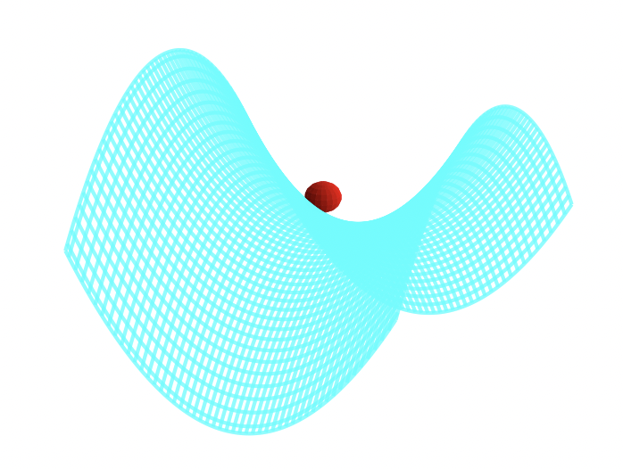

In order to conduct quantum mechanics oriented experiments or operate ion-trap based quantum computers, 
we have to have a way to manipulate small particles. For example, if we want to see the 
behavior of an ion when we hit it with lasers of certain frequency, we will need to keep it confined in a small area. How can we do so?

## What is the Quadrupole Ion Trap (AKA the RF Paul ion trap)?

One way to confine an atomic ion is to provide a force of the form \\(F = -kr\\). 
What would this entail for an electrical potential? Since the electric field is proportional to the force, and is equal to the divergence of the potential, 
we might use a electric potential of the form:

$$\Phi \propto (\alpha x^2 + \beta y^2 + \gamma z^2)$$

That is, we require an electric quadrupole field. 

This equation must obey that condition imposed on all potentials where there is no free charge distribution, namely that:

$$\nabla^2\Phi = 0 \rightarrow \alpha + \beta + \gamma = 0$$

We can satisfy this in more than one way. For the linear Paul Trap, whose initial manifestations were not as a 
trap but as a focusing tunnel of sorts, but which can be turned into a 'race track' ion trap:

{}
$$\alpha = 1 = -\gamma, \beta = 0 \rightarrow \Phi = \frac{\Phi_0}{2r_0^2}(x^2 - z^2)     $$
{}

For the "ionenkäfig", the chamber rf Paul ion trap that restrains ions in a chamber:

{}
$$\alpha = \beta = 1, \gamma = -2 \rightarrow \Phi = \frac{\Phi_0}{r_0^2 + 2z_0^2}(r^2 - 2z^2)$$

we can make this look similar to the race track potential by defining \\( 2d_0^2 = r_0^2 + 2z_0^2\\) and \\(\zeta = \sqrt{2} z\\):

$$\frac{\Phi_0}{2d_0^2}(r^2 - \zeta^2)$$


{}

This figure (from reference [1]) shows a diagram of an idealized rf Paul trap (a) and the chamber rf Paul trap (b):




Such potentials can be provided via hyperbolic-shaped electrodes. We can perform a successive over relaxation of a cross section of these electrodes and find that indeed a two-dimensional stable equilibrium is created at the center (though this is unstable in the third dimension, z) when we satisfy the above conditions (focusing on the chamber trap):

 

We have a repulsive force in the z direction which must be avoided. Unfortunately, [Earnshaw's theorem](https://en.wikipedia.org/wiki/Earnshaw%27s_theorem) tells us that it isn't possible to make an electric potential whose result is confining in all three dimensions of space. We can make a potential which results in an _average_ confining force. This can be done via the clever mechanism of rotating the field so that the focusing and defocusing is applied alternatively in each direction. If done at the right set of frequencies, the ion will maintain a stable orbit near the center of the ion trap.

 


A way to visualize this is with W. Paul's mechanical analog [1, 2]. Paul made an equivalent potential as that described above by carving an hyperbolic saddle surface out of plexiglass. Placing a ball on top of this surface would result in the ball falling off of it, of course. But if the surface is rotated at a proper rate, the ball will stay on the surface.

 

<!--  -->

The applied oscillating potential can be written:

$$\Phi_0 = U + V \cos \omega t     $$

If the particle has a charge e and mass m, then its equation of motion are (this is a blog post, so I'm going to swap \\(\zeta\\) for \\(z\\) and \\(d_0^2\\) for \\(r_0^2\\) to make both writing and reading this easier on author/reader):

$$
\begin{align*}
\ddot{r} + \frac{e}{2mr_0^2}(U + V \cos \omega t)r &= 0 \\\\
\ddot{z} - \frac{e}{2mr_0^2}(U + V \cos \omega t)z &= 0
\end{align*}
$$


These equations can be cast as Mathieu's equation:

$$\ddot{\eta} + \left(a - 2q \cos(2\tau)\right)\eta = 0$$

The variables are dimensionless for this equation, so we have a little work to do to massage our motion equations into this form.

{}

For the \\( z \\)-direction, the equation of motion is:

$$\ddot{z} - \frac{e}{2mr_0^2}(U + V \cos \omega t)z = 0$$

Since we are removing dimensionality in the \\(t\\) variable by setting \\( \tau = \omega t / 2\\),

$$ \ddot{z} = \frac{\omega^2}{4}\frac{d^2r}{d\tau^2} $$

We define:

$$
a = -\frac{4eU}{2mr_0^2\omega^2}, \quad q = \frac{2eV}{2mr_0^2\omega^2}, \quad \tau = \frac{\omega t}{2}
$$

The equation of motion can be rewritten as:

$$\ddot{z} + \left(-\frac{4eU}{2mr_0^2\omega^2} - \frac{4eV}{2mr_0^2\omega^2} \cos(2\tau)\right)z = 0$$

which is of the Mathieu equation form:

$$\ddot{z} + \left(a - 2q \cos(2\tau)\right)z = 0$$
{}


{}

For the \\( r \\)-direction, the equation of motion is:

$$\ddot{r} + \frac{e}{2mr_0^2}(U + V \cos \omega t)r = 0 $$

We can do the exact same analysis above, although in this case there will be a different sign for \\(a\\) and \\(q\\). 
As we will see, the Mathieu function is symmetrical on reflection around \\(q = 0 \\), but _not_ around \\(a = 0\\).
Hence, the Mathieu function for the \\(r\\) and \\(z\\) directions are similar but flipped about \\(a = 0\\). Hence,
to find regions of stability (that is, orbits that will trap the ions), we need to find the __intersection__ of the two.
{}

##  Mathieu's Equation, solution, and stability

### Basics and Flouqent's Theorem

Our derivation below can be found in greater detail and better form in many references [3, 4, 5], and our derivation follows the spirit of these. An equation such as Mathieu's equation,

{}
$$\ddot{\eta} + (a - 2q \cos(2\tau))\eta = 0     $$
{}

is of a class of differential equations of the type [7],

$$L[y] = y^{\prime \prime} + p(t)y^{\prime} + q(t)y = 0     $$

Any two fundamental solutions to this equation, \\(y_1(t), y_2(t)\\), will satisfy the set of boundary value equations,

$$
\begin{align*}
c_1 y_1(t_0) + c_2y_2(t_0) &= y_0 \\\\
c_1 y^{\prime}_1(t_0) + c_2y^{\prime}_2(t_0) &= y^{\prime}_0 
\end{align*}
$$

This equation can be summarized in the matrix equation \\(Y\mathbf{c} = \mathbf{y}\\). We thus require 
that the determinant of Y (called the Wronskian in this context) is not equal to zero (guarantees that the two solutions are linearly independent),

{}
$$
W(Y) = \det(Y)  = \begin{vmatrix}
y_1(t_0) & y_2(t_0)\\\\
y^{\prime}_1(t_0) & y^{\prime}_2(t_0)
\end{vmatrix} \neq 0
$$
{}

The set of even/odd solutions:

$$
\begin{aligned}
y_1 : & \quad y(t_0) = 1, \quad y^{\prime}(t_0) = 0 \\\\
y_2 : & \quad y(t_0) = 0, \quad y^{\prime}(t_0) = 1 \\\\
& \quad \Rightarrow \quad W(Y) = \begin{vmatrix} 1 & 0 \\\\ 0 & 1 \end{vmatrix} = 1
\end{aligned}
$$


are thus fundamental sets of solutions. We may follow Floquet's theorem [3], which tells us that Mathieu's equation has at least one solution such that


{}
For a linear differential equation with periodic coefficients, such as \\( y^{\prime\prime} + p(\eta) y = 0 \\), where \\( p(\eta) \\) is periodic with period \\( T \\), the solutions can be written in the form:

$$
y(\eta + T) = \sigma y(\eta)
$$

and so generally:

$$
y(\eta) = e^{\mu \eta} \phi(\eta), 
$$

where \\( \mu \\) is a complex constant and \\( \phi(\eta) \\) is a periodic function with the same period \\( T \\) as the coefficients. This form decouples the exponential growth/decay or oscillation from the periodic behavior of the solution.



The details of this is outlined as follows:

{}

To understand how the solutions behave after a shift by the period \\(\pi\\), we examine the following relationships, which stem from the properties of second-order linear differential equations with periodic coefficients:

$$
\begin{aligned}
w_1(\eta + \pi) &= \alpha w_1(\eta) + \beta w_2(\eta) \\\\
w_1^{\prime}(\eta + \pi) &= \alpha w_1^{\prime}(\eta) + \beta w_2^{\prime}(\eta)
\end{aligned}
$$

where \\(\alpha\\) and \\(\beta\\) are constants determined by the specific solution.

To facilitate this analysis, we choose the following initial conditions at \\(\eta = 0\\):

$$
\begin{aligned}
w_1(0) &= 1, \quad &w_2(0) = 0, \\\\
w_1^{\prime}(0) &= 0, \quad &w_2^{\prime}(0) = 1
\end{aligned}
$$

These conditions normalize the solutions so that \\(w_1(\eta)\\) and \\(w_2(\eta)\\) resemble basic functions like cosine and sine, respectively.

After one period \\(\pi\\), the solution \\(w_1\\) takes the values:

$$
\begin{aligned}
w_1(\pi) &= \alpha, \quad &w_1^{\prime}(\pi) = \beta
\end{aligned}
$$

Here, \\(\alpha\\) and \\(\beta\\) represent the values of \\(w_1(\eta)\\) and its derivative at the point \\(\eta = \pi\\).

The evolution of the solutions after a shift by \\(\pi\\) can be represented using the matrix \\(A\\):

$$
A = \begin{pmatrix} w_1(\pi) & w_1^{\prime}(\pi) \\\\ w_2(\pi) & w_2^{\prime}(\pi) \end{pmatrix}
$$

This matrix \\(A\\) relates the solutions at \\(\eta\\) to those at \\(\eta + \pi\\):

$$
w(\eta + \pi) = A w(\eta)
$$

but also via Flouquet's theorem

$$
w(\eta + \pi) = \sigma w(\eta)
$$

so that 

$$
A w(\eta) = \sigma w(\eta)
$$

where the vector of solutions is defined as:

$$
w(\eta) = \begin{pmatrix} w_1(\eta) \\\\ w_2(\eta) \end{pmatrix}
$$

Thus according to Floquet's theorem, the constant \\(\sigma\\) must be an eigenvalue of the matrix \\(A\\). To find \\(\sigma\\), we solve the characteristic equation:

$$
|A - \sigma I| = 0
$$

where \\(I\\) is the identity matrix. This equation determines the possible values of \\(\sigma\\), which describe how the solution scales after each period \\(\pi\\).

The characteristic equation is:

$$
|A - \sigma I| = \text{det} \begin{pmatrix} w_1(\pi) - \sigma & w_1^{\prime}(\pi) \\\\ w_2(\pi) & w_2^{\prime}(\pi) - \sigma \end{pmatrix} = 0
$$

Expanding the determinant:

$$
(w_1(\pi) - \sigma)(w_2^{\prime}(\pi) - \sigma) - w_1^{\prime}(\pi)w_2(\pi) = 0
$$

This equation is quadratic in \\(\sigma\\), and solving it gives the eigenvalues \\(\sigma_1\\) and \\(\sigma_2\\):

$$
\sigma = \frac{(w_1(\pi) + w_2^{\prime}(\pi)) \pm \sqrt{(w_1(\pi) + w_2^{\prime}(\pi))^2 - 4(w_1(\pi)w_2^{\prime}(\pi) - w_1^{\prime}(\pi)w_2(\pi))}}{2}
$$

The solutions \\(\sigma_1\\) and \\(\sigma_2\\) describe how the original solution scales after one period \\(\pi\\).


Also according to Floquet's theorem, Mathieu's equation will have a solution of the form \\(e^{\mu \eta} \phi(\eta)\\), where:

$$
\sigma = e^{\mu \pi},
$$

and:

$$
\phi(\eta) = e^{-\mu \eta} y(\eta).
$$

This relationship arises because the Floquet multiplier \\(\sigma\\) can be expressed as an exponential term, with \\(\mu\\) being the Floquet exponent. Given this form, the function \\(\phi(\eta)\\) is periodic with period \\(\pi\\), ensuring:

$$
\phi(\eta + \pi) = e^{-\mu (\eta + \pi)} y(\eta + \pi) = e^{-\mu \eta} y(\eta) = \phi(\eta).
$$

This confirms that the solutions exhibit the quasi-periodic behavior predicted by Floquet's theorem, with the eigenvalue \\(\sigma\\) playing a central role in describing the solution's periodicity and scaling.



### 2.2. Hill's Method solution

With Floquent's theorem we assume a series solution, due to G. W. Hill,

{}
$$w = e^{\mu\eta}\phi(\eta) = e^{\mu\eta}\sum_{r=-\infty}^{\infty} c_{2r}e^{2ri\eta} = \sum_{r=-\infty}^{\infty} c_{2r}e^{(\mu+2ri)\eta}     $$
(essentially a Fourier expansion, where we have the 2 multiplier since the original function is periodic in \\(\pi\\)).
{}

When we put this into Mathieu's equation,

$$\sum_{r=-\infty}^{\infty} c_{2r}\left((\mu + 2ir)^2 + a - 2q\left(\frac{e^{2i\eta} + e^{-2i\eta}}{2}\right)\right)e^{(\mu+2ri)\eta} = 0$$

matching terms in power of r, we get the equation

$$-qc_{2r-2} + ((\mu + 2ir)^2 + a)c_{2r} - qc_{2r+2} = 0     $$

Multiplying through by \\(-1 = i^2\\), and then dividing by the middle term,

$$\frac{q}{(2r - \mu i)^2 - a}c_{2r-2} + c_{2r} + \frac{q}{(2r - \mu i)^2 - a}c_{2r+2} = 0     $$

To simplify our discussion, let's write

$$\gamma_{2r} = \frac{q}{(2r - \mu i)^2 - a}$$

That these coefficents \\(c_i\\) have non-trivial solutions (linearly independence) requires the infinite determinant \\(\Delta\\) to vanish for noninfinite \\(r\\):

$$\Delta(i\mu) = \begin{vmatrix} 
\ddots & & & \\\\
\gamma_{-2} & 1 & \gamma_{-2} & &\\\\
& \gamma_0 & 1 & \gamma_0 & \\\\
& & \gamma_2 & 1 & \gamma_2  \\\\
& & & & \ddots
\end{vmatrix} = 0     $$

But of course, this is not a simple object to understand and solve. We can approach this problem from a rather clever angle introduced by E. T. Whittaker.

{}


Consider the function

$$\lambda = \frac{1}{\cos \pi i\mu - \cos \pi\sqrt{a}}$$

Like our determinant, \\(\lambda\\) has a simple pole at \\(a = (2r - i\mu)^2\\), so that the function

$$\zeta = \Delta(i\mu) - \kappa\lambda$$

has no singularities if \\(\kappa\\) is chosen properly and is bound at \\(\mu \rightarrow \infty\\), where \\(\Delta(i\mu) = 1\\) since the \\(\gamma\\) functions all vanish and the diagonal term is all that remains, and \\(\lambda \rightarrow 0\\) since \\(\cosh(x)\\) limits to zero as x tends towards infinity.

$$\varpi = \Delta(i\mu) - \kappa\lambda \rightarrow 1 - 0$$

By Liouville's theorem (of complex calculus), since this limits to a constant, it is a constant always, so we have

$$\kappa = \frac{\Delta(i\mu) - 1}{\lambda}$$

Next we consider the \\(\mu = 0\\) case and find,

$$
\begin{aligned}
\kappa &= (\Delta(0) - 1)(1 - \cos \pi\sqrt{a}) \\\\
\Rightarrow \frac{\Delta(i\mu) - 1}{\lambda} &= (\Delta(0) - 1)(1 - \cos \pi\sqrt{a})
\end{aligned}
$$

Next we suppose that \\(\mu\\) is chosen to satisfy our requirement that the determinant vanish. We thus have

$$
\begin{aligned}
\cos \pi i\mu-\cos \pi\sqrt{a} &= (1-\Delta(0))(1-\cos \pi\sqrt{a}) \\\\
\Rightarrow i\mu &= \frac{1}{\pi}\cos^{-1}(1 - \Delta(0)(1 - \cos \pi\sqrt{a}))
\end{aligned}
$$

Recall that our solution took the form,

$$w = e^{\mu\eta}\phi(\eta)$$

This solution will be unbounded unless \\(\mu \in \mathbb{I}\\), in which case we have

$$\mu = \frac{1}{\pi}\cos^{-1}(1 - \Delta(0)(1 - \cosh \pi\sqrt{a}))     $$

We can easily encode this result, say,

```c++
if(a>=0){ 
  mu=acos( 1 - (d[100])*(1-cos(pi*sqrt(a)))) / (pi);
  }

if(a<0){ 
  mu=acos( 1 - (d[100])*(1-cosh(pi*sqrt(fabs(a))))) / (pi);
  }

if (mu != mu){mu=0.000000;} //If mu=nan then make it zero
```

But first we must calculate \\(\Delta(0)\\). 
This task has been made exceedingly simple by the work of J. E. Sträng [5] who has found an efficient recursion formula.



### 2.3. Sträng's recursion formula for \\(\Delta(0)\\)

First we note that by the symmetry of \\(\Delta(0)\\), \\(\gamma_{-n} = \gamma_n\\). Following Sträng, we define

$$
A_i = 
\begin{pmatrix} 
1 & \gamma_{2i} & 0 & & & & \\\\
\gamma_{2(i-1)} & 1 & \gamma_{2(i-1)} & & & &  \\\\
0 & \gamma_{2(i-2)} & 1 & &  & &\\\\
& & & \ddots & & &\\\\
& & & &  1 & \gamma_{2(i-2)} & 0  \\\\
& & & & \gamma_{2(i-1)} & 1 & \gamma_{2(i-1)} \\\\
& & & &  0 & \gamma_{2i} & 1 
\end{pmatrix}
$$


We can decompose \\(A_i\\) in terms of \\(A_{i-1}\\),

$$A_i = \begin{pmatrix}
1 & \gamma_{2i} & & & \\\\
\gamma_{2(i-1)} & & & & \\\\
& \ddots & & &  \\\\
& & \left[A_{i-1}\right] & & \\\\
& & & \ddots &  \\\\
& & & & \gamma_{2(i-1)} \\\\
& & & \gamma_{2i}  & 1
\end{pmatrix}     $$

A Laplace decomposition yields

$$\det(A_i) = \begin{vmatrix}
 A_{i-1} & & \\\\
& & \gamma_{2(i-1)} \\\\
 &\gamma_{2i}   & 1
\end{vmatrix} - \gamma_{2i}^2\begin{vmatrix}
\gamma_{2(i-1)} & &  \\\\
& rA_{i-1} &  \\\\
& & & \gamma_{2(i-1)} \\\\
 & & \gamma_{2i} & 1
\end{vmatrix}     $$

Here \\(rA_{i-1}\\) represents \\(A_{i-1}\\) with its left most column chopped off. 

Again, following Sträng we define 
* \\(lA\\) as the matrix \\(A\\) with its rightmost column removed
* \\(rA\\) as the matrix \\(A\\) with its leftmost column removed
* \\(uA\\) the matrix \\(A\\) with its lowest row removed
* \\(dA\\) the matrix \\(A\\) with its upper most row removed

Ultimately, \\(uldr(A_{i-1}) = A_{i-2}\\), and given the symmetry involved, \\(\det(rd(A_{i-1})) = \det(ul(A_{i-1}))\\). 

Define: 

$$ 
\Delta_i = \det(A_i), \quad \Delta(0) = \lim_{i\to\infty} \Delta_i
$$

Following this procedure we find

$$\Delta_i = \Delta_{i-1} - 2\gamma_{2i}\gamma_{2(i-1)}\det(rd(A_{2(i-1)})) + (\gamma_{2i}\gamma_{2(i-1)})^2\Delta_{i-2}     $$

We also note, similarly using Laplacian decomposition,

$$
\Omega_i = \det(ul(A_i)) = \det(rd(A_i)) \\\\ 
\Rightarrow \Omega_i = \det(A_{i-1}) - \gamma_{2i}\gamma_{2(i-1)}\Omega_{i-2
}$$

so that 

$$\frac{\Delta_{i-1} - \Omega_i}{\gamma_{2i}\gamma_{2(i-1)}} = \Omega_{i-1} = \det(rd(A_{i-1}))$$

and

$$\begin{align*}
\Delta_i &= \Delta_{i-1} + 2(\Omega_i - \Delta_{i-1}) + (\gamma_{2i}\gamma_{2(i-1)})^2\Delta_{i-2} \\\\
\Delta_i + \Delta_{i-1} - (\gamma_{2i}\gamma_{2(i-1)})^2\Delta_{i-2})^2 &= \Omega_i \\\\
\Rightarrow (\Delta_{i-1} + \Delta_{i-2} - (\gamma_{2(i-1)}\gamma_{i-2})^2\Delta_{i-3})^2 &= \Omega_{i-1}
\end{align*}$$

Plugging this into our prior equation,

$$\Delta_i = (1-\gamma_{2i}\gamma_{2(i-1)})\Delta_{i-1} + ((\gamma_{2i}\gamma_{2(i-1)})^2 - \gamma_{2i}\gamma_{2(i-1)})\Delta_{i-2} + \gamma_{2i}\gamma_{2(i-1)}(\gamma_{2(i-1)}\gamma_{2(i-2)})^2\Delta_{i-3}$$

Define 

$$\alpha_{2i} = \gamma_{2i}\gamma_{2(i-1)}$$ 

and 

$$1 - \alpha_{2i} = \beta_{2i}$$

and find,

$$\Delta_i = \beta_{2i}\Delta_{i-1} - \alpha_{2i}\beta_{2i}\Delta_{i-2} + \alpha_{2i}\alpha_{2(i-1)}^2\Delta_{i-3}     $$

We can recursively solve for \\(\Delta(0) = \lim_{i\to\infty} \Delta_i\\) to as much accuracy as necessary, though the program presented below found convergence to a fair tolerance quite quickly. We first must "seed" the recursion with the first three \\(\Delta_i\\). This can be done by hand, though we have deferred to the kindness of our computer algebraic program Maple instead.

Maple finds:

```maple
with(linalg):

C:=matrix([[1,e6,0,0,0,0,0],[e4,1,e4,0,0,0,0],[0,e2,1,e2,0,0,0],
[0,0,e0,1,e0,0,0],[0,0,0,e2,1,e2,0],[0,0,0,0,e4,1,e4],[0,0,0,0,0,e6,1]]):

dc:=det(C);

> dc := -2*e2^2*e0*e4^2*e6+e2^2*e4^2-2*e4^2*e2*e0*e6^2+2*e2*e4^2*e6
+e4^2*e6^2+2*e2^2*e0*e4+4*e2*e0*e6*e4-2*e2*e4-2*e6*e4-2*e2*e0+1

A:= matrix([[1,e4,0,0,0],[e2,1,e2,0,0],[0,e0,1,e0,0],
[0,0,e2,1,e2],[0,0,0,e4,1]]):

da:=det(A);

> da := 1-2*e2*e4-2*e2*e0+2*e2^2*e0*e4+e2^2*e4^2

B:=matrix([[1,e2,0],[e0,1,e0],[0,e2,1]]):

db:=det(B);

> db := 1-2*e2*e0
```

Any algebraic program can get these for us, and below we share python code given that Python is more widely available.

Our program seeks to find all stable values of \\(\mu\\), i.e. those that satisfy:
 
$$\mu = \frac{1}{\pi}\cos^{-1}(1 - \Delta(0)(1 - \cosh \pi\sqrt{a}))     $$


i.e. all iso-\\(\mu\\) for which \\(\mu\\) is exclusively imaginary since non-imaginary components result in divergence.

Our code finds all such iso-\\( \mu \\) by looping through the \\(a\\) and \\(q\\) axis. If our \\( \mu \\) formula returns "nan" which is the C language's way of saying not a real number, then we set the value of \\( \mu \\) to zero, though of course it is only the imaginary part of \\( \mu \\) which is actually zero. We perform a contour plot on our data output and find the elegant avian like image of the stability region of Mathieu's equation:


 


For the quadrupole field, the rf linear Paul trap, we have the following stability regime: The original stability diagram is simply reflected about the x-axis as \\(a \rightarrow -a\\) between the two (note, we also have to multiple by 2 the q and a values for $z$ due to the multiple of 2 on \\(z\\) in our earlier derivation).

 


For the chamber rf Paul trap, we recall that for the z direction we must allow for \\( (a, q)  \rightarrow (-a, q) \\), and then map these back to the 
actual physical variables (and remember this is a factor of 2 floating around for \\( z\\)).

## Synthesis

* The stability diagram derived from Mathieu's equation can be mapped to the physics of keeping ions stably confined. 
* The parameter \\(\mu\\), often referred to as the Floquet exponent in Mathieu's equation, corresponds physically to the stability of the ion's trajectory in the trap.
  * When \\(\mu\\), which is part of the exponent for the Floquetified equation of motion, is imaginary, oscillating within a bounded region around the center of the trap. 
  * However, when \\(\mu\\) is purely real, the motion becomes unstable, leading to unbounded oscillations and potential escape from the trap.
* The stability diagram thus maps out regions in the parameter space (characterized by the parameters \\(a\\) and \\(q\\)) which we can map back to physical variables to design functional ion traps.
* Importantly, we must find regions where both the \\(r\\) and the \\(z\\) equations of motion are stable, which corresponds to points on the combined Mathieu's stability diagram where their is intersection of stability regions between them.
* \\(\mu\\)'s magnitude determines frequency of oscillations of the ion orbits 

## Code calculating the stability regions of Mathieu's equation

### Creating the determinant seeds

In my original experiments I used Maple to get the seeds for the determinant, but Python is open-source, free, and more widely used. Here is how
you can get those seeds with python:


{}


In the context of solving Mathieu's equation, we use three key matrices to reflect increasingly large sizes of the larger matrix 
in order to bootstrap our numerical calculations:


Matrix C (7x7):

```
C = [
    [1,  e6, 0,  0,  0,  0,  0 ]
    [e4, 1,  e4, 0,  0,  0,  0 ]
    [0,  e2, 1,  e2, 0,  0,  0 ]
    [0,  0,  e0, 1,  e0, 0,  0 ]
    [0,  0,  0,  e2, 1,  e2, 0 ]
    [0,  0,  0,  0,  e4, 1,  e4]
    [0,  0,  0,  0,  0,  e6, 1 ]
]
```

Matrix C is the largest, a 7x7 tridiagonal matrix. It's symmetric about both diagonals, with the main diagonal consisting of all 1's. The off-diagonals contain e0, e2, e4, and e6 in a symmetric pattern.

Matrix A (5x5):

```
A = [
    [1,  e4, 0,  0,  0 ]
    [e2, 1,  e2, 0,  0 ]
    [0,  e0, 1,  e0, 0 ]
    [0,  0,  e2, 1,  e2]
    [0,  0,  0,  e4, 1 ]
]
```

Matrix A is a 5x5 tridiagonal matrix, essentially a smaller version of matrix C. It maintains the same pattern of 1's on the main diagonal and symmetric placement of e0, e2, and e4 on the off-diagonals.

Matrix B (3x3):

```
B = [
    [1,  e2, 0 ]
    [e0, 1,  e0]
    [0,  e2, 1 ]
]
```

Matrix B is the smallest, a 3x3 tridiagonal matrix. It continues the pattern seen in C and A, but only uses e0 and e2.

* det(C) corresponds to d[3]
* det(A) corresponds to d[2]
* det(B) corresponds to d[1]


The matrices are all odd-sized (3x3, 5x5, 7x7) because Mathieu's equation has solutions that are either even or odd functions. The central row and column in these matrices correspond to the constant term in the Fourier series expansion of the solution.


{}

```python
import sympy as sp

def calculate_mathieu_determinants():
    # Define symbolic variables
    e0, e2, e4, e6 = sp.symbols('e0 e2 e4 e6')

    # Define matrices
    C = sp.Matrix([
        [1, e6, 0, 0, 0, 0, 0],
        [e4, 1, e4, 0, 0, 0, 0],
        [0, e2, 1, e2, 0, 0, 0],
        [0, 0, e0, 1, e0, 0, 0],
        [0, 0, 0, e2, 1, e2, 0],
        [0, 0, 0, 0, e4, 1, e4],
        [0, 0, 0, 0, 0, e6, 1]
    ])

    A = sp.Matrix([
        [1, e4, 0, 0, 0],
        [e2, 1, e2, 0, 0],
        [0, e0, 1, e0, 0],
        [0, 0, e2, 1, e2],
        [0, 0, 0, e4, 1]
    ])

    B = sp.Matrix([
        [1, e2, 0],
        [e0, 1, e0],
        [0, e2, 1]
    ])

    # Calculate determinants
    det_C = C.det()
    det_A = A.det()
    det_B = B.det()

    # Simplify the expressions
    det_C = sp.simplify(det_C)
    det_A = sp.simplify(det_A)
    det_B = sp.simplify(det_B)

    return det_C, det_A, det_B

# Calculate the determinants
d3, d2, d1 = calculate_mathieu_determinants()

# Print the results
print("d[3] =", d3)
print("d[2] =", d2)
print("d[1] =", d1)
print("d[0] = 1")  # This is always 1 by definition
```

### C++: Mathieu’s equation

Many thanks to Christian Schneider for spotting typos here!

```c++
#include <stdio.h>
#include <math.h>

int main() {
    FILE *fp; // Prepare to print to file
    fp = fopen("mat.dat", "w");
    if (fp == NULL) {
        perror("Error opening file");
        return 1;
    }

    int m;
    float e[200], d[101], alpha, beta, alpha1, mu, a, q;
    const float pi = 3.141592653589;

    // Loop over the desired a-q region
    for (q = -10; q < 10; q += 0.02) {
        for (a = -5; a < 10; a += 0.07) {
            // Set all components
            for (m = 0; m <= 248; m += 2) {
                e[m] = q / ((m * m) - a);
            }

            // The first seed determinants, from Maple worksheet
            d[3] = -2 * e[2] * e[2] * e[0] * e[4] * e[4] * e[6] 
                   + e[2] * e[2] * e[4] * e[4]
                   - 2 * e[4] * e[4] * e[2] * e[0] * e[6] * e[6] 
                   + 2 * e[2] * e[4] * e[4] * e[6]
                   + e[4] * e[4] * e[6] * e[6] 
                   + 2 * e[2] * e[2] * e[0] * e[4] 
                   + 4 * e[2] * e[0] * e[6] * e[4]
                   - 2 * e[2] * e[4] 
                   - 2 * e[6] * e[4] 
                   - 2 * e[2] * e[0] + 1;

            d[2] = 1 - 2 * e[2] * e[4] 
                   - 2 * e[2] * e[0] 
                   + 2 * e[2] * e[2] * e[0] * e[4] 
                   + e[2] * e[2] * e[4] * e[4];

            d[1] = 1 - 2 * e[2] * e[0];
            d[0] = 1;

            // Strang's iteration method
            for (m = 4; m <= 100; m++) {
                alpha = e[2 * m] * e[2 * (m - 1)];
                beta = 1 - alpha;
                alpha1 = e[2 * (m - 1)] * e[2 * (m - 2)];
                d[m] = beta * d[m - 1] 
                       - alpha * beta * d[m - 2] 
                       + alpha * alpha1 * alpha1 * d[m - 3];
            }

            // Find mu, make separate case for -a situation
            if (a >= 0) {
                mu = acos(1 - (d[100]) * (1 - cos(pi * sqrt(a)))) / pi;
            } else {
                mu = acos(1 - (d[100]) * (1 - cosh(pi * sqrt(fabs(a))))) / pi;
            }

            // If mu is NaN, then make it zero
            if (isnan(mu)) {
                mu = 0.0;
            }

            // Write to file
            fprintf(fp, "%f %f %f\n", q, a, mu);
        }
        fprintf(fp, "\n"); // Newline between q blocks
    }

    fclose(fp);
    return 0;
}
```

### Python: Mathieu’s equation

```python
import numpy as np
import matplotlib.pyplot as plt

def calculate_stability(q_range, a_range):
    pi = np.pi
    e = np.zeros(250)  # Increased size to 250
    d = np.zeros(101)
    
    results = []
    
    for q in q_range:
        for a in a_range:
            # Set all components
            m_values = np.arange(0, 249, 2)
            e[m_values] = q / ((m_values ** 2) - a)
            
            # The first seed determinants, from Maple worksheet
            d[3] = (-2*e[2]**2*e[0]*e[4]**2*e[6] + e[2]**2*e[4]**2 - 2*e[4]**2*e[2]*e[0]*e[6]**2 
                    + 2*e[2]*e[4]**2*e[6] + e[4]**2*e[6]**2 + 2*e[2]**2*e[0]*e[4] 
                    + 4*e[2]*e[0]*e[6]*e[4] - 2*e[2]*e[4] - 2*e[6]*e[4] - 2*e[2]*e[0] + 1)
            d[2] = 1 - 2*e[2]*e[4] - 2*e[2]*e[0] + 2*e[2]**2*e[0]*e[4] + e[2]**2*e[4]**2
            d[1] = 1 - 2*e[2]*e[0]
            d[0] = 1
            
            # Here goes Strang's iteration method
            for m in range(4, 101):
                alpha = e[2*m] * e[2*(m-1)]
                beta = 1 - alpha
                alpha1 = e[2*(m-1)] * e[2*(m-2)]
                d[m] = beta * d[m-1] - alpha * beta * d[m-2] + alpha * alpha1**2 * d[m-3]
            
            # Find mu, make separate case for -a situation
            if a >= 0:
                mu = np.arccos(1 - (d[100]) * (1 - np.cos(pi * np.sqrt(a)))) / pi
            else:
                mu = np.arccos(1 - (d[100]) * (1 - np.cosh(pi * np.sqrt(abs(a))))) / pi
            
            # If mu is nan then make it zero
            if np.isnan(mu):
                mu = 0.0
            
            results.append((q, a, mu))
    
    return results

def plot_stability(results):
    q_values, a_values, mu_values = zip(*results)
    
    plt.figure(figsize=(10, 8))
    plt.scatter(q_values, a_values, c=mu_values, cmap='viridis', s=1)
    plt.colorbar(label='μ')
    plt.xlabel('q')
    plt.ylabel('a')
    plt.title("Stability Diagram for Mathieu's Equation")
    plt.savefig('mathieu_stability_diagram_01.png')
    #plt.show()

# Define the range for q and a
q_range = np.arange(-10, 10, 0.005)
a_range = np.arange(-5, 10, 0.0175)

# Calculate stability
results = calculate_stability(q_range, a_range)

# Plot the results
plot_stability(results)
```


## References

[1] Wolfgang Paul, Electromagnetic traps for charged and neutral particles, (Reviews of Modern Physics, Vol. 62, No. 3, July 1990)

[2] R.I. Thompson, T.J. Harmon, M.G. Ball, The rotating-saddle trap: a mechanical analogy to RF-electric-quadrupole ion trapping?, (Canadian Journal of Physics, Dec 2002; 80,12)

[3] F. M. Arscott, Periodic Differential Equations, An Introduction to Mathieu, Lamé, and Allied Functions, (The MacMillan Company, New York 1964)

[4] N. W. McLachlan, Theory and Application of Mathieu Functions, (Oxford at the Clarendon Press, 1947)

[5] Jan Eric Sträng, On the characteristic exponents of Floquet solutions to the Mathieu equation, (Acad. Roy. Belg. Bull. Cl. Sci, to be published 2006; url = http://www.citebase.org/cgi-bin/citations?id=oai:arXiv.org:math-ph/0510076, 2005

[6] Leibried et al., Quantum dynamics of single trapped ions, (Rev. Mod. Phys., Vol. 75, No. 1, January 2003)

[7] W. E. Boyce, R. C. DiPrima, Elementary Differential Equations and Boundary Value Problems, (John Wiley & Sons, Inc., 1996)

[8] King, Brian E., Ph. D. Thesis: Quantum State Engineering and Information Processing with Trapped Ions, (url: http://jilawww.colorado.edu/www/pubs/thesis/king/)
