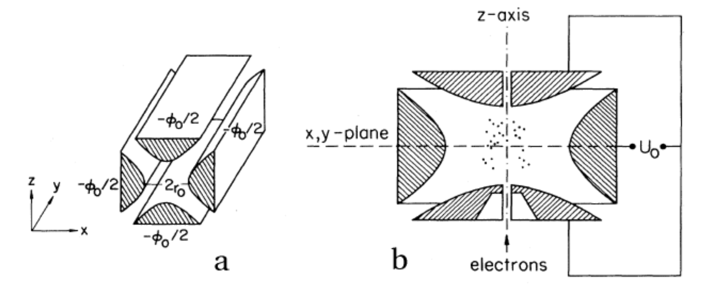

In order to conduct quantum mechanics oriented experiments, we have to have a way to manipulate small particles. For example, if we want to see the 
behavior of an ion when we hit it with lasers of certain frequency, we will need to keep it confined in a small area. How can we do so?

## What is the Quadrupole Ion Trap (AKA the RF Paul ion trap)?

One way to confine an atomic ion is to provide a force of the form \\(F = -kr\\). 
What would this entail for an electrical potential? Since the electric field is proportional to the force, and is equal to the divergence of the potential, 
we might use a electric potential of the form:

$$\Phi \propto (\alpha x^2 + \beta y^2 + \gamma z^2)$$

That is, we require an electric quadrupole field, say,

$$\Phi = \frac{\Phi_0}{2r_0^2}(\alpha x^2 + \beta y^2 + \gamma z^2)     \tag{1.1}$$

Equation 1.1 must obey that condition imposed on all potentials where there is no free charge distribution, namely that:

$$\nabla^2\Phi = 0 \rightarrow \alpha + \beta + \gamma = 0$$

We can satisfy this in more than one way. For the linear Paul Trap, whose initial manifestations were not as a 
trap but as a focusing tunnel of sorts, but which can be turned into a 'race track' ion trap:

{}
$$\alpha = 1 = -\gamma, \beta = 0 \rightarrow \Phi = \frac{\Phi_0}{2r_0^2}(x^2 - z^2)     \tag{1.2}$$
{}

For the "ionenkäfig", the chamber rf Paul ion trap that restrains ions in a chamber:

{}
$$\alpha = \beta = 1, \beta = -2 \rightarrow \Phi = \frac{\Phi_0}{r_0^2 + 2z_0^2}(r^2 - 2z^2), \text{ at } 2z_0^2 = r_0^2     \tag{1.3}$$
{}

This figure (from reference [1]) shows a diagram of an idealized rf Paul trap (a) and the chamber rf Paul trap (b):


<!--  -->

Such potentials can be provided via hyperbolic-shaped electrodes. We can perform a successive over relaxation of a cross section of these electrodes and find that indeed a two-dimensional stable equilibrium is created at the center (though this is unstable in the third dimension, z) when we satisfy the above conditions:

 

 

We have a repulsive force in the z direction which must be avoided. Unfortunately, [Earnshaw^{\prime}s theorem](https://en.wikipedia.org/wiki/Earnshaw%27s_theorem) tells us that it isn't possible to make an electric potential whose result is confining in all three dimensions of space. We can make a potential which results in an _average_ confining force. This can be done via the clever mechanism of rotating the field so that the focusing and defocusing is applied alternatively in each direction. If done at the right set of frequencies, the ion will maintain a stable orbit near the center of the ion trap.

A way to visualize this is with W. Paul's mechanical analog [1, 2]. Paul made an equivalent potential as that described above by carving an hyperbolic saddle surface out of plexiglass. Placing a ball on top of this surface would result in the ball falling off of it, of course. But if the surface is rotated at a proper rate, the ball will stay on the surface.

 

<!--  -->

The applied potential is thus:

$$\Phi_0 = U + V \cos \omega t     \tag{1.4}$$

If the particle has a charge e and mass m, then its equation of motion are:

$$
\begin{align*}
\ddot{x} + \frac{e}{mr_0^2}(U + V \cos \omega t)x &= 0 \\\\
\ddot{z} - \frac{e}{mr_0^2}(U + V \cos \omega t)z &= 0     \tag{1.5}
\end{align*}
$$

Since cosine is an even function, we can generalize this to:

$$\ddot{\eta} + (a - 2q \cos(2\tau))\eta = 0, \quad a = \frac{4eU}{mr_0^2\omega^2}, \quad q = \frac{-2eV}{mr_0^2\omega^2}, \quad \tau = \frac{\omega t}{2}     \tag{1.6}$$

For the z equation, \\(a \rightarrow -a\\). The solution to this equation is simple enough though not trivial, and we give an informal derivation below.

##  Mathieu's Equation, solution, and stability

### Basics and Flouqent's Theorem

Our derivation below can be found in greater detail and better form in many references [3, 4, 5], and our derivation follows the spirit of these. An equation such as Mathieu's equation,

{}
$$\ddot{\eta} + (a - 2q \cos(2\tau))\eta = 0     \tag{2.1}$$
{}

is of a class of differential equations of the type [7],

$$L[y] = y^{\prime \prime} + p(t)y^{\prime} + q(t)y = 0     \tag{2.2}$$

Any two fundamental solutions to this equation, \\(y_1(t), y_2(t)\\), will satisfy the set of boundary value equations,

$$
\begin{align*}
c_1 y_1(t_0) + c_2y_2(t_0) &= y_0 \\\\
c_1 y^{\prime}_1(t_0) + c_2y^{\prime}_2(t_0) &= y^{\prime}_0 \tag{req}
\end{align*}
$$

This equation can be summarized in the matrix equation \\(Y\mathbf{c} = \mathbf{y}\\). We thus require 
that the determinant of Y (called the Wronskian in this context) is not equal to zero (guarantees that the two solutions are linearly independent),

{}
$$
W(Y) = \det(Y) = \begin{vmatrix} y_1(t_0) & y_2(t_0) \\\\ y^{\prime}_1(t_0) & y^{\prime}_2(t_0) \end{vmatrix} \neq 0     \tag{2.3}
$$
{}

The set of even/odd solutions:

$$
\begin{aligned}
y_1 : & \quad y(t_0) = 1, \quad y^{\prime}(t_0) = 0 \\\\
y_2 : & \quad y(t_0) = 0, \quad y^{\prime}(t_0) = 1 \\\\
& \quad \Rightarrow \quad W(Y) = \begin{vmatrix} 1 & 0 \\\\ 0 & 1 \end{vmatrix} = 1
\end{aligned}
$$

are thus fundamental sets of solutions. We may follow Floquet's theorem [3], which tells us that Mathieu's equation has at least one solution such that

{}
For a linear differential equation with periodic coefficients, such as \\( y^{\prime\prime} + p(\eta) y = 0 \\), where \\( p(\eta) \\) is periodic with period \\( T \\), the solutions can be written in the form:

$$
y(\eta + T) = \sigma y(\eta)
$$

and so generally:

$$
y(\eta) = e^{\mu \eta} \phi(\eta), \tag{2.4}
$$

where \\( \mu \\) is a complex constant and \\( \phi(\eta) \\) is a periodic function with the same period \\( T \\) as the coefficients. This form decouples the exponential growth/decay or oscillation from the periodic behavior of the solution.



The details of this is outlined as follows:

{}

To understand how the solutions behave after a shift by the period \\(\pi\\), we examine the following relationships, which stem from the properties of second-order linear differential equations with periodic coefficients:

$$
\begin{aligned}
w_1(\eta + \pi) &= \alpha w_1(\eta) + \beta w_2(\eta) \\\\
w_1^{\prime}(\eta + \pi) &= \alpha w_1^{\prime}(\eta) + \beta w_2^{\prime}(\eta)
\end{aligned}
$$

where \\(\alpha\\) and \\(\beta\\) are constants determined by the specific solution.

To facilitate this analysis, we choose the following initial conditions at \\(\eta = 0\\):

$$
\begin{aligned}
w_1(0) &= 1, \quad &w_2(0) = 0, \\\\
w_1^{\prime}(0) &= 0, \quad &w_2^{\prime}(0) = 1
\end{aligned}
$$

These conditions normalize the solutions so that \\(w_1(\eta)\\) and \\(w_2(\eta)\\) resemble basic functions like cosine and sine, respectively.

After one period \\(\pi\\), the solution \\(w_1\\) takes the values:

$$
\begin{aligned}
w_1(\pi) &= \alpha, \quad &w_1^{\prime}(\pi) = \beta
\end{aligned}
$$

Here, \\(\alpha\\) and \\(\beta\\) represent the values of \\(w_1(\eta)\\) and its derivative at the point \\(\eta = \pi\\).

The evolution of the solutions after a shift by \\(\pi\\) can be represented using the matrix \\(A\\):

$$
A = \begin{pmatrix} w_1(\pi) & w_1^{\prime}(\pi) \\\\ w_2(\pi) & w_2^{\prime}(\pi) \end{pmatrix}
$$

This matrix \\(A\\) relates the solutions at \\(\eta\\) to those at \\(\eta + \pi\\):

$$
w(\eta + \pi) = A w(\eta)
$$

but also via Flouquet's theorem

$$
w(\eta + \pi) = \sigma w(\eta)
$$

so that 

$$
A w(\eta) = \sigma w(\eta)
$$

where the vector of solutions is defined as:

$$
w(\eta) = \begin{pmatrix} w_1(\eta) \\\\ w_2(\eta) \end{pmatrix}
$$

Thus according to Floquet's theorem, the constant \\(\sigma\\) must be an eigenvalue of the matrix \\(A\\). To find \\(\sigma\\), we solve the characteristic equation:

$$
|A - \sigma I| = 0
$$

where \\(I\\) is the identity matrix. This equation determines the possible values of \\(\sigma\\), which describe how the solution scales after each period \\(\pi\\).

The characteristic equation is:

$$
|A - \sigma I| = \text{det} \begin{pmatrix} w_1(\pi) - \sigma & w_1^{\prime}(\pi) \\\\ w_2(\pi) & w_2^{\prime}(\pi) - \sigma \end{pmatrix} = 0
$$

Expanding the determinant:

$$
(w_1(\pi) - \sigma)(w_2^{\prime}(\pi) - \sigma) - w_1^{\prime}(\pi)w_2(\pi) = 0
$$

This equation is quadratic in \\(\sigma\\), and solving it gives the eigenvalues \\(\sigma_1\\) and \\(\sigma_2\\):

$$
\sigma = \frac{(w_1(\pi) + w_2^{\prime}(\pi)) \pm \sqrt{(w_1(\pi) + w_2^{\prime}(\pi))^2 - 4(w_1(\pi)w_2^{\prime}(\pi) - w_1^{\prime}(\pi)w_2(\pi))}}{2}
$$

The solutions \\(\sigma_1\\) and \\(\sigma_2\\) describe how the original solution scales after one period \\(\pi\\).

Also according to Floquet's theorem, Mathieu's equation will have a solution of the form \\(e^{\mu \eta} \phi(\eta)\\), where:

$$
\sigma = e^{\mu \pi},
$$

and:

$$
\phi(\eta) = e^{-\mu \eta} y(\eta).
$$

This relationship arises because the Floquet multiplier \\(\sigma\\) can be expressed as an exponential term, with \\(\mu\\) being the Floquet exponent. Given this form, the function \\(\phi(\eta)\\) is periodic with period \\(\pi\\), ensuring:

$$
\phi(\eta + \pi) = e^{-\mu (\eta + \pi)} y(\eta + \pi) = e^{-\mu \eta} y(\eta) = \phi(\eta).
$$

This confirms that the solutions exhibit the quasi-periodic behavior predicted by Floquet's theorem, with the eigenvalue \\(\sigma\\) playing a central role in describing the solution's periodicity and scaling.



### 2.2. Hill's Method solution

With Floquent's theorem we assume a series solution, due to G. W. Hill,

{}
$$w = e^{\mu\eta}\phi(\eta) = e^{\mu\eta}\sum_{r=-\infty}^{\infty} c_{2r}e^{2ri\eta} = \sum_{r=-\infty}^{\infty} c_{2r}e^{(\mu+2ri)\eta}     \tag{2.5}$$
(essentially a Fourier expansion, where we have the 2 multiplier since the original function is periodic in \\(\pi\\)).
{}

When we put this into Mathieu's equation,

$$\sum_{r=-\infty}^{\infty} c_{2r}\left((\mu + 2ir)^2 + a - 2q\left(\frac{e^{2i\eta} + e^{-2i\eta}}{2}\right)\right)e^{(\mu+2ri)\eta} = 0$$

matching terms in power of r, we get the equation

$$-qc_{2r-2} + ((\mu + 2ir)^2 + a)c_{2r} - qc_{2r+2} = 0     \tag{2.6}$$

Multiplying through by \\(-1 = i^2\\), and then dividing by the middle term,

$$\frac{q}{(2r - \mu i)^2 - a}c_{2r-2} + c_{2r} + \frac{q}{(2r - \mu i)^2 - a}c_{2r+2} = 0     \tag{2.7}$$

To simplify our discussion, let's write

$$\gamma_{2r} = \frac{q}{(2r - \mu i)^2 - a}$$

That these coefficents \\(c_i\\) have non-trivial solutions requires the infinite determinant \\(\Delta\\) to vanish for noninfinite \\(r\\):

$$\Delta(i\mu) = \begin{vmatrix} 
\ddots & & & \\\\
\gamma_{-2} & 1 & \gamma_{-2} & &\\\\
& \gamma_0 & 1 & \gamma_0 & \\\\
& & \gamma_2 & 1 & \gamma_2  \\\\
& & & & \ddots
\end{vmatrix} = 0     \tag{2.8}$$

But of course, this is not a simple object to understand and solve. We can approach this problem from a rather clever angle introduced by E. T. Whittaker.

Consider the function

$$\lambda = \frac{1}{\cos \pi i\mu - \cos \pi\sqrt{a}}$$

Like our determinant, \\(\lambda\\) has a simple pole at \\(a = (2r - i\mu)^2\\), so that the function

$$\zeta = \Delta(i\mu) - \kappa\lambda$$

has no singularities if \\(\kappa\\) is chosen properly and is bound at infinity, where \\(\Delta(i\mu) = 1\\) since the \\(\gamma\\) functions all vanish and the diagonal term is all that remains, and \\(\lambda = 0\\) since \\(\cosh(x)\\) limits to zero as x tends towards infinity.

$$\varpi = \Delta(i\mu) - \kappa\lambda \rightarrow 1 - 0$$

By Liouville's theorem (of complex calculus), since this limits to a constant, it is a constant always, so we have

$$\kappa = \frac{\Delta(i\mu) - 1}{\lambda}$$

Next we consider the $\mu = 0$ case and find,

$$\kappa = (\Delta(0) - 1)(1 - \cos \pi\sqrt{a}) \rightarrow \frac{\Delta(i\mu) - 1}{\lambda} = (\Delta(0) - 1)(1 - \cos \pi\sqrt{a})$$

Next we suppose that $\mu$ is chosen to satisfy our requirement that the determinant vanish. We thus have

$$\cos \pi i\mu-\cos \pi\sqrt{a} = (1-\Delta(0))(1-\cos \pi\sqrt{a}) \rightarrow i\mu = \frac{1}{\pi}\cos^{-1}(1 - \Delta(0)(1 - \cos \pi\sqrt{a}))$$

Recall that our solution took the form,

$$w = e^{\mu\eta}\phi(\eta)$$

This solution will be unbounded unless $\mu \in \mathbb{I}$, in which case we have

$$\mu = \frac{1}{\pi}\cos^{-1}(1 - \Delta(0)(1 - \cosh \pi\sqrt{a}))     \tag{2.9}$$

We can easily encode this result, say,

if(a>=0){ mu=acos( 1 - (d[100])*(1-cos(pi*sqrt(a)))) / (pi);}
if(a<0){ mu=acos( 1 - (d[100])*(1-cosh(pi*sqrt(fabs(a))))) / (pi);}
if (mu != mu){mu=0.000000;} //If mu=nan then make it zero

But first we must calculate $\Delta(0)$. This task has been made exceedingly simple by the recent work of J. E. Sträng [5] who has found an efficient recursion formula.

### 2.3. Sträng's recursion formula for $\Delta(0)$

First we note that by the symmetry of $\Delta(0)$, $\gamma_{-n} = \gamma_n$. Following Sträng, we define

$$A_i = \begin{pmatrix} 
1 & \gamma_{2i} & 0 & & \\\\
\gamma_{2(i-1)} & 1 & \gamma_{2(i-1)} & & \\\\
0 & \gamma_{2(i-2)} & 1 & & \\\\
& & & \ddots & \\\\
& & & & \ddots \\\\
1 & \gamma_{2(i-2)} & 0 & & \\\\
\gamma_{2(i-1)} & 1 & \gamma_{2(i-1)} & & \\\\
0 & \gamma_{2i} & 1 & & 
\end{pmatrix}     \tag{2.10}

We have $\Delta_i = \det(A_i) \quad \exists \Delta(0) = \lim_{i\to\infty} \Delta_i$. We can decompose $A_i$ in terms of $A_{i-1}$,

$$A_i = \begin{pmatrix}
1 & \gamma_{2i} & & & \\\\
\gamma_{2(i-1)} & & & & \\\\
& & A_{i-1} & & \\\\
& & & & \gamma_{2(i-1)} \\\\
\gamma_{2i} & & & & 1
\end{pmatrix}     \tag{2.11}$$

A Laplace decomposition yields

$$\det(A_i) = \begin{vmatrix}
& & A_{i-1} & & \\\\
& & & & \gamma_{2(i-1)} \\\\
\gamma_{2i} & & & & 1
\end{vmatrix} - \gamma_{2i}^2\begin{vmatrix}
\gamma_{2(i-1)} & & & \\\\
& rA_{i-1} & & \\\\
& & & \gamma_{2(i-1)} \\\\
\gamma_{2i} & & & 1
\end{vmatrix}     \tag{2.12}$$

Here $rA_{i-1}$ represents $A_{i-1}$ with its left most column chopped off. Again, following Sträng we define $lA$ as the matrix $A$ with its rightmost column removed, $uA$ the matrix $A$ with its lowest row removed, $lA$ the matrix $A$ with its upper most row removed. Ultimately, $uldr(A_{i-1}) = A_{i-2}$, and given the symmetry involved, $\det(rd(A_{i-1})) = \det(ul(A_{i-1}))$. Following this procedure we find

$$\Delta_i = \Delta_{i-1} - 2\gamma_{2i}\gamma_{2(i-1)}\det(rd(A_{2(i-1)})) + (\gamma_{2i}\gamma_{2(i-1)})^2\Delta_{i-2}     \tag{2.13}$$

We also note, similarly using Laplacian decomposition,

$$\Omega_i = \det(ul(A_i)) = \det(rd(A_i)) \rightarrow \Omega_i = \det(A_{i-1}) - \gamma_{2i}\gamma_{2(i-1)}\Omega_{i-2}$$

so that 

$$\frac{\Delta_{i-1} - \Omega_i}{\gamma_{2i}\gamma_{2(i-1)}} = \Omega_{i-1} = \det(rd(A_{i-1}))$$

and

$$\begin{align*}
\Delta_i &= \Delta_{i-1} + 2(\Omega_i - \Delta_{i-1}) + (\gamma_{2i}\gamma_{2(i-1)})^2\Delta_{i-2} \\\\
\Delta_i + \Delta_{i-1} - (\gamma_{2i}\gamma_{2(i-1)})^2\Delta_{i-2})^2 &= \Omega_i \\\\
\Rightarrow (\Delta_{i-1} + \Delta_{i-2} - (\gamma_{2(i-1)}\gamma_{i-2})^2\Delta_{i-3})^2 &= \Omega_{i-1}
\end{align*}$$

Plugging this into Equation 2.13,

$$\Delta_i = (1-\gamma_{2i}\gamma_{2(i-1)})\Delta_{i-1} + ((\gamma_{2i}\gamma_{2(i-1)})^2 - \gamma_{2i}\gamma_{2(i-1)})\Delta_{i-2} + \gamma_{2i}\gamma_{2(i-1)}(\gamma_{2(i-1)}\gamma_{2(i-2)})^2\Delta_{i-3}$$

Define $\alpha_{2i} = \gamma_{2i}\gamma_{2(i-1)}$ and $1 - \alpha_{2i} = \beta_{2i}$ and find,

$$\Delta_i = \beta_{2i}\Delta_{i-1} - \alpha_{2i}\beta_{2i}\Delta_{i-2} + \alpha_{2i}\alpha_{2(i-1)}^2\Delta_{i-3}     \tag{2.14}$$

We can recursively solve for $\Delta(0) = \lim_{i\to\infty} \Delta_i$ to as much accuracy as necessary, though the program presented below found convergence to a fair tolerance quite quickly. We first must "seed" the recursion with the first three $\Delta_i$. This can be done by hand, though we have deferred to the kindness of our computer algebraic program Maple instead.

Maple finds,

with(linalg):
C:=matrix([[1,e6,0,0,0,0,0],[e4,1,e4,0,0,0,0],[0,e2,1,e2,0,0,0],
[0,0,e0,1,e0,0,0],[0,0,0,e2,1,e2,0],[0,0,0,0,e4,1,e4],[0,0,0,0,0,e6,1]]):
dc:=det(C);
dc := -2*e2^2*e0*e4^2*e6+e2^2*e4^2-2*e4^2*e2*e0*e6^2+2*e2*e4^2*e6
+e4^2*e6^2+2*e2^2*e0*e4+4*e2*e0*e6*e4-2*e2*e4-2*e6*e4-2*e2*e0+1
A:= matrix([[1,e4,0,0,0],[e2,1,e2,0,0],[0,e0,1,e0,0],
[0,0,e2,1,e2],[0,0,0,e4,1]]):
da:=det(A);
da := 1-2*e2*e4-2*e2*e0+2*e2^2*e0*e4+e2^2*e4^2
B:=matrix([[1,e2,0],[e0,1,e0],[0,e2,1]]):
db:=det(B);
db := 1-2*e2*e0

Our program seeks to find all stable values of $\mu$, i.e. those that satisfy Equation 2.9 as real values (i.e. all iso-$\mu$ for which $\mu$ is exclusively imaginary.

Our code finds all such iso-$\mu$ by looping through the $a$ and $q$ axis. If our $\mu$ formula returns "nan" which is the C language's way of saying not a real number, then we set the value of $\mu$ to zero, though of course it is only the imaginary part of $\mu$ which is actually zero. We perform a contour plot on our data output and find the elegant avian like image of the stability region of Mathieu's equation (Figure 2.1).

For the quadrupole field, the rf linear Paul trap, we have the following stability regime (Figure 2.2). The original stability diagram is simply reflected about the x-axis as $a \rightarrow -a$ between the two.

For the chamber rf Paul trap, we recall that for the z direction we must allow for $(a, q) \rightarrow (2a, 2q)$ (Equation 1.3), and so the lowest region of stability (and the largest region at that) has a slightly different look (Figure 2.4).

## 3. C Program for calculating the stability regions of Mathieu's equation

Many thanks to Christian Schneider for spotting typos here!

#include<stdio.h>
#include<math.h>
int main(){
FILE *fp; // Prepare to print to file
fp=fopen("mat.dat","w");
int m,i,j;
float e[200],d[101],alpha,beta,alpha1,mu,a,q;
float pi=3.141592653589;
a=0.5;
q=0;
for(q=-10;q<10;q+=0.02){ //Loop over the desired
for(a=-5;a<10;a+=0.07){ //a-q region
for(m=0;m<=248;m+=2){
e[m]=q/((m*m*1.0)-a);} //Set all components
//The first seed determinants, from Maple worksheet
d[3]=-2*e[2]*e[2]*e[0]*e[4]*e[4]*e[6]+e[2]*e[2]*e[4]*e[4]
-2*e[4]*e[4]*e[2]*e[0]*e[6]*e[6]+2*e[2]*e[4]*e[4]*e[6]
+e[4]*e[4]*e[6]*e[6]+2*e[2]*e[2]*e[0]*e[4]+4*e[2]*e[0]*e[6]*e[4]-
2*e[2]*e[4]-2*e[6]*e[4]-2*e[2]*e[0]+1;
d[2]=1-2*e[2]*e[4]-2*e[2]*e[0]+2*e[2]*e[2]*e[0]*e[4]+e[2]*e[2]*e[4]*e[4];
d[1]=1-2*e[2]*e[0];
d[0]=1;
for(m=4; m<=100; m++){ //Here goes Strang's iteration method
alpha=e[2*m]*e[2*(m-1)];
beta=1-alpha;
alpha1=e[2*(m-1)]*e[2*(m-2)];
d[m]=beta*d[m-1] - alpha*beta*d[m-2] + alpha*alpha1*alpha1*d[m-3]; }
//Find mu, make separate case for -a situation
if(a>=0){ mu=acos( 1 - (d[100])*(1-cos(pi*sqrt(a)))) / (pi);}
if(a<0){ mu=acos( 1 - (d[100])*(1-cosh(pi*sqrt(fabs(a))))) / (pi);}
if (mu != mu){mu=0.000000;} //If mu=nan then make it zero
fprintf(fp,"%f %f %f \n", q, a, mu);}fprintf(fp,"\n");}
}

As a final note, we wish to add the code used for gnuplot. One run was to outline the edge of the $\mu = 0$ isobar, since gnuplot does not plot contour this (starts with 0.05). The second run does the overall contouring as seen in the above figures.

For the border outline:

set data style lines
set contour base
set cntrparam levels discrete 0.001
set nosurface
set view 0,0
splot 'so2.txt'

For the inner contours:

set data style lines
set cntrparam levels 20
set contour
set nosurface
set view 0,0
splot 'so2.txt'

## 4. Activation of the equation for the ideal rf Paul trap

Now that we have demonstrated the fundamentals of Mathieu's equation, we can apply it more directly to the ideal rf Paul. Here we follow the outline from [8].

### 4.1. Kapitsa's Secular Approximation

We neglect the DC potential $U$ for now and assume the equations of motion are of the form, for the rf Paul Ideal chamber ion trap:

$$\begin{align*}
\ddot{r} + \frac{2e}{m(r_0^2 + 2z_0^2)}(V \cos \omega t)r &= 0 \\\\
\ddot{z} - \frac{4e}{m(r_0^2 + 2z_0^2)}(V \cos \omega t)z &= 0     \tag{4.1}
\end{align*}$$

Define $d_0 = r_0^2 + 2z_0^2$. Assume that the $r$ and $z$ motion can be partitioned into large-amp slow "secular" motion $r$ and $z$, and small-amp high frequency micromotion $r_\mu$, $z_\mu$ at the frequency of the applied potential $\omega$. Then our equations become

$$\begin{align*}
\ddot{r} + \ddot{r}_\mu &= -\frac{2e}{md_0^2}(V \cos \omega t)(r + r_\mu) \\\\
\ddot{z} + \ddot{z}_\mu &= \frac{4e}{md_0^2}(V \cos \omega t)(z + z_\mu)     \tag{4.2}
\end{align*}$$

$$(r_\mu \ll r, \ddot{r}_\mu \gg \ddot{r}) \rightarrow r_\mu \approx +\left(\frac{2eV}{md_0^2\omega^2}r \cos \omega t\right),$$
$$(z_\mu \ll z, \ddot{z}_\mu \gg \ddot{z}) \rightarrow z_\mu \approx -\left(\frac{4eV}{md_0^2\omega^2}z \cos \omega t\right) \quad \exists$$

$$\begin{align*}
\ddot{r} &\approx -\left(\left(\frac{4eV}{md_0^2}\cos \omega t\right) - \left(\frac{4e^2V^2}{m^2d_0^4}\cos^2 \omega t\right)\right)r, \\\\
\ddot{z} &\approx \left(\left(\frac{8eV}{md_0^2}\cos \omega t\right) - \left(\frac{16e^2V^2}{m^2d_0^4}\cos^2 \omega t\right)\right)z \quad \exists
\end{align*}$$

$$\begin{align*}
\ddot{r} &\approx \left(\frac{2e^2V^2}{m^2d_0^4\omega^2}\right)r \rightarrow r \approx -\cos\left(\sqrt{\frac{2eV}{md_0^2}}\omega t\right) = \cos \omega_r t \\\\
\ddot{z} &\approx -\left(\frac{8e^2V^2}{m^2d_0^4\omega^2}\right)z \rightarrow z \approx \cos\left(2\sqrt{\frac{2eV}{md_0^2}}\omega t\right) = \cos \omega_z t
\end{align*}$$

Evidently, $\omega_r = \omega_z/2$. We can thus write,

$$\begin{align*}
r_{tot} &\approx -\cos(\omega_z t/2)\left(

1 - \frac{2eV}{md_0^2\omega^2}\cos \omega t\right) \\\\
z_{tot} &\approx \cos(\omega_z t)\left(1 - \frac{4eV}{md_0^2\omega^2}\cos \omega t\right)
\end{align*}$$

The results of these approximations are graphically displayed in Figures 4.1 and 4.2 created with the following C code:

float w=53;
float wz=4;
float r,z;
float t=0.0;
while(t<1000){
r=-cos(wz*t/2)*(1-0.3*cos(w*t));
z=cos(wz*t)*(1-0.6*cos(w*t));
t+=0.01;}

### 4.2. A solution with Mathieu's Equation

For a more formal analysis refer to [6]. Starting with the equation,

$$\frac{d^2z}{d\eta^2} + (a_z - 2q_z \cos(2\eta)) z = 0, \quad \eta = \frac{\omega t}{2}, \quad a_z = \frac{-16eU}{md_0^2\omega^2}, \quad q_z = \frac{-8eV}{md_0^2\omega^2}$$

We apply Floquet's theorem and the subsequent corollary to suppose solutions of the form,

$$u_1(\eta) = e^{\mu\eta}\phi_1(\eta), \quad u_2(\eta) = e^{-\mu\eta}\phi_2(\eta)$$

The conditions for stability require that $\mu$ be purely imaginary. It is typical to write $\mu = \alpha + i\beta$, and so we can take a Fourier expansion of the $\phi$, and recalling that the original equation contains $\cos(2\eta)$, we assume a general solution,

$$z(\eta) = A\sum_{n=-\infty}^{\infty} C_{2n}e^{i(2n+\beta)\eta} + B\sum_{n=-\infty}^{\infty} C_{2n}e^{-i(2n+\beta)\eta}$$

$$z(\eta) = A'\sum_{n=-\infty}^{\infty} C_{2n}\cos((2n + \beta)\eta)$$

As before, we can find a useful recursion relation. Define:

$$D_{2n} \equiv \frac{a_z - (2n + \beta)^2}{q_z} \rightarrow D_{2n}C_{2n} - C_{2n-2} - C_{2n+2} = 0$$

When $n = 0$ we have

$$D_0 = \frac{a_z - \beta^2}{q_z} = \frac{C_{-2}}{C_0} + \frac{C_2}{C_0}$$

With this recursion relationship we may solve for $\beta$ with increasing levels of accuracy, for example,

$$\begin{align*}
C_{2n} &= \frac{C_{2n-2}}{D_{2n}} + \frac{C_{2n+2}}{D_{2n}} \\\\
&= \frac{C_{2n-4}}{D_{2n-2}} + \frac{C_{2n}}{D_{2n-2}} \\\\
&\quad + \frac{C_{2n}}{D_{2n+2}} + \frac{C_{2n+4}}{D_{2n+2}}
\end{align*}$$

As a first approximation, we set $C_{\pm4} = 0$ and obtain

$$D_0 = \frac{1}{D_{-2}} + \frac{1}{D_2}$$

$$\frac{a - \beta^2}{q} = q\left(\frac{1}{a - (-2 + \beta)^2} + \frac{1}{a - (2 + \beta)^2}\right)$$

When we assume $4 \gg \beta^2, \beta, a$ we obtain the approximation,

$$\beta = \sqrt{a + \frac{q^2}{2}}$$

If we take $U = 0 \quad \exists a = 0$ then we find we have recovered the approximation of the previous section,

$$\omega_z = 2\sqrt{\frac{2eV}{md_0^2}}\omega$$

From such references as [8] we know that the next approximation is

$$\beta = \sqrt{a_z + q_z^2\left(\frac{1}{2} + \frac{a}{8}\right) + \frac{q^4}{128}} \cdot \frac{1}{\sqrt{1 - q^2\left(\frac{3}{8} + \frac{5a}{16}\right)}}$$

The motion will have frequencies of $(2n + \beta)$, of which the lowest and second to the lowest correspond roughly with the secular approximation secular and micromotion.

We could carry this process on ad infinitum ad nauseum. This is but one method to solve for $\beta$. The other method is the numerical method we used to find the stable points of the iso-$\mu$. A third method is to use the more technical solutions to the Mathieu equation developed by the mathematicians. We will close this report with a brief review of one such solution.

## 5. Technical details

This form of the solution can be found in many references ([4] for example).

We need consider the case in which our bound periodic solution to the Mathieu equation is of integral order (integer $\times\pi$) and fractional order $\nu\pi$ where $\nu$ is real but may be rational or irrational.

### 5.1. Integral order

We write the Mathieu equation as

$$\frac{d^2y}{dz^2} + (a - 2q \cos(2z))y = 0$$

And consider the case when $q = 0$ and write $a = m^2$ and have solutions $\pm \cos mz, \pm \sin mz$.

We then suppose that the case when $q$ is nonzero can be taken into account as a series based on this initial solution. Let

$$a = 1 + \sum_{i=1}^{\infty} \alpha_i q^i     \tag{5.1}$$

Then we suppose that

$$y = \cos z + \sum_{i=1}^{\infty} q^i c_i(z)     \tag{5.2}$$

We determine the nature of the $c_i$ functions as follows. Plugging our solution into the Mathieu equation, we get

$$\begin{align*}
y^{\prime}' &= -\cos z + \sum_{i=1}^{\infty} q^i c_i''(z) \\\\
ay &= \cos z + \sum_{i=1}^{\infty} q^i\left(c_i + \alpha_i \cos z + \sum_{k=1}^{i-1} \alpha_i c_{i-k}\right)
\end{align*}$$

Using the identity

$$\begin{align*}
2 \cos(\frac{1}{2}(A + B)) \cos(\frac{1}{2}(A - B)) &= \frac{(e^{1/2(A+B)} + e^{-1/2(A+B)})(e^{1/2(A-B)} + e^{-1/2(A-B)})}{2} \\\\
&= \frac{e^A + e^{-A}}{2} + \frac{e^B + e^{-B}}{2} \\\\
&= \cos A + \cos B
\end{align*}$$

$$-(2q \cos 2z)y = -q(\cos(z) + \cos(3z) - 2 \cos(2z)\sum_{i=1}^{\infty} q^{i+1} c_1$$

Coefficients are matched:

$$\begin{align*}
q^0 \cos z &= \cos z = 0 \\\\
q^1 c_1'' + c_1 - \cos(3z) + (\alpha_1 - 1) \cos z &= 0 \\\\
q^2 c_2'' + c_2 + \alpha_1 c_1 - 2c_1 \cos 2z + \alpha_2 \cos z &= 0
\end{align*}$$

The particular solution corresponding to $(\alpha_1 - 1) \cos z$ is $\frac{1}{2}(1 - \alpha_1)z \sin z$ which is not bounded, thus we require that $\alpha_1 = 1$ such that

$$c_1'' + c_1 = \cos 3z$$

$$w^{\prime}' + w = A \cos mz \rightarrow w = -\frac{A \cos mz}{(m^2 - 1)} \quad \exists$$

$$c_1 = -\frac{1}{8} \cos 3z$$

The arguments presented before imply that

$$\alpha_2 = -\frac{1}{8} \quad \exists c_2'' + c_2 = \frac{1}{8} \cos 3z - \frac{1}{8} \cos 5z$$

$$\Rightarrow c_2 = -\frac{1}{64} \cos 3z + \frac{1}{192} \cos 5z$$

Following [4], we write

$$\alpha_3 = -\frac{1}{64}, \quad c_3 = -\frac{1}{152}\left(\frac{\cos 3z}{3} - \frac{4 \cos 5z}{9} + \frac{\cos 7z}{18}\right)$$

and so we find the $c$ functions can be represented by "cosine-elliptic" function,

$$\begin{align*}
ce_1(z, q) &= \cos z - \frac{1}{8} q \cos 3z + \frac{1}{64} q^2\left(-\cos 3z + \frac{\cos 5z}{3}\right) \\\\
&\quad -\frac{q^3}{512}\left(\frac{\cos 3z}{3} - \frac{4 \cos 5z}{9} + \frac{\cos 7z}{18}\right) + O(q^4)     \tag{5.3}
\end{align*}$$

$$a = 1 + q - \frac{q^2}{8} - \frac{q^3}{64} + O(q^4)     \tag{5.4}$$

### 5.2. Fractional order

Now we suppose solutions of the form

$$ce_\nu(z, q) = \cos \nu z + \sum_{r=1}^{\infty} q^r c_r(z)     \tag{5.5}$$

$$a = \nu^2 + \sum_{r=1}^{\infty} \alpha_r q^r     \tag{5.6}$$

Quoting again our references [4, 3], the above procedure may be applied to find,

$$\begin{align*}
ce_\nu(z, q) &= \cos \nu z - \frac{q}{4}\left(\frac{\cos(\nu + 2)z}{\nu + 1} - \frac{\cos(\nu - 2)z}{\nu - 1}\right) \\\\
&\quad + \frac{q^2}{32}\left(\frac{\cos(\nu + 4)z}{(\nu + 1)(\nu + 2)} + \frac{\cos(\nu - 4)z}{(\nu - 1)(\nu - 2)}\right) + O(q^3)     \tag{5.7}
\end{align*}$$

$$\begin{align*}
a &= \nu^2 + \frac{q^2}{2(\nu^2 - 1)} + \frac{(5\nu^2 + 7)q^4}{32(\nu^2 - 1)^3(\nu^3 - 4)} \\\\
&\quad + \frac{(9\nu^4 + 58\nu^3 + 29)q^6}{64(\nu^2 - 1)^5(\nu^2 - 4)(\nu^2 - 9)} + \cdots     \tag{5.8}
\end{align*}$$

The latter can be rewritten,

$$\begin{align*}
\nu^2 &= a - \frac{q^2}{2(\nu^2 - 1)} - \frac{(5\nu^2 + 7)q^4}{32(\nu^2 - 1)^3(\nu^3 - 4)} \\\\
&\quad - \frac{(9\nu^4 + 58\nu^3 + 29)q^6}{64(\nu^2 - 1)^5(\nu^2 - 4)(\nu^2 - 9)} - \cdots     \tag{5.9}
\end{align*}$$

A first approximation is $\nu^2 = a$. Putting this into the $q^2$ coefficient gives a second approximation,

$$\nu^2 = a - \frac{q^2}{2(a - 1)}$$

And repeating the process gives

$$\nu^2 = a - \frac{a - 1}{2(a - 1)^2 - q^2} q^2 - \frac{5a - 7}{32(a - 1)^3(a - 4)} q^4 + O(q^6)$$

Finally we note that $\nu^2 = (m + \beta)^2$ (the integral and fractional component), we have the approximation

$$\beta \approx \left(a - \frac{a - 1}{2(a - 1)^2 - q^2} q^2 - \frac{5a + 7}{32(a - 1)^3(a - 4)} q^5\right)^{1/2} - m     \tag{5.10}$$

The cosine functions have sine equivalents which we have not included for the sake of brevity. These formulations are not uncommon in the literature, though for obvious reasons the previous derivations were presented in fuller context as they seem to be the preferred method of dealing with the Mathieu equation. But alas, after presenting so many ways of looking at Mathieu's equation, like Pandora's box, last out is hope.

## 6. Mathieu & Maple, forever

Maple 'help' tells us about a number of Mathieu related functions in her tool box, including:

The Mathieu functions MathieuC(a, q, x) and MathieuS(a, q, x) are solutions of the Mathieu differential equation.

MathieuC and MathieuS are even and odd functions of x, respectively.

MathieuFloquet(a, q, x) is a Floquet solution of Mathieu's equation.
where nu = MathieuExponent(a, q) is the characteristic exponent and P(x) is a Pi periodic function.

We present a few plots to demonstrate the usefulness of these functions below.

This report has treated, in some detail, the mathematics behind the ideal rf Paul trap. Of course, the actual realization of the trap differs in many important ways from its ideal, but we may approach these realizations, in their many forms, with a fundamental understanding of their operational basis.

## References

[1] Wolfgang Paul, Electromagnetic traps for charged and neutral particles, (Reviews of Modern Physics, Vol. 62, No. 3, July 1990)

[2] R.I. Thompson, T.J. Harmon, M.G. Ball, The rotating-saddle trap: a mechanical analogy to RF-electric-quadrupole ion trapping?, (Canadian Journal of Physics, Dec 2002; 80,12)

[3] F. M. Arscott, Periodic Differential Equations, An Introduction to Mathieu, Lamé, and Allied Functions, (The MacMillan Company, New York 1964)

[4] N. W. McLachlan, Theory and Application of Mathieu Functions, (Oxford at the Clarendon Press, 1947)

[5] Jan Eric Sträng, On the characteristic exponents of Floquet solutions to the Mathieu equation, (Acad. Roy. Belg. Bull. Cl. Sci, to be published 2006; url = http://www.citebase.org/cgi-bin/citations?id=oai:arXiv.org:math-ph/0510076, 2005

[6] Leibried et al., Quantum dynamics of single trapped ions, (Rev. Mod. Phys., Vol. 75, No. 1, January 2003)

[7] W. E. Boyce, R. C. DiPrima, Elementary Differential Equations and Boundary Value Problems, (John Wiley & Sons, Inc., 1996)

[8] King, Brian E., Ph. D. Thesis: Quantum State Engineering and Information Processing with Trapped Ions, (url: http://jilawww.colorado.edu/www/pubs/thesis/king/)