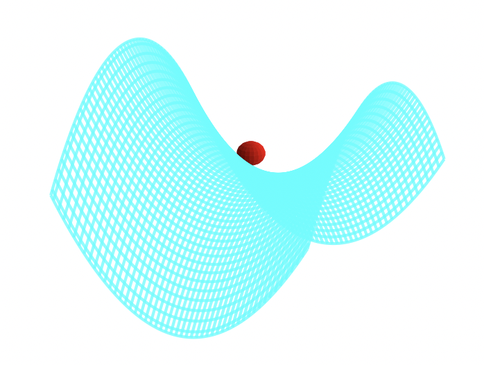



In order to conduct quantum-mechanics-oriented experiments or operate ion-trap-based quantum computers, 
we need a way to manipulate small particles. For example, if we want to observe the 
behavior of an ion when we hit it with lasers of a certain frequency, we will need to keep it confined in a small area. How can we do so?

To get _closer_ to understanding the answer takes us through some rougher-than-usual (for a blog post) mathematical woods, but anyone spending enough time with mathematics knows that difficult journeys are often rewarded with beauty. Look at the image below, one we will earn the right to admire not just aesthetically,
but also mathematically. This image answers the question of how we can keep ions trapped, and this post will outline the mathematical reason why this answer is found in something so unexpectedly interesting.




## What is the Quadrupole Ion Trap (AKA the RF Paul ion trap)?

One way to confine an atomic ion is to provide a force of the form \\(F = -kr\\). 
What would this entail for an electrical potential? Since the electric field is proportional to the force, and is equal to the negative gradient of the potential, 
we might use an electric potential of the form:

$$\Phi \propto (\alpha x^2 + \beta y^2 + \gamma z^2)$$

That is, we require an electric quadrupole field. 

This equation must obey the condition imposed on all electric potentials where there is no free charge distribution, namely Laplace's equation:

$$\nabla^2\Phi = 0 \rightarrow \alpha + \beta + \gamma = 0$$

We can satisfy this in more than one way. For the linear Paul trap, whose initial manifestations were not as a 
trap but as a focusing tunnel of sorts, but which can be turned into a 'race track' ion trap:


$$\alpha = 1 = -\beta, \gamma = 0 \rightarrow \Phi = \frac{\Phi_0}{2r_0^2}(x^2 - y^2)$$
(with the trap/transport axis along \\(z\\))


For the true 3D rf Paul trap (the "ionenkäfig" or chamber trap) that restrains ions in all three dimensions:


$$\alpha = \beta = 1, \gamma = -2 \rightarrow \Phi = \frac{\Phi_0}{2r_0^2}(x^2 + y^2 - 2z^2)$$


This figure (from reference <a id="cite-paul-1990"></a>[[paul-1990]](#ref-paul-1990)) shows a diagram of an idealized rf Paul trap (a) and the chamber rf Paul trap (b). The foundational concept of this geometry was first introduced by Paul and Steinwedel <a id="cite-paul-steinwedel-1953"></a>[[paul-steinwedel-1953]](#ref-paul-steinwedel-1953), and an excellent operational textbook on its dynamics is provided by Ghosh <a id="cite-ghosh-1995"></a>[[ghosh-1995]](#ref-ghosh-1995):



Such potentials can be provided via hyperbolic-shaped electrodes. We can perform a successive over-relaxation (SOR) of a cross section of these electrodes and find that indeed a two-dimensional stable equilibrium is created at the center (though this is unstable in the third dimension, z) when we satisfy the above conditions (focusing on the chamber trap):

 

We have a repulsive force in the \\(z\\) direction which must be avoided. Unfortunately, Earnshaw's theorem <a id="cite-earnshaw-1842"></a>[[earnshaw-1842]](#ref-earnshaw-1842) tells us that it isn't possible to make an electric potential whose result is a stable equilibrium confining in all three dimensions of space using only *static* inverse-square forces. However, we can create a potential which results in an *average* confining force by using time-dependent fields. This can be done via the clever mechanism of alternating the focusing and defocusing fields in each direction. If done at the right set of frequencies, the ion will maintain a stable orbit near the center of the ion trap.

 


A way to visualize this is with W. Paul's mechanical analog <a id="cite-paul-1990"></a>[[paul-1990]](#ref-paul-1990), <a id="cite-thompson-2002"></a>[[thompson-2002]](#ref-thompson-2002). Paul made an equivalent potential as that described above by carving a hyperbolic saddle surface out of plexiglass. Placing a ball on top of this surface would result in the ball falling off, of course. But if the surface is rotated at a proper rate (which acts as an analogy for the alternating spatial confinement of the actual electric fields), the ball will stay on the surface.

 

<!--  -->


This post will derive the Mathieu stability equations for a *pure 3D quadrupole rf field* (the classic 3D "chamber" trap), which relies upon true 3D rf confinement. In a **linear trap** (often utilized for Quantum Computing hardware; see Cirac & Zoller <a id="cite-cirac-1995"></a>[[cirac-1995]](#ref-cirac-1995) or Häffner et al. <a id="cite-haffner-2008"></a>[[haffner-2008]](#ref-haffner-2008)), the axial confinement along \\(z\\) is typically DC (static harmonic) - not Mathieu in the same way - and the Mathieu stability chart we derive predominantly governs only the radial \\(x,y\\) directions. 


The applied oscillating potential can be written:

$$\Phi_0 = U + V \cos \Omega t$$

giving the full spatial potential for the chamber trap:

$$\Phi(x,y,z,t) = \frac{U + V \cos \Omega t}{2r_0^2}(x^2 + y^2 - 2z^2)$$

If the particle has a charge \\(e\\) and mass \\(m\\), the resulting electric field is \\( \mathbf{E} = -\nabla \Phi \\):

$$
\mathbf{E} = -\frac{U + V \cos \Omega t}{r_0^2} (x \mathbf{\hat{i}} + y \mathbf{\hat{j}} - 2z \mathbf{\hat{k}})
$$

This gives us the coordinate-wise equations of motion:

$$
\begin{align*}
\ddot{x} + \frac{e}{mr_0^2}(U + V \cos \Omega t)x &= 0 \\\\
\ddot{y} + \frac{e}{mr_0^2}(U + V \cos \Omega t)y &= 0 \\\\
\ddot{z} - \frac{2e}{mr_0^2}(U + V \cos \Omega t)z &= 0
\end{align*}
$$


These equations can be cast as Mathieu's equation, which describes the parametric resonance driving the ion's stability:

$$\frac{d^2u}{d\tau^2} + \left(a - 2q \cos(2\tau)\right)u = 0$$

The variables are dimensionless for this equation, so we have a little work to do to massage our motion equations into this form.



Since we are removing dimensionality in the \\(t\\) variable by setting \\( \tau = \Omega t / 2\\),

$$ \frac{d^2u}{dt^2} = \left(\frac{\Omega}{2}\right)^2\frac{d^2u}{d\tau^2} $$

For the \\( x \\) and \\(y\\)-directions, the equation of motion:

$$\ddot{x} + \frac{e}{mr_0^2}(U + V \cos \Omega t)x = 0$$

can be rewritten by defining:

$$
a_x = a_y = \frac{4eU}{mr_0^2\Omega^2}, \quad q_x = q_y = -\frac{2eV}{mr_0^2\Omega^2}, \quad \tau = \frac{\Omega t}{2}
$$

resulting in the Mathieu equation form:

$$\frac{d^2x}{d\tau^2} + \left(a_x - 2q_x \cos(2\tau)\right)x = 0$$

For the \\(z\\)-direction equation of motion:

$$\ddot{z} - \frac{2e}{mr_0^2}(U + V \cos \Omega t)z = 0$$

We similarly define:

$$
a_z = -\frac{8eU}{mr_0^2\Omega^2}, \quad q_z = \frac{4eV}{mr_0^2\Omega^2}
$$

resulting in:

$$\frac{d^2z}{d\tau^2} + \left(a_z - 2q_z \cos(2\tau)\right)z = 0$$

Notice the critical relationship between the stability parameters:

$$ a_z = -2a_x, \qquad q_z = -2q_x $$

*(Note: sign conventions for \\(q\\) vary across the literature. Some texts define the equation with \\(+2q\cos(2\tau)\\) and yield the opposite sign. Stability depends on \\(|q|\\) since the stability diagram is symmetric under \\(q \rightarrow -q\\).)*

As we will see, the general stability diagram for Mathieu's equation is symmetrical upon reflection around \\(q = 0 \\), but _not_ around \\(a = 0\\).
Thus, to find regions of overall 3D stability for the **chamber trap** where the ion is trapped in all directions simultaneously, we must pull the \\(z\\)-region back into the \\((a_x, q_x)\\)-space. We are explicitly intersecting the stable sets in the same parameter plane to find an operating point \\( (a_x, q_x) \\) such that both \\( (a_x, q_x) \\) and \\( (-2a_x, -2q_x) \\) lie within stable regions of the generic Mathieu chart.


##  Mathieu's Equation, solution, and stability

### Basics and Floquet's Theorem

Our derivation below can be found in greater detail and better form in many references <a id="cite-arscott-1964"></a>[[arscott-1964]](#ref-arscott-1964), <a id="cite-mclachlan-1947"></a>[[mclachlan-1947]](#ref-mclachlan-1947), <a id="cite-strang-2005"></a>[[strang-2005]](#ref-strang-2005), and our derivation follows the spirit of these. An equation such as Mathieu's equation,


$$\frac{d^2u}{d\tau^2} + (a - 2q \cos(2\tau))u = 0     $$


is of a class of differential equations of the type <a id="cite-boyce-1996"></a>[[boyce-1996]](#ref-boyce-1996),

$$L[u] = u^{\prime \prime} + p(\tau)u^{\prime} + s(\tau)u = 0     $$

Any two fundamental solutions to this equation, \\(u_1(\tau), u_2(\tau)\\), will satisfy the set of boundary value equations,

$$
\begin{align*}
c_1 u_1(\tau_0) + c_2u_2(\tau_0) &= u_0 \\\\
c_1 u^{\prime}_1(\tau_0) + c_2u^{\prime}_2(\tau_0) &= u^{\prime}_0 
\end{align*}
$$

This equation can be summarized in the matrix equation \\(Y\mathbf{c} = \mathbf{u}\\). We thus require 
that the determinant of Y (called the Wronskian in this context) is not equal to zero (guarantees that the two solutions are linearly independent),


$$
W(Y) = \det(Y)  = \begin{vmatrix}
u_1(\tau_0) & u_2(\tau_0)\\\\
u^{\prime}_1(\tau_0) & u^{\prime}_2(\tau_0)
\end{vmatrix} \neq 0
$$


The set of even/odd solutions:

$$
\begin{aligned}
u_1 : & \quad u(\tau_0) = 1, \quad u^{\prime}(\tau_0) = 0 \\\\
u_2 : & \quad u(\tau_0) = 0, \quad u^{\prime}(\tau_0) = 1 \\\\
& \quad \Rightarrow \quad W(Y) = \begin{vmatrix} 1 & 0 \\\\ 0 & 1 \end{vmatrix} = 1
\end{aligned}
$$


are thus fundamental sets of solutions. We may follow Floquet's theorem <a id="cite-arscott-1964"></a>[[arscott-1964]](#ref-arscott-1964), which tells us that Mathieu's equation has at least one solution such that



For a linear differential equation with periodic coefficients, such as \\( u^{\prime\prime}(\tau) + p(\tau) u(\tau) = 0 \\), where \\( p(\tau) \\) is periodic with period \\( T \\), there exist solutions of the form:

$$
u(\tau + T) = \sigma u(\tau)
$$

for a Floquet mode, and so generally:

$$
u(\tau) = e^{i\beta \tau} \phi(\tau), 
$$

where \\( \beta \\) is a constant (often called the characteristic exponent) and \\( \phi(\tau) \\) is a periodic function with the same period \\( T \\) as the coefficients. This form decouples the exponential growth/decay or oscillation from the periodic behavior of the solution. Stable solutions correspond to a real-valued characteristic exponent \\( \beta \in \mathbb{R} \\).



To help visualize how these mathematical components interconnect, here is an outline of the derivation flow we will follow:


flowchart TD
    A["Mathieu's Equation"] --> B["Floquet's Theorem<br>(Assumes quasi-periodic solution)"]
    B --> C["Hill's Method<br>(Fourier Series Expansion)"]
    C --> D["Infinite Determinant Δ(β) = 0"]
    D --> E["Characteristic Equation Mapping<br>(via DLMF & Sträng)"]
    E --> F["Isolates Characteristic Exponent (β)"]
    F --> G["Sträng's Recursion Formula<br>(Calculates Seed Determinant Δ(0))"]
    G --> H["Numerical Stability Diagram Map"]


The details of this process are outlined as follows:

### 2.1b. Floquet's theorem for Mathieu's Equations

To understand how the solutions behave after a shift by the period \\(\pi\\), we examine the following relationships, which stem from the properties of second-order linear differential equations with periodic coefficients:

$$
\begin{aligned}
u_1(\tau + \pi) &= A u_1(\tau) + B u_2(\tau) \\\\
u_1^{\prime}(\tau + \pi) &= A u_1^{\prime}(\tau) + B u_2^{\prime}(\tau)
\end{aligned}
$$

where \\(A\\) and \\(B\\) are constants determined by the specific solution.

To facilitate this analysis, we choose the following initial conditions at \\(\tau = 0\\):

$$
\begin{aligned}
u_1(0) &= 1, \quad &u_2(0) = 0, \\\\
u_1^{\prime}(0) &= 0, \quad &u_2^{\prime}(0) = 1
\end{aligned}
$$

These conditions normalize the solutions so that \\(u_1(\tau)\\) and \\(u_2(\tau)\\) resemble basic functions like cosine and sine, respectively.

After one period \\(\pi\\), the solution \\(u_1\\) takes the values:

$$
\begin{aligned}
u_1(\pi) &= A, \quad &u_1^{\prime}(\pi) = B
\end{aligned}
$$

Here, \\(A\\) and \\(B\\) represent the values of \\(u_1(\tau)\\) and its derivative at the point \\(\tau = \pi\\).

The evolution of the solutions after a shift by \\(\pi\\) can be analyzed rigorously using the fundamental matrix \\(Y(\tau)\\):

$$
Y(\tau) = \begin{pmatrix} u_1(\tau) & u_2(\tau) \\\\ u_1^{\prime}(\tau) & u_2^{\prime}(\tau) \end{pmatrix}
$$

Because of our chosen initial conditions, \\(Y(0) = I\\) (the identity matrix). After one period \\(\pi\\), the solutions' state is captured entirely by the **Monodromy matrix** \\(M = Y(\pi)\\):

$$
M = \begin{pmatrix} u_1(\pi) & u_2(\pi) \\\\ u_1^{\prime}(\pi) & u_2^{\prime}(\pi) \end{pmatrix}
$$

The fundamental matrix satisfies the standard periodic-system identity:

$$
Y(\tau + \pi) = Y(\tau) M
$$

Also, from Floquet's theorem, we seek fundamental solutions that simply scale by a multiplier \\(\sigma\\) over one period:

$$
u(\tau + \pi) = \sigma u(\tau)
$$

Thus, the Floquet multipliers \\(\sigma\\) correspond precisely to the eigenvalues of the monodromy matrix \\(M\\). Boundedness corresponds to \\(|\sigma|=1\\) (or equivalently \\(\beta \in \mathbb{R}\\)). To find \\(\sigma\\), we solve the characteristic equation:

$$
|M - \sigma I| = \text{det} \begin{pmatrix} u_1(\pi) - \sigma & u_2(\pi) \\\\ u_1^{\prime}(\pi) & u_2^{\prime}(\pi) - \sigma \end{pmatrix} = 0
$$

Expanding the determinant:

$$
(u_1(\pi) - \sigma)(u_2^{\prime}(\pi) - \sigma) - u_1^{\prime}(\pi)u_2(\pi) = 0
$$

This equation is quadratic in \\(\sigma\\), and solving it gives the eigenvalues \\(\sigma_1\\) and \\(\sigma_2\\):

$$
\sigma = \frac{(u_1(\pi) + u_2^{\prime}(\pi)) \pm \sqrt{(u_1(\pi) + u_2^{\prime}(\pi))^2 - 4(u_1(\pi)u_2^{\prime}(\pi) - u_1^{\prime}(\pi)u_2(\pi))}}{2}
$$

The solutions \\(\sigma_1\\) and \\(\sigma_2\\) describe how the original solution scales after one period \\(\pi\\). Additionally, since Mathieu's equation lacks a first-derivative drag term, the Wronskian is constant over time, meaning \\(\det M = 1\\), which enforces the constraint \\(\sigma_1\sigma_2 = 1\\).


Also according to Floquet's theorem, Mathieu's equation will have a solution of the form \\(e^{i\beta \tau} \phi(\tau)\\), where:

$$
\sigma = e^{i\beta \pi},
$$

and:

$$
\phi(\tau) = e^{-i\beta \tau} u(\tau).
$$

This relationship arises because the Floquet multiplier \\(\sigma\\) can be expressed as an exponential term, with \\(\beta\\) being the characteristic exponent. Stable bounded solutions demand that \\(\sigma\\) lies on the complex unit circle, meaning \\(\beta\\) must strictly be a real number.

Given this form, the function \\(\phi(\tau)\\) is periodic with period \\(\pi\\), ensuring:

$$
\phi(\tau + \pi) = e^{-i\beta (\tau + \pi)} u(\tau + \pi) = e^{-i\beta \tau} u(\tau) = \phi(\tau).
$$

This confirms that the solutions exhibit the quasi-periodic behavior predicted by Floquet's theorem, with the eigenvalue \\(\sigma\\) playing a central role in describing the solution's periodicity and scaling.

### 2.2. Hill's Method solution

With Floquet's theorem we assume a series solution, due to G. W. Hill (for authoritative expositions on Hill's equations, see Magnus & Winkler <a id="cite-magnus-1966"></a>[[magnus-1966]](#ref-magnus-1966) and the NIST DLMF <a id="cite-dlmf-mathieu"></a>[[dlmf-mathieu]](#ref-dlmf-mathieu)),


$$u(\tau) = e^{i\beta\tau}\phi(\tau) = e^{i\beta\tau}\sum_{r=-\infty}^{\infty} c_{2r}e^{2ri\tau} = \sum_{r=-\infty}^{\infty} c_{2r}e^{i(\beta+2r)\tau}     $$
(essentially a Fourier expansion, where we have the 2 multiplier since the original function is periodic in \\(\pi\\)).


When we put this into Mathieu's equation,

$$\sum_{r=-\infty}^{\infty} c_{2r}\left(-(\beta + 2r)^2 + a - 2q\left(\frac{e^{2i\tau} + e^{-2i\tau}}{2}\right)\right)e^{i(\beta+2r)\tau} = 0$$

matching terms in power of r, we get the equation

$$-qc_{2r-2} + (a - (\beta + 2r)^2)c_{2r} - qc_{2r+2} = 0     $$

Multiplying through by \\(-1\\) and then dividing by the middle term yields:

$$
\frac{q}{(\beta + 2r)^2 - a}c_{2r-2} + c_{2r} + \frac{q}{(\beta + 2r)^2 - a}c_{2r+2} = 0
$$

To simplify our discussion, let's write

$$\gamma_{2r} = \frac{q}{(\beta + 2r)^2 - a}$$

That these coefficients \\(c_i\\) have non-trivial solutions (linear independence) requires the infinite determinant \\(\Delta\\) to vanish for finite \\(r\\):

$$\Delta(\beta) = \begin{vmatrix} 
\ddots & & & \\\\
\gamma_{-2} & 1 & \gamma_{-2} & &\\\\
& \gamma_0 & 1 & \gamma_0 & \\\\
& & \gamma_2 & 1 & \gamma_2  \\\\
& & & & \ddots
\end{vmatrix} = 0     $$

### 2.2b. Characteristic Equation for \\(\beta\\)

The expansion requires the infinite determinant \\(\Delta(\beta)\\) to vanish. With this specific normalization of \\(\Delta(\beta)\\), the literature yields an identity relating the infinite determinant directly to the characteristic Mathieu exponent \\(\beta\\) and the evaluated seed determinant at zero, \\(\Delta(0)\\). Following the established derivations in the literature (e.g. NIST DLMF <a id="cite-dlmf-mathieu"></a>[[dlmf-mathieu]](#ref-dlmf-mathieu) section 28.29, and Sträng <a id="cite-strang-2005"></a>[[strang-2005]](#ref-strang-2005)), the characteristic equation mapping is given by:

$$
\cos \pi \beta-\cos \pi\sqrt{a} = (1-\Delta(0))(1-\cos \pi\sqrt{a}) 
$$

From this, we trivially extract \\(\beta\\):

$$
\beta = \frac{1}{\pi}\cos^{-1}(1 - \Delta(0)(1 - \cos \pi\sqrt{a}))
$$

Recall that our stable solutions require \\(\beta \in \mathbb{R}\\). The mathematical boundary where stability switches to instability occurs when the argument sent to \\(\cos^{-1}\\) breaches the domain \\([-1, 1]\\), at which point \\(\beta\\) becomes complex and forces exponential divergence.

But first we must calculate \\(\Delta(0)\\). 
This task has been made exceedingly simple by the work of J. E. Sträng <a id="cite-strang-2005"></a>[[strang-2005]](#ref-strang-2005) who has found an efficient recursion formula.

### 2.3. Sträng's recursion formula for \\(\Delta(0)\\)

First we note that by the symmetry of \\(\Delta(0)\\), we have \\(\gamma_{-n} = \gamma_n\\). While mathematically infinite, one can compute this determinant numerically by truncating it (taking a finite $K \times K$ subset centered across the main diagonal). Evaluating truncated infinite determinants by expanding minors can quickly yield horrific complexity leaps.

Sträng solved this elegantly by recognizing sub-patterns in the diagonal blocks of the Mathieu matrix, decomposing the nested subset matrix $A_i$ and utilizing recursive Laplace expansion relations.

Without reproducing the full lengthy inductive steps (which trace the removal of matrix columns - right, left, up, and down borders - for nested sub-determinants), the result condenses marvelously. 
By defining successive determinants $\Delta_i$, as well as:

$$\alpha_{2i} = \gamma_{2i}\gamma_{2(i-1)}$$ 

and 

$$b_{2i} = 1 - \alpha_{2i}$$

Sträng derives the computationally trivial recursive state:

$$\Delta_i = b_{2i}\Delta_{i-1} - \alpha_{2i}b_{2i}\Delta_{i-2} + \alpha_{2i}\alpha_{2(i-1)}^2\Delta_{i-3}     $$

We can recursively solve for \\(\Delta(0) = \lim_{i\to\infty} \Delta_i\\) to as much accuracy as necessary. We first must "seed" the recursion with the first three \\(\Delta_i\\). This can be done by hand, though we have deferred to the kindness of our computer algebraic program Maple instead.

Maple finds:

```maple
with(linalg):

C:=matrix([[1,e6,0,0,0,0,0],[e4,1,e4,0,0,0,0],[0,e2,1,e2,0,0,0],
[0,0,e0,1,e0,0,0],[0,0,0,e2,1,e2,0],[0,0,0,0,e4,1,e4],[0,0,0,0,0,e6,1]]):

dc:=det(C);

> dc := -2*e2^2*e0*e4^2*e6+e2^2*e4^2-2*e4^2*e2*e0*e6^2+2*e2*e4^2*e6
+e4^2*e6^2+2*e2^2*e0*e4+4*e2*e0*e6*e4-2*e2*e4-2*e6*e4-2*e2*e0+1

A:= matrix([[1,e4,0,0,0],[e2,1,e2,0,0],[0,e0,1,e0,0],
[0,0,e2,1,e2],[0,0,0,e4,1]]):

da:=det(A);

> da := 1-2*e2*e4-2*e2*e0+2*e2^2*e0*e4+e2^2*e4^2

B:=matrix([[1,e2,0],[e0,1,e0],[0,e2,1]]):

db:=det(B);

> db := 1-2*e2*e0
```

Any algebraic program can get these for us, and below we share python code given that Python is more widely available.

Our program seeks to find regions where the bounded stable solutions of Mathieu's equations exist. Note that points where \\((2r)^2 \approx a\\) sit on the exact poles of the determinant formulation; the \\(10^{-12}\\) guard in the code loops below is purely a pragmatic scanning hack to keep the arrays stable, which will slightly blur calculations precisely on the boundaries.

By computing \\(\Delta(0)\\), we construct a Boolean stability mask across the target variable ranges. We check the criteria:

$$ |1 - \Delta(0)(1 - \cos \pi\sqrt{a})| \leq 1 $$
*(alternating to $\cosh$ for negative $a$ due to \\(\cos(ix) = \cosh(x)\\))*

When this argument is bound within \\([-1, 1]\\), \\(\beta \in \mathbb{R}\\), granting stability. If it exceeds 1, exponential divergence destroys the trap orbit.

Our code loops through the \\(a\\) and \\(q\\) parameter grid, outputting the stability Boolean. We perform a contour and filled plot on the matrix block and find the elegant avian-like image of the general stability region of Mathieu's equation:


 


For the quadrupole field, we have the following compound stability regime: the stable regions are those in which the fundamental $(a_x, q_x)$ stability diagrams intersect with the scaled mapping for the transverse $(a_z = -2a_x, q_z = -2q_x)$ axes, dictating the operation of the **3D rf Paul trap (endcap/chamber)**:

 

To briefly connect this pure formalism back to standard trapped-ion physics terminology: these stable oscillatory orbits decompose neatly into two superposed elements: a very slow harmonic trap frequency oscillation often called the **secular motion**, riding atop a fast, small-amplitude micromotion occurring perfectly at the high radio drive frequency $\Omega$.

This yields the deeply useful **pseudopotential approximation** (often called the Dehmelt approximation <a id="cite-dehmelt-1968"></a>[[dehmelt-1968]](#ref-dehmelt-1968)). For \\(|q| \ll 1\\) (and \\(a\\) not too large), the rapidly oscillating micromotion effectively creates a time-averaged harmonic well (the pseudopotential). The ion behaves as if it's trapped in a static harmonic oscillator with secular frequency:
$$\omega_{\text{sec}} \approx \frac{\beta\Omega}{2}$$
where, for small driving amplitudes \\(|q| \ll 1\\), the characteristic exponent itself can be approximated as:
$$\beta \approx \sqrt{a + \frac{q^2}{2}}$$
(For a deeper dive into this secular motion + micromotion decomposition, see Leibfried et al. <a id="cite-leibfried-2003"></a>[[leibfried-2003]](#ref-leibfried-2003)).

## Synthesis

* The stability diagram derived from Mathieu's equation can be mapped to the physics of keeping ions stably confined. 
* The parameter \\(\beta\\), often referred to as the characteristic Mathieu exponent, corresponds physically to the stability of the ion's trajectory in the trap.
  * When \\(\beta\\) is strictly real, the ion oscillates within a bounded region around the center of the trap, representing an orbit comprised of slow harmonic secular motion coupled with fast driving micromotion.
  * However, when \\(\beta\\) becomes complex, the motion becomes unstable, leading to unbounded oscillations and exponential growth out of the trap.
* The stability diagram thus maps out regions in the parameter space (characterized by the parameters \\(a\\) and \\(q\\)) which we can map back to physical variables to design functional ion traps.
* Importantly, we must find regions where both the radial (\\(x,y\\)) and the axial (\\(z\\)) equations of motion are stable, which corresponds to points on the combined Mathieu's stability diagram where there is an intersection of stability regions between them.

## Code calculating the stability regions of Mathieu's equation

### Creating the determinant seeds

In my original experiments I used Maple to get the seeds for the determinant, but Python is open-source, free, and more widely used. Here is how
you can get those seeds with python:





In the context of solving Mathieu's equation, we use three key matrices to reflect increasingly large sizes of the larger matrix 
in order to bootstrap our numerical calculations:


Matrix C (7x7):

```
C = [
    [1,  e6, 0,  0,  0,  0,  0 ]
    [e4, 1,  e4, 0,  0,  0,  0 ]
    [0,  e2, 1,  e2, 0,  0,  0 ]
    [0,  0,  e0, 1,  e0, 0,  0 ]
    [0,  0,  0,  e2, 1,  e2, 0 ]
    [0,  0,  0,  0,  e4, 1,  e4]
    [0,  0,  0,  0,  0,  e6, 1 ]
]
```

Matrix C is the largest, a 7x7 tridiagonal matrix. It's symmetric about both diagonals, with the main diagonal consisting of all 1's. The off-diagonals contain e0, e2, e4, and e6 in a symmetric pattern.

Matrix A (5x5):

```
A = [
    [1,  e4, 0,  0,  0 ]
    [e2, 1,  e2, 0,  0 ]
    [0,  e0, 1,  e0, 0 ]
    [0,  0,  e2, 1,  e2]
    [0,  0,  0,  e4, 1 ]
]
```

Matrix A is a 5x5 tridiagonal matrix, essentially a smaller version of matrix C. It maintains the same pattern of 1's on the main diagonal and symmetric placement of e0, e2, and e4 on the off-diagonals.

Matrix B (3x3):

```
B = [
    [1,  e2, 0 ]
    [e0, 1,  e0]
    [0,  e2, 1 ]
]
```

Matrix B is the smallest, a 3x3 tridiagonal matrix. It continues the pattern seen in C and A, but only uses e0 and e2.

* det(C) corresponds to d[3]
* det(A) corresponds to d[2]
* det(B) corresponds to d[1]


The matrices are all odd-sized (3x3, 5x5, 7x7) because Mathieu's equation has solutions that are either even or odd functions. The central row and column in these matrices correspond to the constant term in the Fourier series expansion of the solution.




{}
{}
```python
import sympy as sp

def calculate_mathieu_determinants():
    # Define symbolic variables
    e0, e2, e4, e6 = sp.symbols('e0 e2 e4 e6')

    # Define matrices
    C = sp.Matrix([
        [1, e6, 0, 0, 0, 0, 0],
        [e4, 1, e4, 0, 0, 0, 0],
        [0, e2, 1, e2, 0, 0, 0],
        [0, 0, e0, 1, e0, 0, 0],
        [0, 0, 0, e2, 1, e2, 0],
        [0, 0, 0, 0, e4, 1, e4],
        [0, 0, 0, 0, 0, e6, 1]
    ])

    A = sp.Matrix([
        [1, e4, 0, 0, 0],
        [e2, 1, e2, 0, 0],
        [0, e0, 1, e0, 0],
        [0, 0, e2, 1, e2],
        [0, 0, 0, e4, 1]
    ])

    B = sp.Matrix([
        [1, e2, 0],
        [e0, 1, e0],
        [0, e2, 1]
    ])

    # Calculate determinants
    det_C = C.det()
    det_A = A.det()
    det_B = B.det()

    # Simplify the expressions
    det_C = sp.simplify(det_C)
    det_A = sp.simplify(det_A)
    det_B = sp.simplify(det_B)

    return det_C, det_A, det_B

# Calculate the determinants
d3, d2, d1 = calculate_mathieu_determinants()

# Print the results
print("d[3] =", d3)
print("d[2] =", d2)
print("d[1] =", d1)
print("d[0] = 1")  # This is always 1 by definition
```
{}
{}
Go does not have a standard Computer Algebra System like SymPy or GiNaC. However, writing a simple recursive polynomial evaluator is quite elegant, and perfectly capable of calculating these seeds algebraically!

```go
package main

import (
	"fmt"
	"sort"
	"strings"
)

// Term represents the exponents of e0, e2, e4, e6
type Term struct {
	e0, e2, e4, e6 int
}

func (t Term) str() string {
	if t.e0 == 0 && t.e2 == 0 && t.e4 == 0 && t.e6 == 0 { return "" }
	var p []string
	if t.e0 > 0 { if t.e0 == 1 { p = append(p, "e0") } else { p = append(p, fmt.Sprintf("e0^%d", t.e0)) } }
	if t.e2 > 0 { if t.e2 == 1 { p = append(p, "e2") } else { p = append(p, fmt.Sprintf("e2^%d", t.e2)) } }
	if t.e4 > 0 { if t.e4 == 1 { p = append(p, "e4") } else { p = append(p, fmt.Sprintf("e4^%d", t.e4)) } }
	if t.e6 > 0 { if t.e6 == 1 { p = append(p, "e6") } else { p = append(p, fmt.Sprintf("e6^%d", t.e6)) } }
	return strings.Join(p, "*")
}

// Poly maps a term to its integer coefficient
type Poly map[Term]int

func Term1(coef int, t Term) Poly {
	p := make(Poly)
	if coef != 0 { p[t] = coef }
	return p
}

func (p Poly) Add(other Poly) Poly {
	res := make(Poly)
	for t, c := range p { res[t] = c }
	for t, c := range other {
		res[t] += c
		if res[t] == 0 { delete(res, t) }
	}
	return res
}

func (p Poly) Sub(other Poly) Poly {
	res := make(Poly)
	for t, c := range p { res[t] = c }
	for t, c := range other {
		res[t] -= c
		if res[t] == 0 { delete(res, t) }
	}
	return res
}

func (p Poly) Mul(other Poly) Poly {
	res := make(Poly)
	for t1, c1 := range p {
		for t2, c2 := range other {
			t := Term{t1.e0 + t2.e0, t1.e2 + t2.e2, t1.e4 + t2.e4, t1.e6 + t2.e6}
			res[t] += c1 * c2
			if res[t] == 0 { delete(res, t) }
		}
	}
	return res
}

func (p Poly) String() string {
	if len(p) == 0 { return "0" }
	var terms []string
	for t, c := range p {
		ts := t.str()
		if ts == "" {
			terms = append(terms, fmt.Sprintf("%d", c))
		} else if c == 1 {
			terms = append(terms, ts)
		} else if c == -1 {
			terms = append(terms, "-"+ts)
		} else {
			terms = append(terms, fmt.Sprintf("%d*%s", c, ts))
		}
	}
	sort.Strings(terms)
	
	res := terms[0]
	for i := 1; i < len(terms); i++ {
		if strings.HasPrefix(terms[i], "-") {
			res += " - " + terms[i][1:]
		} else {
			res += " + " + terms[i]
		}
	}
	return res
}

func det(m [][]Poly) Poly {
	n := len(m)
	if n == 1 { return m[0][0] }
	if n == 2 { return m[0][0].Mul(m[1][1]).Sub(m[0][1].Mul(m[1][0])) }

	res := make(Poly)
	for col := 0; col < n; col++ {
		if len(m[0][col]) == 0 { continue }
		
		sub := make([][]Poly, n-1)
		for i := 1; i < n; i++ {
			sub[i-1] = make([]Poly, 0, n-1)
			sub[i-1] = append(sub[i-1], m[i][:col]...)
			sub[i-1] = append(sub[i-1], m[i][col+1:]...)
		}

		cofactor := m[0][col].Mul(det(sub))
		if col%2 == 1 {
			res = res.Sub(cofactor)
		} else {
			res = res.Add(cofactor)
		}
	}
	return res
}

func main() {
	one := Term1(1, Term{0, 0, 0, 0})
	zero := Term1(0, Term{0, 0, 0, 0})
	e0 := Term1(1, Term{1, 0, 0, 0})
	e2 := Term1(1, Term{0, 1, 0, 0})
	e4 := Term1(1, Term{0, 0, 1, 0})
	e6 := Term1(1, Term{0, 0, 0, 1})

	B := [][]Poly{
		{one, e2, zero},
		{e0, one, e0},
		{zero, e2, one},
	}
	
	A := [][]Poly{
		{one, e4, zero, zero, zero},
		{e2, one, e2, zero, zero},
		{zero, e0, one, e0, zero},
		{zero, zero, e2, one, e2},
		{zero, zero, zero, e4, one},
	}
	
	C := [][]Poly{
		{one, e6, zero, zero, zero, zero, zero},
		{e4, one, e4, zero, zero, zero, zero},
		{zero, e2, one, e2, zero, zero, zero},
		{zero, zero, e0, one, e0, zero, zero},
		{zero, zero, zero, e2, one, e2, zero},
		{zero, zero, zero, zero, e4, one, e4},
		{zero, zero, zero, zero, zero, e6, one},
	}

	fmt.Println("d[3] =", det(C))
	fmt.Println("d[2] =", det(A))
	fmt.Println("d[1] =", det(B))
	fmt.Println("d[0] = 1")
}
```
{}
{}
In C++, computing symbolic algebra is historically handled by third-party libraries like [GiNaC](https://www.ginac.de/). 

*Compile with: `g++ seeds.cpp -lginac -lcln`*

```cpp
#include <iostream>
#include <ginac/ginac.h>

using namespace std;
using namespace GiNaC;

int main() {
    symbol e0("e0"), e2("e2"), e4("e4"), e6("e6");

    matrix C = {
        {1, e6, 0, 0, 0, 0, 0},
        {e4, 1, e4, 0, 0, 0, 0},
        {0, e2, 1, e2, 0, 0, 0},
        {0, 0, e0, 1, e0, 0, 0},
        {0, 0, 0, e2, 1, e2, 0},
        {0, 0, 0, 0, e4, 1, e4},
        {0, 0, 0, 0, 0, e6, 1}
    };

    matrix A = {
        {1, e4, 0, 0, 0},
        {e2, 1, e2, 0, 0},
        {0, e0, 1, e0, 0},
        {0, 0, e2, 1, e2},
        {0, 0, 0, e4, 1}
    };

    matrix B = {
        {1, e2, 0},
        {e0, 1, e0},
        {0, e2, 1}
    };

    cout << "d[3] = " << expand(C.determinant()) << endl;
    cout << "d[2] = " << expand(A.determinant()) << endl;
    cout << "d[1] = " << expand(B.determinant()) << endl;
    cout << "d[0] = 1" << endl;

    return 0;
}
```
{}
{}

### Mathieu's Equation Solver

Many thanks to Christian Schneider for spotting typos in the C++ version!

{}
{}
```python
import numpy as np
import matplotlib.pyplot as plt

def calculate_stability(q_range, a_range):
    q_len = len(q_range)
    a_len = len(a_range)
    
    # Preallocate a 2D array for the stability mask
    # 1 for stable (bounded), 0 for unstable
    stability_mask = np.zeros((a_len, q_len))
    
    e = np.zeros(250)
    d = np.zeros(101)
    
    for i, a in enumerate(a_range):
        for j, q in enumerate(q_range):
            # Set all components, guarding against division by zero
            m_values = np.arange(0, 249, 2)
            denom = (m_values ** 2) - a
            # Replace 0 denominators with a very small number to avoid warnings/inf
            denom[denom == 0] = 1e-12 
            e[m_values] = q / denom
            
            # The first seed determinants, from Maple worksheet
            d[3] = (-2*e[2]**2*e[0]*e[4]**2*e[6] + e[2]**2*e[4]**2 - 2*e[4]**2*e[2]*e[0]*e[6]**2 
                    + 2*e[2]*e[4]**2*e[6] + e[4]**2*e[6]**2 + 2*e[2]**2*e[0]*e[4] 
                    + 4*e[2]*e[0]*e[6]*e[4] - 2*e[2]*e[4] - 2*e[6]*e[4] - 2*e[2]*e[0] + 1)
            d[2] = 1 - 2*e[2]*e[4] - 2*e[2]*e[0] + 2*e[2]**2*e[0]*e[4] + e[2]**2*e[4]**2
            d[1] = 1 - 2*e[2]*e[0]
            d[0] = 1
            
            # Sträng's iteration method
            for m in range(4, 101):
                alpha = e[2*m] * e[2*(m-1)]
                b = 1 - alpha
                alpha1 = e[2*(m-1)] * e[2*(m-2)]
                d[m] = b * d[m-1] - alpha * b * d[m-2] + alpha * alpha1**2 * d[m-3]
            
            # Boolean stability test
            if a >= 0:
                arg = 1 - d[100] * (1 - np.cos(np.pi * np.sqrt(a)))
            else:
                arg = 1 - d[100] * (1 - np.cosh(np.pi * np.sqrt(abs(a))))
            
            # Stable iff the argument lies within [-1, 1]
            if abs(arg) <= 1:
                stability_mask[i, j] = 1
                
    return stability_mask

q_min, q_max, q_step = -10, 10, 0.02
a_min, a_max, a_step = -5, 10, 0.05

q_range = np.arange(q_min, q_max, q_step)
a_range = np.arange(a_min, a_max, a_step)

stability_mask = calculate_stability(q_range, a_range)

plt.figure(figsize=(10, 8))
plt.imshow(stability_mask, origin="lower", extent=[q_min, q_max, a_min, a_max], aspect="auto", cmap="viridis")
plt.xlabel('q')
plt.ylabel('a')
plt.title("Stability Diagram for Mathieu's Equation")
plt.savefig('mathieu_stability_diagram_01.png')
#plt.show()
```
{}
{}
```go
package main

import (
    "fmt"
    "math"
    "os"
)

func main() {
    fp, err := os.Create("mat.dat")
    if err != nil {
        fmt.Println("Error opening file:", err)
        return
    }
    defer fp.Close()

    var m int
    var e [250]float64
    var d [101]float64
    var alpha, b, alpha1, arg, a, q float64
    var stable int
    const pi = math.Pi

    // Loop over the desired a-q region
    for q = -10.0; q < 10.0; q += 0.02 {
        for a = -5.0; a < 10.0; a += 0.05 {
            // Set all components
            for m = 0; m <= 248; m += 2 {
                denom := float64(m*m) - a
                if math.Abs(denom) < 1e-12 {
                    denom = 1e-12
                }
                e[m] = q / denom
            }

            // The first seed determinants
            d[3] = -2*e[2]*e[2]*e[0]*e[4]*e[4]*e[6] +
                   e[2]*e[2]*e[4]*e[4] -
                   2*e[4]*e[4]*e[2]*e[0]*e[6]*e[6] +
                   2*e[2]*e[4]*e[4]*e[6] +
                   e[4]*e[4]*e[6]*e[6] +
                   2*e[2]*e[2]*e[0]*e[4] +
                   4*e[2]*e[0]*e[6]*e[4] -
                   2*e[2]*e[4] -
                   2*e[6]*e[4] -
                   2*e[2]*e[0] + 1
                   
            d[2] = 1 - 2*e[2]*e[4] -
                   2*e[2]*e[0] +
                   2*e[2]*e[2]*e[0]*e[4] +
                   e[2]*e[2]*e[4]*e[4]
                   
            d[1] = 1 - 2*e[2]*e[0]
            d[0] = 1

            // Strang's iteration method
            for m = 4; m <= 100; m++ {
                alpha = e[2*m] * e[2*(m-1)]
                b = 1 - alpha
                alpha1 = e[2*(m-1)] * e[2*(m-2)]
                d[m] = b*d[m-1] - alpha*b*d[m-2] + alpha*alpha1*alpha1*d[m-3]
            }

            // Boolean stability test
            if a >= 0 {
                arg = 1 - d[100]*(1 - math.Cos(pi*math.Sqrt(a)))
            } else {
                arg = 1 - d[100]*(1 - math.Cosh(pi*math.Sqrt(math.Abs(a))))
            }

            stable = 0
            if math.Abs(arg) <= 1.0 {
                stable = 1
            }

            // Write to file
            fmt.Fprintf(fp, "%f %f %d\n", q, a, stable)
        }
        fmt.Fprintf(fp, "\n")
    }
}
```
{}
{}
```cpp
#include <stdio.h>
#include <math.h>

int main() {
    FILE *fp;
    fp = fopen("mat.dat", "w");
    if (fp == NULL) {
        perror("Error opening file");
        return 1;
    }

    int m, stable;
    double e[250], d[101], alpha, b, alpha1, arg, a, q, denom;
    const double pi = 3.14159265358979323846;

    // Loop over the desired a-q region
    for (q = -10.0; q < 10.0; q += 0.02) {
        for (a = -5.0; a < 10.0; a += 0.05) {
            // Set all components
            for (m = 0; m <= 248; m += 2) {
                denom = (m * m) - a;
                if (fabs(denom) < 1e-12) denom = 1e-12;
                e[m] = q / denom;
            }

            // The first seed determinants
            d[3] = -2 * e[2] * e[2] * e[0] * e[4] * e[4] * e[6] 
                   + e[2] * e[2] * e[4] * e[4]
                   - 2 * e[4] * e[4] * e[2] * e[0] * e[6] * e[6] 
                   + 2 * e[2] * e[4] * e[4] * e[6]
                   + e[4] * e[4] * e[6] * e[6] 
                   + 2 * e[2] * e[2] * e[0] * e[4] 
                   + 4 * e[2] * e[0] * e[6] * e[4]
                   - 2 * e[2] * e[4] 
                   - 2 * e[6] * e[4] 
                   - 2 * e[2] * e[0] + 1;

            d[2] = 1 - 2 * e[2] * e[4] 
                   - 2 * e[2] * e[0] 
                   + 2 * e[2] * e[2] * e[0] * e[4] 
                   + e[2] * e[2] * e[4] * e[4];

            d[1] = 1 - 2 * e[2] * e[0];
            d[0] = 1;

            // Strang's iteration method
            for (m = 4; m <= 100; m++) {
                alpha = e[2 * m] * e[2 * (m - 1)];
                b = 1 - alpha;
                alpha1 = e[2 * (m - 1)] * e[2 * (m - 2)];
                d[m] = b * d[m - 1] 
                       - alpha * b * d[m - 2] 
                       + alpha * alpha1 * alpha1 * d[m - 3];
            }

            // Boolean stability test
            if (a >= 0) {
                arg = 1 - d[100] * (1 - cos(pi * sqrt(a)));
            } else {
                arg = 1 - d[100] * (1 - cosh(pi * sqrt(fabs(a))));
            }

            stable = 0;
            if (fabs(arg) <= 1.0) {
                stable = 1;
            }

            // Write to file
            fprintf(fp, "%f %f %d\n", q, a, stable);
        }
        fprintf(fp, "\n"); // Newline between q blocks
    }

    fclose(fp);
    return 0;
}
```
{}
{}


## References

- **[paul-1990]** **<a id="ref-paul-1990"></a>Paul, W. (1990).** *[Electromagnetic traps for charged and neutral particles](https://link.aps.org/doi/10.1103/RevModPhys.62.531).* Reviews of Modern Physics. [↩](#cite-paul-1990)
- **[paul-steinwedel-1953]** **<a id="ref-paul-steinwedel-1953"></a>Paul, W., Steinwedel, H. (1953).** *A New Mass Spectrometer without a Magnetic Field.* Z. Naturforsch. 8a, 448-450. [↩](#cite-paul-steinwedel-1953)
- **[ghosh-1995]** **<a id="ref-ghosh-1995"></a>Ghosh, P. K. (1995).** *[Ion Traps](https://global.oup.com/academic/product/ion-traps-9780198539957).* Oxford University Press. [↩](#cite-ghosh-1995)
- **[major-2005]** **<a id="ref-major-2005"></a>Major, F. G., Gheorghe, V. N., Werth, G. (2005).** *Charged Particle Traps.* Springer. [↩](#cite-major-2005)
- **[march-2005]** **<a id="ref-march-2005"></a>March, R. E., Todd, J. F. J. (2005).** *Quadrupole Ion Trap Mass Spectrometry.* Wiley. [↩](#cite-march-2005)
- **[cirac-1995]** **<a id="ref-cirac-1995"></a>Cirac, J. I., Zoller, P. (1995).** *[Quantum Computations with Cold Trapped Ions](https://link.aps.org/doi/10.1103/PhysRevLett.74.4091).* Physical Review Letters. [↩](#cite-cirac-1995)
- **[haffner-2008]** **<a id="ref-haffner-2008"></a>Häffner, H., Roos, C. F., Blatt, R. (2008).** *[Quantum computing with trapped ions](https://www.sciencedirect.com/science/article/pii/S0370157308003463).* Physics Reports. [↩](#cite-haffner-2008)
- **[dehmelt-1968]** **<a id="ref-dehmelt-1968"></a>Dehmelt, H. G. (1968).** *[Radiofrequency spectroscopy of stored ions I: Storage](https://doi.org/10.1016/S0065-2199(08)60170-0).* Advances in Atomic and Molecular Physics, Vol. 3, 53-72. [↩](#cite-dehmelt-1968)
- **[leibfried-2003]** **<a id="ref-leibfried-2003"></a>Leibfried, D., et al. (2003).** *[Quantum dynamics of single trapped ions](https://link.aps.org/doi/10.1103/RevModPhys.75.281).* Rev. Mod. Phys. [↩](#cite-leibfried-2003)
- **[thompson-2002]** **<a id="ref-thompson-2002"></a>Thompson, R.I., Harmon, T.J., Ball, M.G. (2002).** *The rotating-saddle trap: a mechanical analogy to RF-electric-quadrupole ion trapping?* Canadian Journal of Physics. [↩](#cite-thompson-2002)
- **[arscott-1964]** **<a id="ref-arscott-1964"></a>Arscott, F. M. (1964).** *Periodic Differential Equations: An Introduction to Mathieu, Lamé, and Allied Functions.* The MacMillan Company, New York. [↩](#cite-arscott-1964)
- **[mclachlan-1947]** **<a id="ref-mclachlan-1947"></a>McLachlan, N. W. (1947).** *Theory and Application of Mathieu Functions.* Oxford at the Clarendon Press. [↩](#cite-mclachlan-1947)
- **[strang-2005]** **<a id="ref-strang-2005"></a>Sträng, J. E. (2005).** *[On the characteristic exponents of Floquet solutions to the Mathieu equation](http://www.citebase.org/cgi-bin/citations?id=oai:arXiv.org:math-ph/0510076).* Acad. Roy. Belg. Bull. Cl. Sci. [↩](#cite-strang-2005)
- **[boyce-1996]** **<a id="ref-boyce-1996"></a>Boyce, W. E., DiPrima, R. C. (1996).** *Elementary Differential Equations and Boundary Value Problems.* John Wiley & Sons, Inc. [↩](#cite-boyce-1996)
- **[king-1999]** **<a id="ref-king-1999"></a>King, B. E. (1999).** *[Quantum State Engineering and Information Processing with Trapped Ions](http://jilawww.colorado.edu/www/pubs/thesis/king/).* Ph.D. Thesis. [↩](#cite-king-1999)
- **[dlmf-mathieu]** **<a id="ref-dlmf-mathieu"></a>NIST.** *[DLMF: §28 Mathieu Functions and Hill’s Equation](https://dlmf.nist.gov/28).* NIST Digital Library of Mathematical Functions. [↩](#cite-dlmf-mathieu)
- **[magnus-1966]** **<a id="ref-magnus-1966"></a>Magnus, W., Winkler, S. (1966).** *[Hill's Equation](https://books.google.com/books/about/Hill_s_Equation.html?id=gB0RpZOD-Y0C).* Interscience Publishers. [↩](#cite-magnus-1966)
- **[earnshaw-1842]** **<a id="ref-earnshaw-1842"></a>Earnshaw, S. (1842).** *On the Nature of the Molecular Forces which Regulate the Constitution of the Luminiferous Ether.* Transactions of the Cambridge Philosophical Society, Vol. 7, 97-112. [↩](#cite-earnshaw-1842)
