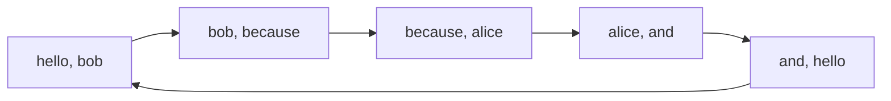
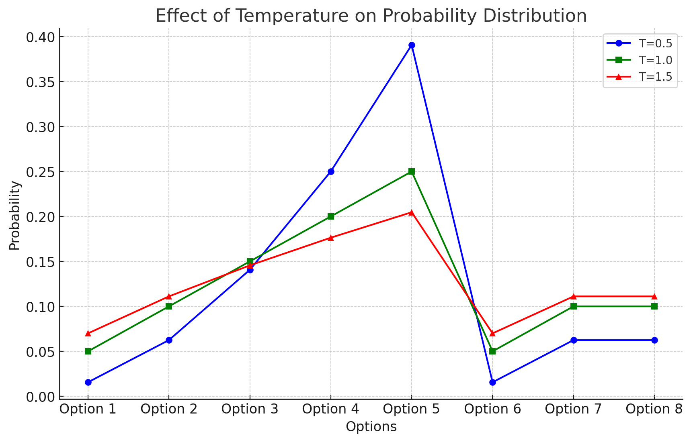
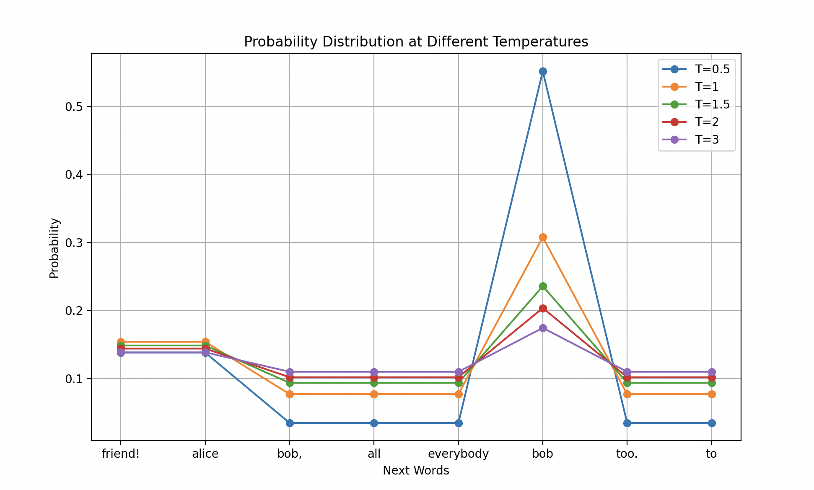
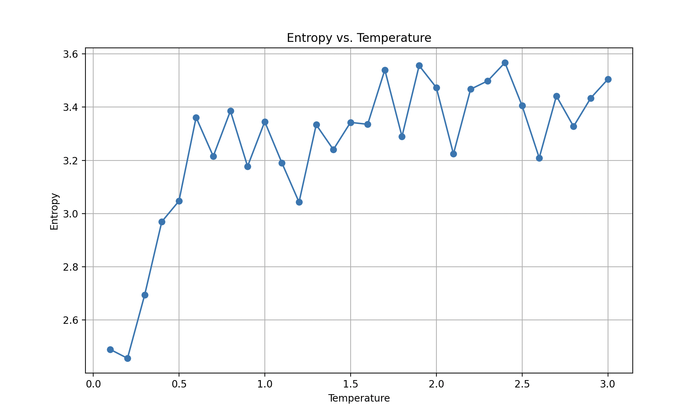
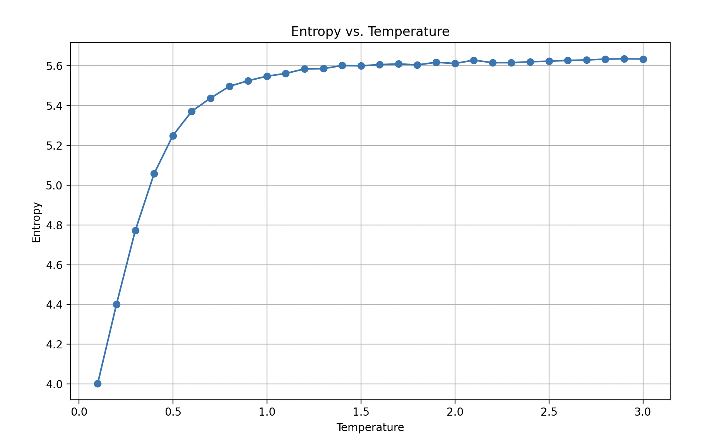

The topic of LLMs has become wildly popular in recent times with the advent of Chat GPT, Claude, Gemini, Llama, and other models.
In this post, we construct a rudimentary tiny first pass LLM we call _Lil' LLM_. With each part in this series, we will increase
the sophistication of _Lil' LLM_.

## Definitions

We begin with some definitions, which we will start out at introductory level (at the expense of precision) and deepen as the series proceeds.

{}

An __LLM__, or Large Language Model, refers to a type of AI model that has been trained on text data, via neural networks with potentially billions of parameters, in order to create seemingly intelligent output to given language input.
{}


{}
An __n-gram__ is a contiguous sequence of n items from a given text input. The text can be broken up into syllables, letters, words, or base pairs according to the application. An n-gram of size 1 is referred to as a "unigram"; size 2 is a "bigram" (or "digram"); size 3 is a "trigram"; and so on.
{}

{}
In the context of natural language processing, a __token__ is a single, atomic unit of text where the atomicity is chosen by those training the model. 
{}

{}
A __seed__ refers to the initial input given to the model to generate text. The seed is provided to the model in order to initiate its output,
and varying the seed can help vary the output, as we will see with Lil' LLM.
{}

## Lil' LLM v 0.1

Let's start with the most simple program we could. 

* We provide it text to train on, which is pretty nonsensical but will demonstrate the problem with having such a simple model.
* We tokenize by simply splitting the text by word, where for example "alice is" results in ["alice", "is"] and "alice, said" results in ["alice,", "said"], and "alice" and "alice," are not considered the same token.
* We will use bigrams here, that is, we train only on pairs of words.
    * We create a dictionary called `bigrams` whose key is the word pairs and whose value is the count.
* Our seed is the word "hello", which is found multiple times in the training text.
    * We initialize the output list such that the first item is "hello"
* We have it generate 7 words
    * To pick the next word based on the prior word, we construct a list called `possible_follows` that contains all words in the training text that has followed the current word.
    * From that list, we pick the word based on frequency, e.g. if hello is followed by X once and by Y twice, then from hello the next word would be Y.

And that's it! Very simple, nothing sophisticated, and we have not used an neural networks. Neural networks will come in the next part of this series. For now, we will focus on some of the primary ingredients of an LLM.

```python
corpus = """
Hello friend! I said to them. They were not sure whom I meant.
Hello friend! I said again, and still no one replied. Ok I said.
I will say Hello Alice and Hello Bob, but I don't know who the
rest of you are so I won't say Hello All or Hello everybody but I will
say Hello Alice and Hello Bob because Alice and Bob are people I would
say Hello too. Except I didn't say Hello Bob last time because Bob 
didn't say Hello to me. So, Hello Bob too, but if you aren't nice to
me I will not say Hello Bob anymore.
"""
tokens = corpus.lower().split()  # Simple tokenization

# Build bigrams (n-grams with n=2)
bigrams = {}
for i in range(len(tokens) - 1):
    gram = (tokens[i], tokens[i+1])
    bigrams[gram] = bigrams.get(gram, 0) + 1

# "Generation"
seed = "hello"
output = [seed]
for _ in range(7):  # Generate 7 words 
    possible_follows = [w for w in bigrams if w[0] == output[-1]]
    next_word = max(possible_follows, key=lambda x: bigrams[x])  # Greedy choice
    output.append(next_word[1])

print(" ".join(output))
```

The code for v0.1 can be found [on github](https://github.com/tdj28/lil-llm/tree/v0.1).

The output of this program is:

{}
hello bob because alice and hello bob because
{}

Not great, but it is a start! We see that we already got trapped in a cycle:



### The resulting bigram dictionary 

Let's take a look at the bigram dictionary to see why we got stuck in a loop with Lil' LLM v0.1.
We recreate the dictionary here in part (missing items are count 1 and do not end up in the cycle
so we omit them for brevity):


| Phrase Pair | Count | Phrase Pair | Count |
|-------------|-------|-------------|-------|
| say → hello | 7 | are → so | 1 |
| **hello → bob** | **4** | so → i | 1 |
| i → will | 3 | i → won't | 1 |
| **alice → and** | **3** | won't → say | 1 |
| hello → friend! | 2 | hello → all | 1 |
| friend! → i | 2 | all → or | 1 |
| i → said | 2 | or → hello | 1 |
| will → say | 2 | hello → everybody | 1 |
| hello → alice | 2 | everybody → but | 1 |
| **and → hello** | **2** | **bob → because** | **1** |
| but → i | 2 | **because → alice** | **1** |
| didn't → say | 2 | and → bob | 1 |
| said → to | 1 | bob → are | 1 |
...
| bob, → but | 1 | if → you | 1 |
...


* With our seed being `hello`, the most likely next word for hello is `bob`, a word
that has multiple mappings (e.g. `bob → because`, `bob → are`) so Lil' LLM selects
the very first mapping in the list since they are all otherwise equal (that is, in
the training text, the first example of the word bob followed by another word).

* This process will always be hopelessly caught in loops given the finitude of human created texts.

## Lil' LLM v 0.2

For version 0.2, let's change our selection function to add the concept of temperature:

```python
import random

temperature_values = [0.1, 1, 2]
all_tables = ""

# Corpus and tokenization
corpus = """
Hello friend! I said to them. They were not sure whom I meant.
Hello friend! I said again, and still no one replied. Ok I said.
I will say Hello Alice and Hello Bob, but I don't know who the
rest of you are so I won't say Hello All or Hello everybody but I will
say Hello Alice and Hello Bob because Alice and Bob are people I would
say Hello too. Except I didn't say Hello Bob last time because Bob 
didn't say Hello to me. So, Hello Bob too, but if you aren't nice to
me I will not say Hello Bob anymore.
"""
tokens = corpus.lower().split()  

# Build bigrams (n-grams with n=2)
bigrams = {}
for i in range(len(tokens) - 1):
    gram = (tokens[i], tokens[i+1])
    bigrams[gram] = bigrams.get(gram, 0) + 1

def generate_text(seed, temperature, length=15):
    output = [seed]
    for _ in range(length):  
        possible_follows = [w for w in bigrams if w[0] == output[-1]]

        if possible_follows: 
            next_words = [x[1] for x in possible_follows] 
            probabilities = [bigrams[x] for x in possible_follows]

            adjusted_probs = [p ** (1 / temperature) for p in probabilities] 
            prob_sum = sum(adjusted_probs)
            normalized_probs = [p / prob_sum for p in adjusted_probs]

            next_word = random.choices(next_words, weights=normalized_probs)[0]  
            output.append(next_word)
        else:
            break  

    return " ".join(output)


for temp in temperature_values:
    runs = [generate_text("hello", temp) for _ in range(5)]
    
    markdown_table = f"### Temperature = {temp}\n\n"
    markdown_table += "| Run | Output |\n|-----|--------|\n"
    for i, run in enumerate(runs, 1):
        markdown_table += f"| Run {i} | {run} |\n"
    markdown_table += "\n"
    all_tables += markdown_table

print(all_tables)
```

This is a simplified version of the code for v0.2 that can be found on [github](https://github.com/tdj28/lil-llm/tree/v0.2).

Let's break these changes down:

```python
   probabilities = [bigrams[x] for x in possible_follows]
   temperature = 0.8 
   adjusted_probs = [p **(1/temperature) for p in probabilities]
```

* As before, we are constructing probabilities based on how frequently
one word is followed by another, but in this case, we __raise__ the 
probability by the inverse of the temperature T: \\(p_i^{\prime} = p_i^{1/T} \\)

```python
   prob_sum = sum(adjusted_probs)
   normalized_probs = [p / prob_sum for p in adjusted_probs]
```

* In order to maintain a valid probability distribution, we must normalize the sum of all probabilities to be equal to one (that is, of all possible outcomes, one of them will happen, the probability of something happening has to be 100%):

$$p_i^{\text{norm}} = \frac{p_i^{\prime}}{\sum_{j} p_j^{\prime}}$$

* We also add a new key feature:

```python
        next_word = random.choices(next_words, weights=normalized_probs)[0]  
```

* Instead of picking the words based explicitly on the dictionary of most common following words, we 
conduct a __weighted random choice__. That is, we have the program pick the words from our list, but weighted 
based on the probabilities we constructed prior. Thus the _most likely_ following word is more often than not picked, but _not always_.

### What does temperature do?

The effect of temperature:

| Temperature Value | Effect on Distribution |
|-------------------|------------------------|
| T < 1 | Sharpens the distribution; high probabilities become higher, low probabilities become lower |
| T > 1 | Flattens the distribution; probabilities become more uniform |
| T = 1 | Distribution remains unchanged |

The overall transformation can be expressed as:

$$p_i^{norm} = \frac{p_i^{\frac{1}{T}}}{\sum_{j} p_j^{\frac{1}{T}}}$$

This temperature factor allows us to add some variation in the behavior of Lil' LLM, where lower temperatures lead to more deterministic and focused outputs, while higher temperatures introduce more randomness and diversity.

We can see this in the following graph:



* In this hypothetical graph, the green lines represents the probabilities of various options when the temperature is T=1. The blue line represents a lower temperature at T=0.5, and the red line represents a higher temperature at T=1.5.
* The blue line, the lower temperature, shows that the higher probabilities are above the T=1 line, and the lower probabilities are below that line, showing the sharpening. 
* Thus lower temperatures will make models behavior more predictably as the rich get richer and the poor get poorer, so to speak. 
* On the other hand, the higher temperature red line shows a decrease relative to the T=1 peak, but higher values where the T=1 line is lower. 
* To continue with our analogy, the higher the temperature, the more wealth is redistributed, and hence the less likely we will get trapped in cycles since _other_ words than the most likely ones have a better chance at being picked.

### Results

#### Temperature = 0.1

| Run | Output |
|-----|--------|
| Run 1 | hello bob because alice and hello bob are so i will say hello bob too, but |
| Run 2 | hello bob because alice and hello bob didn't say hello bob anymore. |
| Run 3 | hello bob because alice and hello bob too, but i will say hello bob because bob |
| Run 4 | hello bob are so i will say hello bob too, but i will say hello bob |
| Run 5 | hello bob anymore. |

#### Temperature = 1

| Run | Output |
|-----|--------|
| Run 1 | hello bob, but i didn't say hello friend! i won't say hello friend! i didn't say |
| Run 2 | hello bob because alice and bob too, but i won't say hello bob didn't say hello |
| Run 3 | hello everybody but i meant. hello bob because bob because alice and bob are people i |
| Run 4 | hello bob because bob are so i won't say hello bob too, but i will say |
| Run 5 | hello too. except i would say hello bob anymore. |

#### Temperature = 2

| Run | Output |
|-----|--------|
| Run 1 | hello friend! i won't say hello all or hello bob, but i said to them. they |
| Run 2 | hello to me. so, hello friend! i said. i don't know who the rest of you |
| Run 3 | hello bob didn't say hello to them. they were not sure whom i said. i said |
| Run 4 | hello bob too, but i would say hello everybody but i meant. hello too. except i |
| Run 5 | hello to me i meant. hello alice and hello too. except i said. i won't say |

## Discussion

So we can see a shift as temperature increases, where lower temperature is fairly repetitive,
and higher temperature has more variations. Let's try to show that more quantitatively.

* Firstly, we can see explicitly that as the temperature gets higher, the probabilities for
word selection converges:



* We are seeing that the higher the temperature, incrementally increasing the temperature changes the 
probability less and less as temperature goes up.

* If we look at the entropy, a way to sort of measure how random the choices are, we see this convergence clearly happens around T=1.5:



* As the temperature increases, the word probability tends towards a uniform distribution. Once they get close enough to that 
distribution, they tend towards it asymptotically and hence further increases of temperature are less and less effective in increasing 
entropy.

* If we use entropy as a measure of the  unpredictability of the distribution, we know that maximum entropy corresponds to a uniform distribution where each choice is as likely as any other choice. So we should expect to see entropy reach an asymptotic climb towards
the theoretical maximum for the training text we use.

* Because probabilities are being raised by \\( 1/T \\), as T gets larger and larger, \\( 1/T \rightarrow 0 \\), and so 
the probabilities for each word in a training text of N words \\( \rightarrow 1/N \\). The larger the text, the closer it can get
to uniform distribution as both \\( N \rightarrow \infty \\) and \\(T \rightarrow \infty \\).

### Larger training text

If we use more complicated text, such as the Declaration of Independence, we see the asymptotic behavior of entropy increasing at diminishing rates with temperature much more clearly:



Here is output for T=0.5 with the seed word "we":

| Run | Output |
|-----|--------|
| Run 1 | we have connected them shall seem most valuable laws, the thirteen united states of the course |
| Run 2 | we have been deaf to alter or to the rights of the right inestimable to be |
| Run 3 | we have petitioned for the same absolute tyranny over these states. to the consent of our |
| Run 4 | we have been the high seas to the unanimous declaration of the most wholesome and payment |
| Run 5 | we have returned to alter their future security.--such has erected a long train of the political |

Here is output for T=3.0 with the seed word "we":

| Run | Output |
|-----|--------|
| Run 1 | we must, therefore, the political connection between them with power to reduce them into compliance with |
| Run 2 | we mutually pledge to extend an unwarrantable jurisdiction over these colonies: for us beyond seas to |
| Run 3 | we must, therefore, acquiesce in general congress, assembled, appealing to suffer, while evils are instituted among |
| Run 4 | we been deaf to time of our charters, abolishing our laws; giving his governors to harrass |
| Run 5 | we been answered only by a candid world. he is unfit to dissolve the rectitude of |

We can clearly observe an increase in randomness of the text with temperature.

So Lil' LLM v0.2 is definitely more interesting than Lil' LLM v0.1, but we have to press forward to get more interesting output.

### Next steps

* Our use of temperature here is non-ideal, so we need to use more sophisticated functions for our probabilities.
* Our LLM as it is constructed now isn't going to produce very interesting output, so we have to press forward with new tricks.
* Obviously, we will need at some point to introduce neural networks.

## Appendix

### Entropy

Entropy is a measure of the unpredictability or randomness in a set of outcomes. For a given probability distribution \\( P \\), the entropy \\( H \\) is defined as:

$$ H(P) = -\sum_{i} p_i \log(p_i) $$

where:
- \\( p_i \\) is the probability of the \\( i \\)-th outcome.
- The logarithm can via any base, but natural logarithms (base \\( e \\) is my preference due to a physics background).

#### Steps to Roughly Calculate Entropy

1. **Tokenize the Corpus**: The text corpus is split into individual tokens (words).
2. **Build Bigrams**: Pairs of consecutive words (bigrams) are counted to understand the likelihood of one word following another.
3. **Generate Text**: Using a seed word and a temperature parameter, text is generated by selecting the next word based on adjusted probabilities.
4. **Calculate Word Probabilities**:
   - Collect all the words from the generated texts.
   - Count the occurrences of each word.
   - Convert these counts into probabilities by dividing by the total number of words.
5. **Compute Entropy**:
   - Use the formula \\( H(P) = -\sum_{i} p_i \log(p_i) \\) to calculate the entropy of the word probabilities.

#### Python Implementation

Here is a summary of how the entropy is calculated in the code:

```python
from collections import Counter
from scipy.stats import entropy
import numpy as np

def calculate_entropy(texts):
    all_words = " ".join(texts).split()
    word_counts = Counter(all_words)
    word_probs = np.array(list(word_counts.values())) / sum(word_counts.values())
    return entropy(word_probs)
```

The `scipy.stats` entropy function uses the natural log (base `e`).