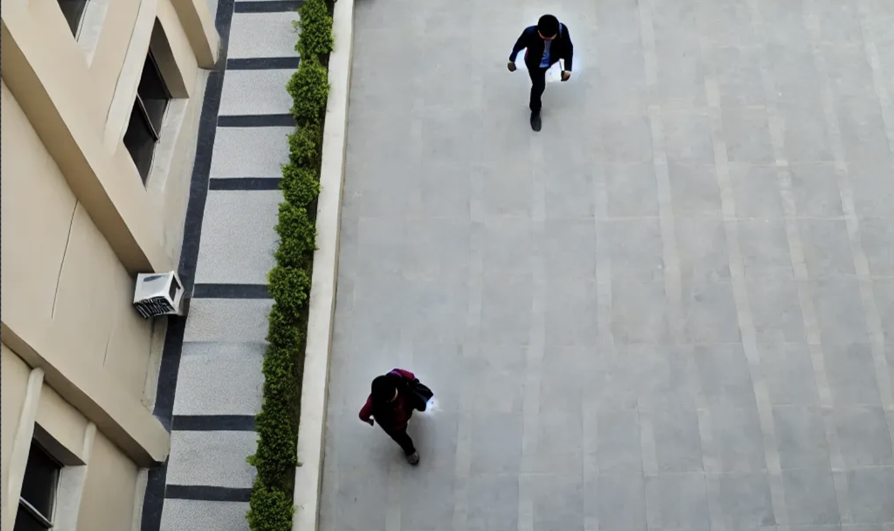
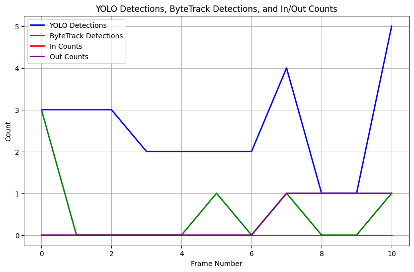
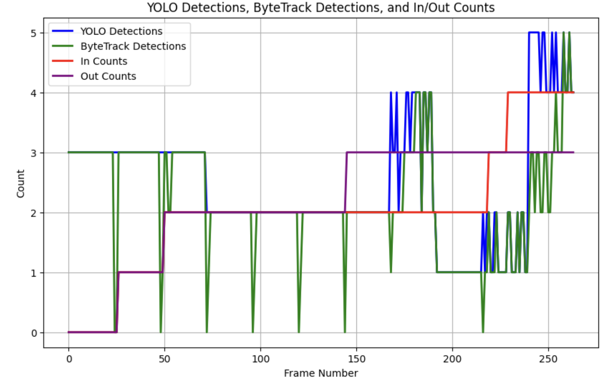

In the realm of computer vision, dealing with low-frame-rate (FPS) video presents unique challenges, especially when attempting to maintain consistent object tracking. One novel approach involves applying small, random shifts to each frame artificially generate higher FPS video. 

Here I take a look at the `supervision` implementation of ByteTrack. ByteTrack is an efficient tracking algorithm designed for multi-object tracking (MOT). It builds on top of the popular SORT (Simple Online and Realtime Tracking) and DeepSORT algorithms

### Method

### Getting low FPS demo video

First, generate an image using a GenAI tooling. Here is an example of an image of an apartment courtyard with a few people walking using DALLE:



The video isn't perfect, with weird artifacts such as two people forming from one. However, it suffices to demonstrate the power of
jittering.

We next create a synthetic video via RunwayML using this image as the starting frame. As of the writing of this post, Alpha 3 turbo generates ten seconds of video at 24 fps:




We can downscale that to 1fps with this ffmpeg command:

```bash
ffmpeg -i input_video.mp4 -vf "fps=1" -c:v libx264 -crf 23 -preset veryslow -an output_1fps.mp4
```

resulting in this video low frame rate video:




When I process this video with YOLOv8/ByteTrack, I get poor tracking. Wherever you see the word YOLO in the bounding box attributes rather than Object ID, that means that while YOLO detected a person, ByteTrack couldn't track it, which happens a lot in the 1fps video:




We can see the failure of ByteTrack in this graph which shows Yolo detections and ByteTrack ids, where the latter line is consistently lower than the detections:




### ex uno plures

Is there a CPU/GPU cheap way to artificially increase the framerate? One way is that I could provide a jitter of the image where I shift it slightly up, down, left, or right, using a Gaussian distribution.

```python
def wiggle_frame(frame, shift_std=2):
    """Apply a small random shift to the frame."""
    rows, cols, _ = frame.shape
    x_shift = int(np.random.normal(0, shift_std))
    y_shift = int(np.random.normal(0, shift_std))

    # Translation matrix for the frame
    M = np.float32([[1, 0, x_shift], [0, 1, y_shift]])

    # Apply the translation to the frame
    wiggled_frame = cv2.warpAffine(frame, M, (cols, rows))

    return wiggled_frame

def increase_fps(input_video_filename, target_fps):
    cap = cv2.VideoCapture(input_video_filename)
    original_fps = cap.get(cv2.CAP_PROP_FPS)
    original_frame_count = int(cap.get(cv2.CAP_PROP_FRAME_COUNT))
    frame_duration = 1 / original_fps
    target_frame_count = int(original_frame_count * target_fps / original_fps)

    # Prepare the output video
    output_filename = f"{os.path.splitext(input_video_filename)[0]}_wiggle_{target_fps}fps.mp4"
    fourcc = cv2.VideoWriter_fourcc(*'mp4v')
    width = int(cap.get(cv2.CAP_PROP_FRAME_WIDTH))
    height = int(cap.get(cv2.CAP_PROP_FRAME_HEIGHT))
    out = cv2.VideoWriter(output_filename, fourcc, target_fps, (width, height))

    # Process each frame
    for _ in tqdm(range(original_frame_count)):
        ret, frame = cap.read()
        if not ret:
            break

        # Write the original frame first
        out.write(frame)

        # Generate additional frames to meet the target FPS
        num_wiggles = target_fps - 1
        for _ in range(num_wiggles):
            wiggled_frame = wiggle_frame(frame)
            out.write(wiggled_frame)

    cap.release()
    out.release()
    print(f"Processed video saved as {output_filename}")
```

this produces the jittered equivalent of the original 1fps video:



### Detecting with the jittered video

Next we run the same detection against the jittered video, finding substantially better tracking than the original 1fps video:



We can see this graphed here, where the YOLO detections and the ByteTrack detections line up far better, albeit not perfectly:



There is an inverse spiky behavior when the ByteTrack detections drop out in one or two of the 23 synthetic frames; this can
be solved by binning over N frames and taking the majority detections.

## Next steps

Even though this method is substantially less intensive to run than any attempts to morph between frames, it will likely be less accurate than those methods. However, this method showed substantial improvement in tracking over the original low frame-rate video. Ways this could be refined include:

* Trying to find the optimal jitter magnitude
* Doing an ensemble over the artificial extra frames and go with the id that was most frequently attached to the detection
* Combining ByteTrack with some further augmentations such as assistance with dropped IDs in some frames by forcing it to assume a most likely id based on the presence of that id in prior and future parts of the video in the same vicinity.
* More sophisticated solutions such as improving the models
* ???

## Code samples

The detection/id function:

```python
def analyze_video(input_video_filename):
    # Initialize lists to store data for plotting
    yolo_detections_per_frame = []
    tracked_detections_per_frame = []
    in_counts_per_frame = []
    out_counts_per_frame = []
    frame_numbers = []

    output_base = os.path.splitext(input_video_filename)[0]
    output_video_filename = f"{output_base}_processed.mp4"
    output_png_filename = f"{output_base}.png"

    base_fps = get_video_fps(input_video_filename)
    # Reinitialize the tracker for each video
    tracker = sv.ByteTrack(
        lost_track_buffer=80,
        track_activation_threshold=0.02,
        minimum_matching_threshold=3,
        frame_rate=base_fps  # Adjust according to the actual frame rate of your video
    )

    classes = list(model.names.values())

    LINE_STARTS, LINE_END = sv.Point(0, 400), sv.Point(1280, 400)
    box_annotator = sv.BoxAnnotator()
    label_annotator = sv.LabelAnnotator()
    line_counter = sv.LineZone(start=LINE_STARTS, end=LINE_END)
    line_annotator = sv.LineZoneAnnotator(thickness=2, text_thickness=2, text_scale=0.5)

    video_info = sv.VideoInfo.from_video_path(video_path=input_video_filename)

    # Process the video frames
    with sv.VideoSink(target_path=output_video_filename, video_info=video_info) as sink:
        frame_index = 0

        for frame in tqdm(sv.get_video_frames_generator(source_path=input_video_filename), total=video_info.total_frames):
            enhanced_frame = enhance_frame(frame)

            # Run YOLO on the frame
            results = model(enhanced_frame, verbose=False, conf=0.2, iou=0.7)[0]
            detections = sv.Detections.from_ultralytics(results)
            detections = detections[np.where((detections.class_id == 0) | (detections.class_id == 2) | (detections.class_id == 7))]

            # Collect the number of YOLO detections
            yolo_detections_per_frame.append(len(detections.xyxy))

            # Apply the narrowing to all detections
            for i, bbox in enumerate(detections.xyxy):
                detections.xyxy[i] = narrow_bounding_box(bbox, reduction_ratio=0.6)

            # Track the detections
            detections_tracked = tracker.update_with_detections(detections)

            # Collect the number of tracked detections
            tracked_detections_per_frame.append(len(detections_tracked.xyxy))

            # Annotate frame with bounding boxes and labels
            annotated_frame = enhanced_frame.copy()

            # Annotate YOLO detections (even if not tracked)
            annotated_frame = box_annotator.annotate(scene=annotated_frame, detections=detections)
            labels = [f"YOLO: {classes[detections.class_id[i]]} {detections.confidence[i]:.2f}"
                      for i in range(len(detections.class_id))]
            annotated_frame = label_annotator.annotate(scene=annotated_frame, detections=detections, labels=labels)

            # Annotate tracked detections
            annotated_frame = box_annotator.annotate(scene=annotated_frame, detections=detections_tracked)
            tracked_labels = [f"#{detections_tracked.tracker_id[i]} {classes[detections_tracked.class_id[i]]} {detections_tracked.confidence[i]:.2f}"
                              for i in range(len(detections_tracked.class_id))]
            annotated_frame = label_annotator.annotate(scene=annotated_frame, detections=detections_tracked, labels=tracked_labels)

            # Handle line crossing and collect in/out counts
            line_counter.trigger(detections=detections_tracked)
            annotated_frame = line_annotator.annotate(frame=annotated_frame, line_counter=line_counter)

            # Store in/out counts
            in_counts_per_frame.append(line_counter.in_count)
            out_counts_per_frame.append(line_counter.out_count)

            # Write the annotated frame to the output video
            sink.write_frame(frame=annotated_frame)

            # Collect frame number for plotting
            frame_numbers.append(frame_index)
            frame_index += 1

    # Plotting the results
    plt.figure(figsize=(10, 6))

    # Plot YOLO detections with a solid line
    plt.plot(frame_numbers, yolo_detections_per_frame, label="YOLO Detections", color="blue", linestyle='-', linewidth=2)

    # Plot ByteTrack detections with a solid line
    plt.plot(frame_numbers, tracked_detections_per_frame, label="ByteTrack Detections", color="green", linestyle='-', linewidth=2)

    # Plot in counts with a solid line
    plt.plot(frame_numbers, in_counts_per_frame, label="In Counts", color="red", linestyle='-', linewidth=2)

    # Plot out counts with a solid line
    plt.plot(frame_numbers, out_counts_per_frame, label="Out Counts", color="purple", linestyle='-', linewidth=2)

    plt.xlabel("Frame Number")
    plt.ylabel("Count")
    plt.title("YOLO Detections, ByteTrack Detections, and In/Out Counts")
    plt.legend()
    plt.grid(True)
    plt.savefig(output_png_filename)
    plt.show()
```

## References

https://arxiv.org/abs/2110.06864

https://github.com/ifzhang/ByteTrack

https://roboflow.com/model/bytetrack

https://www.datature.io/blog/introduction-to-bytetrack-multi-object-tracking-by-associating-every-detection-box

https://supervision.roboflow.com/trackers/